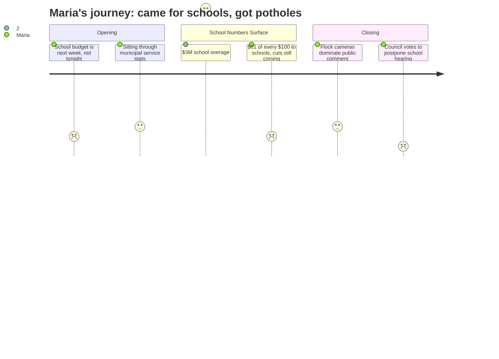

# Interpretation: Maria (PERSONA-001)
## Meeting: City Council Regular Meeting -- April 7, 2026 -- 2026-04-07

### Structured Points

#### 1. School Budget Not Presented Tonight
- **Fact:** The city manager opened by announcing that the school department would present its FY27 budget the following week, not at this meeting. The school portion of the public hearing was formally postponed to April 14 by council vote at the end of the meeting.
- **Source:** Transcript [00:05] and [107:16]
- **Emotional valence:** negative
- **Threat level:** 2
- **Open question:** true

#### 2. City Anticipates a $3 Million School Budget Shortfall This Year
- **Fact:** The city manager disclosed that the city has set aside $3 million from its own fund balance as an anticipated loan to the school department to cover expected overages in the current fiscal year: approximately $2 million in operating costs and $1 million in food service. He noted this may be a high estimate but described it as necessary to prepare for the shortfall.
- **Source:** Transcript [19:44]
- **Emotional valence:** negative
- **Threat level:** 4
- **Open question:** true

#### 3. Schools Take $61 of Every $100 in Property Taxes — and Still Face Major Cuts
- **Fact:** The city manager stated that of every $100 a homeowner pays in property taxes, $61.70 goes to the school department. On the average South Portland home, that translates to just over $4,000 of the $6,540 annual tax bill going to schools. This share is the dominant driver of the overall tax commitment, yet the school district is simultaneously proposing significant workforce reductions to close a structural gap.
- **Source:** Transcript [24:47] and [25:15]
- **Emotional valence:** neutral
- **Threat level:** 3
- **Open question:** true

#### 4. Average Homeowner Faces $315 Tax Increase, Down From Earlier Projection
- **Fact:** The city manager reported that new construction growth updated the projected overall tax increase from 6% to 5.1%, resulting in a $315 increase for a homeowner without the homestead exemption on a home valued at the South Portland average of $456,100. He noted the final figure won't be set until the assessor completes work in late July.
- **Source:** Transcript [00:52] and [25:15]
- **Emotional valence:** neutral
- **Threat level:** 2
- **Open question:** false

#### 5. State Funding Gap Briefly Acknowledged, Governor Supplemental Offers Vague Hope
- **Fact:** When asked about non-property-tax revenues, the city manager identified state aid to education as the largest single source for the school side of the budget. A councilor then asked whether the governor's recently passed supplemental budget might bring additional revenue to the school, and the city manager confirmed it contained "some good news" for schools without specifying an amount or timeline.
- **Source:** Transcript [53:29] and [57:57]
- **Emotional valence:** positive
- **Threat level:** 2
- **Open question:** true

#### 6. School Budget Numbers Still Unofficial — Board Has Not Yet Voted
- **Fact:** The city manager noted that the school budget numbers he referenced were updated as of March 23 and were more current than those printed in the budget books given to councilors. He explicitly cautioned that the school board had not yet voted to approve a final budget to send to the council, meaning the figures remain subject to change.
- **Source:** Transcript [01:38]
- **Emotional valence:** negative
- **Threat level:** 3
- **Open question:** true

---

### Journey Map

---

### Reactions

Okay so I sat through almost two hours of that and the schools literally did not come up. Like, the whole reason I went — the school budget, the teacher cuts, all of it — they pushed it to next week. The city manager mentioned it in the first thirty seconds and I thought, okay, maybe it's later in the agenda, but no. They just voted at the very end to officially postpone it to April 14th. So I rearranged my whole evening for nothing. I'm not even mad at the council, it just... nobody told parents this was happening. I checked the school's page, I looked at the agenda, and nowhere did it say "hey, if you're here for the schools, come back next Tuesday."

The one thing that did catch my attention — and I've been chewing on it since I got home — is that the city manager casually mentioned that they've set aside three million dollars as a loan to the school because they're expecting the schools to go three million over budget *this year*. Two million in the regular budget, one million in food service. He said "we hope that's a high estimate" but they had to plan for it. So the schools are already spending more than they have right now, before we even vote on next year's cuts. And then we're also being told next year's budget proposes eliminating 42 teachers and 16 ed techs. I keep trying to connect those two things in my head and I can't make them add up to something reassuring.

The other thing I keep thinking about is what he said about the tax bill — $61 out of every $100 goes to the school. I actually grabbed my phone and did the math during the meeting. On my house, that's about four thousand dollars a year just for schools. I'm not complaining about that, I think schools should be funded. But if that's already where most of the money is going, and we're still facing this huge structural gap, then the problem isn't that families like mine aren't paying. The problem is the state is only covering something like twenty percent of what it's supposed to. That came up sideways when someone asked about revenues and the city manager said state aid is the biggest non-tax source. A councilor asked about the governor's supplemental budget and the city manager said there was "some good news for schools" — but that was it. No number. No detail. I'll be looking that up tonight. The rest of the meeting was an extended back-and-forth about license plate cameras that, honestly, I have zero opinion on right now. I just want to know which teachers at my kids' school still have jobs next fall.