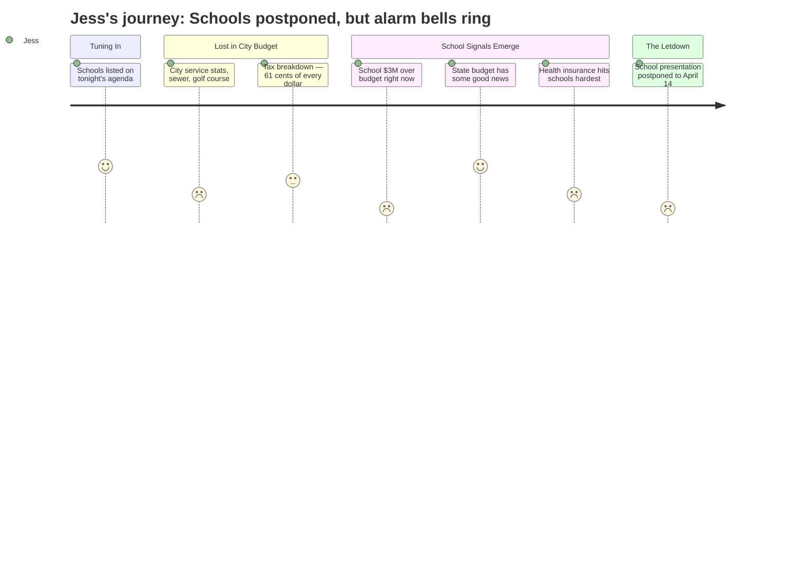

# Interpretation: Jess (PERSONA-003)
## Meeting: City Council Regular Meeting -- April 7, 2026 -- 2026-04-07

### Structured Points

#### 1. School presentation postponed -- nothing to hear tonight
- **Fact:** The school budget presentation was not given at this meeting. The city manager noted at the outset that the school department "tentatively will be presenting their share of the budget, not tonight, but next week." At the end of the meeting, council voted to postpone the public hearing on the school budget to April 14.
- **Source:** Transcript [00:05] and [1:07:16--1:08:02]
- **Emotional valence:** negative
- **Threat level:** 2
- **Open question:** true

#### 2. The school is already $3 million over budget this year -- before next year even starts
- **Fact:** The city manager revealed the city has set aside $3 million as an anticipated loan to the school department for a current-year budget overrun: approximately $2 million in the operating budget and $1 million in food service. The city's own fund balance has been reduced specifically to cover this anticipated school shortfall.
- **Source:** Transcript [00:19:44--00:20:33]
- **Emotional valence:** negative
- **Threat level:** 4
- **Open question:** true

#### 3. Forty-two teachers proposed for elimination next year
- **Fact:** The FY27 proposed school budget includes the elimination of 78 positions total -- 12% of all district staff -- including 42 classroom teachers, 16 educational technicians, and 14 other positions. The school board has not yet voted on the budget.
- **Source:** Meeting Fiscal Context; Transcript [00:01:38]
- **Emotional valence:** negative
- **Threat level:** 5
- **Open question:** true

#### 4. Elementary enrollment has dropped sharply -- and the cuts follow from that
- **Fact:** Elementary enrollment fell 23% in four years, from 1,401 to 1,080 students. The district's structural budget gap is partly the result of staffing that grew by 82 positions during the same period that enrollment fell by roughly 300 students.
- **Source:** Meeting Fiscal Context
- **Emotional valence:** negative
- **Threat level:** 3
- **Open question:** true

#### 5. Voters decide the school budget on June 9 -- and it could fail
- **Fact:** The school budget referendum is scheduled for June 9, 2026. Voters will give an up-or-down on the school budget. The timeline from the city manager's presentation makes clear that the school budget has not yet been voted on by the school board and has not yet been sent to the council.
- **Source:** Transcript [00:45:43--00:46:29]
- **Emotional valence:** neutral
- **Threat level:** 3
- **Open question:** true

#### 6. Health insurance is rising fast -- and it hurts schools more than the city
- **Fact:** The city confirmed it is locked in at a 10% health insurance premium increase. A city councilor asked whether the school is in the same position; the city manager noted the school has not yet confirmed its number but has a much larger employee population, adding: "That number for them hurts a lot more."
- **Source:** Transcript [00:55:46--00:56:15]
- **Emotional valence:** negative
- **Threat level:** 3
- **Open question:** false

#### 7. Some good news from the state -- but details are vague
- **Fact:** When a councilor asked whether the governor's supplemental budget might bring new revenues, the city manager confirmed "there was some good news in that budget" specifically for the schools. No dollar figure or program detail was provided at this meeting.
- **Source:** Transcript [00:57:21--00:58:06]
- **Emotional valence:** positive
- **Threat level:** 1
- **Open question:** true

#### 8. Property taxes going up -- for a system that may look very different by the time a child enters kindergarten
- **Fact:** The proposed overall tax rate increase is 5.1%, adding approximately $315 annually to the average homeowner's bill ($456,100 home, no homestead exemption). Of the average $6,540 tax bill, just over $4,000 already goes to the school. The school tax is 61% of total property taxes.
- **Source:** Transcript [00:25:15--00:26:02]; Meeting Fiscal Context
- **Emotional valence:** negative
- **Threat level:** 2
- **Open question:** false

---

### Journey Map

---

### Reactions

Okay so I finally watched that city council meeting from last week because someone in my playgroup mentioned the school budget and I wanted to actually understand what's happening before my daughter starts kindergarten in two years. I watched the whole thing -- almost two hours -- and the school part? Got postponed. They didn't even present it. The whole reason I watched. It's happening April 14 instead, apparently because the school board hasn't even voted on it yet. I just... okay. Fine.

But here's what actually kept me up: before the school presentation got punted, the city manager just casually dropped that the city is setting aside three million dollars as a loan to the school department because the schools are already over budget *this year*. Like, not next year's scary budget with all the teacher cuts. The current year. They're already in the red by two million in operations and another million in food service. And meanwhile I'm watching them talk about cutting 42 teachers next year on top of this. I don't know what school my kid is even going to go to -- I'm still figuring that out -- and I'm trying to do math on what the kindergarten classroom looks like if the district is losing 12% of its staff. The city manager said the district grew by 82 positions while enrollment dropped by 300 kids over four years. I get that something has to give. I really do. But "something has to give" shouldn't mean my daughter walks into a kindergarten with a substitute and 28 kids.

The one thing that gave me a tiny bit of hope is someone asked about the governor's supplemental budget and the city manager said there's "some good news" for the schools in there. He didn't say how much or what it was, which is maddening, but at least it wasn't purely doom. The school budget goes to a public vote on June 9, which means all of this could still change -- or not pass at all, which I don't even want to think about. I need to actually go to the April 14 meeting or at least watch it live, because I finally get to hear what the actual school budget looks like. I've been putting off really digging into this because it's overwhelming and my kid isn't even three yet, but I can't keep waiting for someone to just explain it to me. I have to go find out myself.