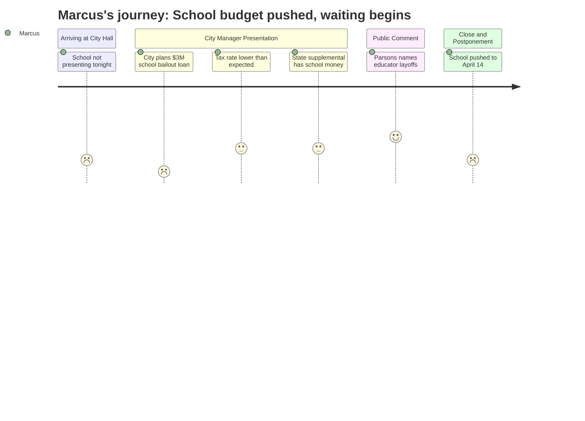

# Interpretation: Marcus (PERSONA-004)
## Meeting: City Council Regular Meeting -- April 7, 2026 -- 2026-04-07

### Structured Points

#### 1. School budget postponed -- again
- **Fact:** The school budget presentation, advertised as part of tonight's public hearing, was not delivered. The city manager confirmed at the opening that the school department would present "not tonight, but next week." A formal motion to postpone was passed at the end of the meeting to April 14.
- **Source:** Transcript [00:05] and motion at [107:16]
- **Emotional valence:** negative
- **Threat level:** 3
- **Open question:** true

#### 2. City already budgeting a $3M loan to cover school's current-year deficit
- **Fact:** The city's finance director set aside $3 million in municipal fund balance as an anticipated loan to the school department to cover an expected current-year overage -- approximately $2M in operating and $1M in food service. The city manager described this as a "high estimate" but said the school's own fund balance will run out first.
- **Source:** Transcript [19:44]
- **Emotional valence:** negative
- **Threat level:** 5
- **Open question:** true

#### 3. School still does not have final health insurance numbers
- **Fact:** In response to a council question, the city manager confirmed that the school department is still estimating its health insurance premiums -- unlike the city, which is locked in at a 10% increase. The city manager noted that a 10% or 12% increase "hurts a lot more" for the school given its much larger employee population.
- **Source:** Transcript [55:45]
- **Emotional valence:** negative
- **Threat level:** 4
- **Open question:** true

#### 4. School board has not yet voted to send a budget to council
- **Fact:** The city manager noted that the school budget numbers he referenced (updated as of March 23) should be "taken with a grain of salt" because "the school board hasn't actually voted yet to approve a budget to send to the council."
- **Source:** Transcript [01:38]
- **Emotional valence:** neutral
- **Threat level:** 2
- **Open question:** true

#### 5. School accounts for 61 cents of every property tax dollar
- **Fact:** The city manager stated that of every $100 in property taxes, the school receives $61.70 -- the single largest share, exceeding municipal, county, and metro combined. For the average South Portland home, over $4,000 of the $6,540 tax bill goes to the school.
- **Source:** Transcript [24:26] and [25:15]
- **Emotional valence:** neutral
- **Threat level:** 2
- **Open question:** false

#### 6. Overall tax rate came in lower than feared -- some relief for the referendum
- **Fact:** Due to new construction growth (not revaluation), the overall projected tax increase dropped from 6% to 5.1%. The school's share of that increase is 3.6 percentage points. The city manager noted the final number won't be confirmed until the assessor finishes work in late July.
- **Source:** Transcript [00:52] and [24:26]
- **Emotional valence:** positive
- **Threat level:** 1
- **Open question:** false

#### 7. Good news in governor's supplemental budget -- for schools specifically
- **Fact:** In response to a council question about whether the governor's recently passed supplemental budget contained revenue for South Portland, the city manager confirmed there was "good news in that budget" specifically for the school -- not for the municipality directly. No dollar figure was provided.
- **Source:** Transcript [57:36]
- **Emotional valence:** positive
- **Threat level:** 1
- **Open question:** true

#### 8. A community member named educator layoffs explicitly in public comment
- **Fact:** During public comment, resident Carlton Parsons listed "a plan to fire some of our best educators in the state and raise our unemployment rate" as one of his core objections to the budget direction. His comment was the only moment in the entire meeting where the human impact of the proposed 42 teacher eliminations was named aloud before the council.
- **Source:** Transcript [63:34]
- **Emotional valence:** positive
- **Threat level:** 1
- **Open question:** false

---

### Journey Map

---

### Reactions

I drove down there tonight expecting to finally hear the school budget laid out in public -- the superintendent, the numbers, the council asking hard questions. Instead the city manager opens by saying the school is presenting "next week." Great. I sat through an hour and a half of plow trucks and golf course mowers and Flock cameras waiting for something that never happened. The motion to postpone it to April 14 comes at the very end, almost as an afterthought.

Here's what actually jumped out at me though: buried in the city manager's presentation, he mentioned the city has set aside $3 million in fund balance as a loan to the school because the district is going to run out of its own money before the fiscal year ends. Operating overage, food service overage. That's not next year's problem -- that's this year. We're already in the red before the FY27 cuts even hit. And they still don't have their health insurance numbers locked in. The city is at 10%, the school is still estimating, and the city manager literally said "10% for the school would be a lot worse." That's 42 teachers plus a 12% health insurance bomb that nobody can fully price yet. That's what I'm thinking about right now.

One thing that actually felt good: Carlton Parsons stood up during public comment and said it plain -- there's a plan to "fire some of our best educators" and he named it as a problem, not just a line item. Nobody on the council pushed back on him. Nobody said "well, we have to make hard choices." They just received it. That's not nothing. But the Flock camera conversation ate up half the public comment time and the school budget still isn't on the table. Next Tuesday, I'm going back. And this time I'm not leaving until we actually hear the numbers.