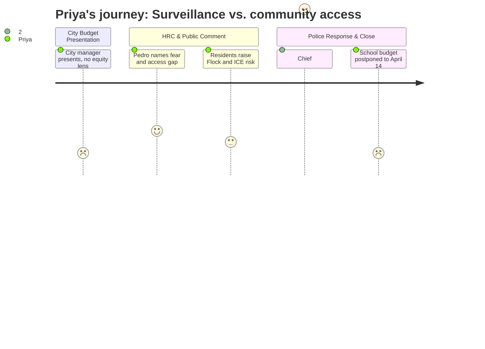

# Interpretation: Priya (PERSONA-005)
## Meeting: City Council Regular Meeting -- April 7, 2026 -- 2026-04-07

### Structured Points

#### 1. HRC names the participation gap in the budget
- **Fact:** Human Rights Commission Chair Pedro Vazquez told the council that parts of the community are currently "experiencing fear, withdrawal, and uneven access to public systems," and that the city is "strengthening systems but not strengthening access at the same pace" — specifically naming language access, community engagement, and participation infrastructure as underinvested relative to enforcement capacity.
- **Source:** Transcript [58:55–62:01]
- **Emotional valence:** positive
- **Threat level:** 2
- **Open question:** true

#### 2. Flock camera sited near Red Bank with no demographic analysis
- **Fact:** When explaining camera placement at Crockett's Corner, Police Chief Hart acknowledged the location is "near Red Bank" but attributed the choice solely to entry-point traffic geography, saying "Is it targeting? No. That's why it's chosen." No demographic impact analysis was presented.
- **Source:** Transcript [97:44–98:33]
- **Emotional valence:** negative
- **Threat level:** 4
- **Open question:** true

#### 3. Chief declares cameras "fair and equitable" without supporting data
- **Fact:** Chief Hart stated that LPR cameras "do not target certain individuals," are "fair," "equitable," and safeguard "all of our community, everyone in our community." No data on search patterns, demographic breakdown of vehicles queried, or third-party audit results was presented to support these claims.
- **Source:** Transcript [95:24–96:11]
- **Emotional valence:** negative
- **Threat level:** 3
- **Open question:** true

#### 4. Contract data retention may exceed Maine's 21-day statutory limit
- **Fact:** Resident Alex Redfield stated that a Flock contract obtained via a separate FOA request "implies that data can be held for 30 days," while Maine law requires individual data be held no more than 21 days. Chief Hart countered that the department retains data for 21 days as required by state law. The discrepancy between what the contract language says and what the department does was not resolved in the meeting.
- **Source:** Transcript [75:14–76:02] (Redfield); [93:06–93:30] (Hart)
- **Emotional valence:** negative
- **Threat level:** 4
- **Open question:** true

#### 5. Project HOME mechanism exists for immigration-affected residents
- **Fact:** The city manager described an existing agreement with Project HOME providing up to $100,000 in rental assistance for residents affected by immigration enforcement. Payments go directly to landlords, with specific vetting to confirm hardship, and are available to residents whether or not they were among those detained.
- **Source:** Transcript [88:29–89:17]
- **Emotional valence:** positive
- **Threat level:** 1
- **Open question:** true

#### 6. FOIA request on Flock stalled five months; administrative explanation given
- **Fact:** A resident noted that an ACLU of Maine FOIA request submitted November 5, 2025 — seeking communications between the police department and Flock Safety and audit logs — remained unfulfilled five months later. The city manager explained that as of the prior week, the request was waiting on payment from the requester to begin document processing.
- **Source:** Transcript [74:27–75:14] (Redfield); [104:05–104:35] (city manager response)
- **Emotional valence:** neutral
- **Threat level:** 2
- **Open question:** true

#### 7. School budget presentation postponed; no equity data available at this meeting
- **Fact:** The superintendent's budget presentation was not made at this meeting and was formally postponed to April 14. No information about staffing cuts, program eliminations, or equity impacts on English learners, students with disabilities, or high-need schools was presented.
- **Source:** Transcript [107:16–108:02]; Agenda Item G.2
- **Emotional valence:** neutral
- **Threat level:** 2
- **Open question:** true

---

### Journey Map

---

### Reactions

I went to that meeting expecting the school budget — the 78 positions, what happens to ELL supports, whether the equity commitments from the 2024 boundary process survive these cuts. None of that happened. The school presentation got kicked to April 14th, so I sat through almost two hours of municipal budget and left with zero information on the students I actually care about. That was frustrating. But here's what I did come away with.

Pedro from the Human Rights Commission said the most important thing in that room all night. He named it plainly: there are people in this city right now who are afraid to engage with public systems, withdrawing from civic life. And in that exact context, the council is debating whether to expand Flock surveillance cameras — $21,500 to add another fixed camera to the existing network. The police chief stood up and said these cameras are "fair" and "equitable" and protect "all of our community, everyone in our community." He said it with real conviction. But there was no demographic data on what vehicles get queried, no impact assessment, no third-party audit presented. Just the assertion. When someone specifically asked about the camera near Red Bank, the chief's answer was essentially: yes, it's near Red Bank, but that's because it's a traffic entry point. Maybe that's true. But "maybe" isn't an equity analysis. You don't get to declare a system equitable without showing your work.

Here's the thing I can't stop thinking about: a public commenter flagged that a Flock contract obtained through a separate FOA request suggests data can be held for 30 days — Maine law says 21. The chief said they follow the 21-day standard. That conflict was not resolved. And the ACLU's November FOA request — asking for audit logs and communications with Flock — is apparently still in processing, waiting on a payment from the requester to cover review costs. That's an ordinary administrative explanation, not evidence of bad faith. But it means the council is being asked to budget for surveillance expansion before the community has seen the full transparency documentation. Pedro put it the right way: we're investing in enforcement systems faster than we're investing in the infrastructure that helps people trust and access those systems. I needed to hear the school budget to know whether that pattern holds there too. I'm going April 14th.