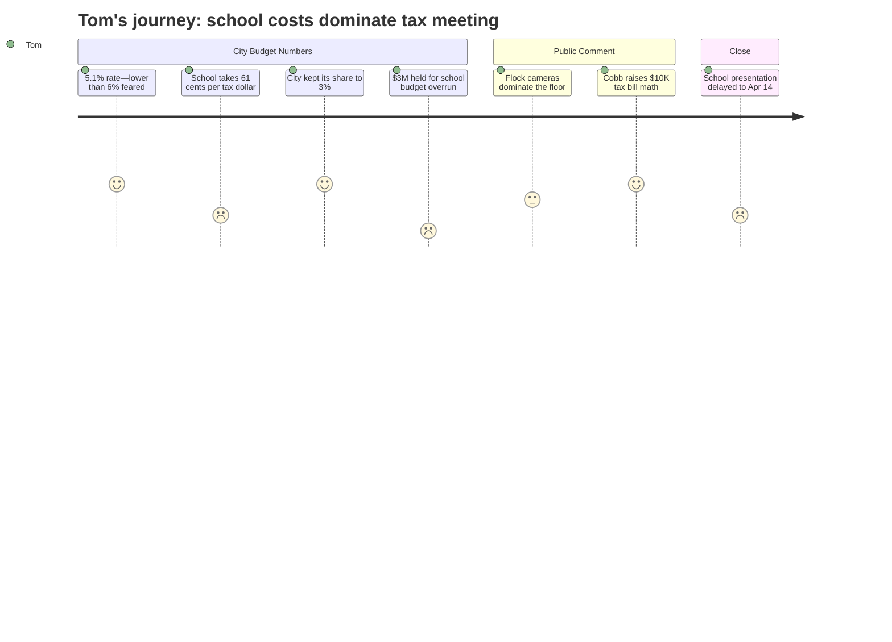

# Interpretation: Tom (PERSONA-006)
## Meeting: City Council Regular Meeting -- April 7, 2026 -- 2026-04-07

---

### Structured Points

#### 1. Overall tax rate lands at 5.1% -- lower than the feared 6%
- **Fact:** The city manager opened with good news: new construction growth reduced the projected overall tax rate increase from 6% to 5.1%. This is not a revaluation -- it reflects actual new building in the city.
- **Source:** Transcript [00:52]
- **Emotional valence:** positive
- **Threat level:** 2
- **Open question:** false

#### 2. The school consumes 61.7 cents of every property tax dollar paid
- **Fact:** Of every $100 in property taxes, $61.70 goes to the school. The school accounts for 55% of the general fund, and on an average $6,540 tax bill, just over $4,000 goes to the schools.
- **Source:** Transcript [24:26] and [13:23]
- **Emotional valence:** negative
- **Threat level:** 3
- **Open question:** false

#### 3. City already set aside $3M because the school is expected to overspend this year's budget
- **Fact:** The finance director set aside $3 million from the city's unassigned fund balance as an anticipated loan to the school department -- roughly $2M in operating overages and $1M in food service -- because the school is projected to exhaust its own fund balance before the fiscal year ends.
- **Source:** Transcript [19:44]
- **Emotional valence:** negative
- **Threat level:** 4
- **Open question:** true -- How did the school arrive at a projected $3M overrun in the current year, and will that figure be explained when the school budget is presented on April 14?

#### 4. The city held its own tax increase to 3% and made real cuts
- **Fact:** The city denied all eight new position requests submitted by departments, cut 2.5 existing positions, deferred a police vehicle purchase, and kept its share of the tax rate increase to 3% -- at the low end of council guidance. This required finding nearly $3.45M in cuts or new revenues.
- **Source:** Transcript [10:17] and [11:49]
- **Emotional valence:** positive
- **Threat level:** 1
- **Open question:** false

#### 5. Average homeowner faces $315 increase on a $456,100 home
- **Fact:** The city manager stated that the average assessed home in South Portland is $456,100, and the proposed FY27 budget translates to a $315 increase (or $297 for homestead-exempt properties), bringing the average bill to $6,540.
- **Source:** Transcript [25:15]
- **Emotional valence:** negative
- **Threat level:** 3
- **Open question:** false

#### 6. Two COVID-funded staff positions are now permanently on the property tax rate
- **Fact:** A communications officer and an upgraded purchasing agent were half-funded through ARPA (COVID relief) money. The city was explicit that FY26 would be the last year of that federal subsidy. Those salary costs now fall fully on taxpayers in FY27.
- **Source:** Transcript [81:26]
- **Emotional valence:** negative
- **Threat level:** 2
- **Open question:** false

#### 7. A resident publicly challenged the city on the trajectory toward a $10,000 tax bill
- **Fact:** Public commenter Ed Cobb stated that at the current rate of 5-6% annual spending growth, which he characterized as roughly double the national inflation rate, average homeowners could face a $10,000 tax bill within 7-8 years -- even without the proposed capital projects for police, fire, and city hall. The city manager's response outlined contributing factors but did not provide a counter-projection.
- **Source:** Transcript [66:41]
- **Emotional valence:** negative
- **Threat level:** 4
- **Open question:** true -- Has the city modeled a long-range tax burden trajectory? The question was left open.

#### 8. The sewer bill is set to rise 22% annually for three years -- separate from property taxes
- **Fact:** The Pearl Street pump station and plant dewatering project will add debt service that the city manager said will require a 22% sewer rate increase in each of the next three years. This was explicitly noted as separate from the property tax bill. The FY27 sewer budget does not yet reflect the full impact.
- **Source:** Transcript [33:55]
- **Emotional valence:** negative
- **Threat level:** 4
- **Open question:** true -- The city acknowledged it will present the full rate impact during the budget process, but no firm number was given.

---

### Journey Map

---

### Reactions

So I sat through the whole meeting last night -- nearly two hours. The city manager led with what he called good news: 5.1% instead of 6%. And look, I'll take it. But let's be clear -- that's still well above inflation, and we've got a $315 hit coming on a house assessed at $456,000. The city's own piece of that is actually pretty modest this year -- 3% -- and the manager deserves credit. He turned down eight new hiring requests, cut two and a half existing positions, deferred a cruiser purchase. That's someone actually trying. The city side of the ledger didn't embarrass me last night.

Here's what I kept coming back to though: the school is 61 cents of every property tax dollar. Sixty-one cents. And before they've even told us what they want to spend next year, the city has already set aside $3 million of its savings to cover what the school is expected to overspend in the *current* year. Not a hypothetical. They plugged it in as a line item. Operating overage of $2 million, food service overage of $1 million. That's the school running out of money before June, and the city holding a cushion just in case. I'd like to know how that happened. We'll see if that gets explained when the school finally presents on the 14th -- because they didn't show up last night. I came to hear about those 78 position cuts, and that whole piece got postponed.

The public comment was mostly about security cameras, which is fine, that's people's right. But a guy named Ed Cobb got up and did the math that I think a lot of us in that room were already doing in our heads: at 5-6% a year, the average homeowner is looking at a $10,000 tax bill inside of a decade. Nobody gave him a real answer. Another fellow, Murphy, asked why we own a golf course. Turns out we can't sell it -- it's locked up by a federal conservation deed from the 1970s -- but at least the golf course pays for itself, I'll give them that. What I won't stop thinking about is that sewer bill coming down the pike. Twenty-two percent a year for three years. That's separate. Doesn't even touch the property tax line. When you add it all up, the city side is behaving. But the school side still hasn't shown its cards.