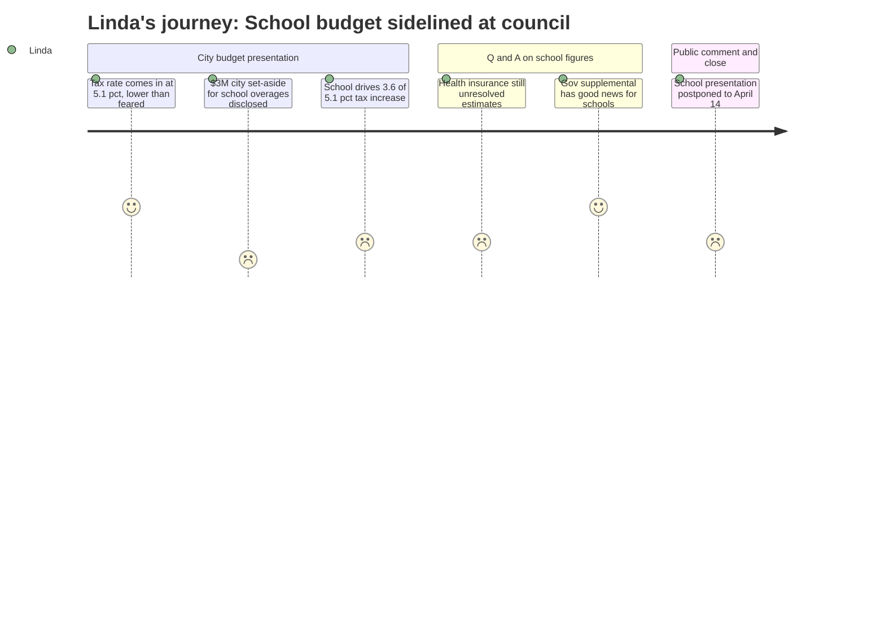

# Interpretation: Linda (PERSONA-007)
## Meeting: City Council Regular Meeting -- April 7, 2026 -- 2026-04-07

### Structured Points

#### 1. City Manager Discloses $3M Anticipated Loan for School Budget Overages
- **Fact:** The city manager stated that $3 million has been set aside from the city's fund balance as an anticipated loan to the school department for current-year overages — approximately $2M in operations and $1M in food service — noting this may be a high estimate but is what has been "plugged in."
- **Source:** Transcript [19:44--20:33]
- **Emotional valence:** negative
- **Threat level:** 4
- **Open question:** true — What is the source of the operating overages, and has the school board been formally briefed on the magnitude? The city manager disclosed this publicly before the board has presented its FY27 budget.

#### 2. School Budget Postponed; Timeline to Referendum Is Now Extremely Compressed
- **Fact:** The school's budget presentation, originally noticed for this meeting, was postponed to April 14. The public hearing and board vote to send the budget to voters is scheduled for May 5, leaving fewer than three weeks between presentation and approval. The voter referendum is June 9.
- **Source:** Transcript [45:43--46:29]; Transcript [107:16--108:02]; Agenda item G.2
- **Emotional valence:** negative
- **Threat level:** 3
- **Open question:** true — Is there enough time between April 14 and May 5 to incorporate council feedback, finalize uncertain line items (health insurance, state aid), and build public understanding before the referendum?

#### 3. School Budget Drives 3.6 of the 5.1 Percentage Points of the Overall Tax Increase
- **Fact:** The city manager's presentation itemized that the school accounts for 3.6% of the 5.1% overall tax rate increase, with the municipal share at 1% and county/metro at roughly 0.5%. The school's share of total property taxes is $61.70 of every $100 collected, with the average homeowner's school bill exceeding $4,000.
- **Source:** Transcript [24:26--25:15]; Transcript [25:15--26:02]
- **Emotional valence:** neutral
- **Threat level:** 3
- **Open question:** false — Linda knows this structural reality, but the explicit public framing of the school as the dominant driver of tax increases will shape the referendum environment.

#### 4. School Health Insurance Premiums Remain Unresolved Estimates
- **Fact:** In response to a council question, the city manager confirmed that the city is locked in at a 10% health insurance increase but that the school is still using estimates. He noted that a 10% increase "for the school would be a lot worse than it is for the city" given the much larger employee population.
- **Source:** Transcript [55:00--55:46]
- **Emotional valence:** negative
- **Threat level:** 3
- **Open question:** true — The board must present April 14 with a budget whose largest non-salary cost driver is still unresolved. How much variance exists in the current estimate, and does it materially change the required cuts or the tax impact?

#### 5. Rev 2 Revenue Sharing and New Growth Bring Overall Rate Down to 5.1%
- **Fact:** South Portland qualified for Rev 2 revenue sharing for the first time in several years, generating approximately $820,000. Combined with new construction growth (~$270,000 in new tax revenue), these factors brought the overall tax rate increase from an initially projected level down to 5.1%. The city manager cautioned that Rev 2 qualification is not guaranteed to recur.
- **Source:** Transcript [00:52--01:38]; Transcript [17:18--18:06]
- **Emotional valence:** positive
- **Threat level:** 1
- **Open question:** true — Rev 2 depends on the mill rate staying above the state threshold. If next year's budget requires smaller increases, the district could lose that $820K.

#### 6. Governor's Supplemental Budget Contains Unquantified Good News for Schools
- **Fact:** In response to a council question about whether the governor's recently passed supplemental budget contained new revenue for the city, the city manager said "no" for the municipal side but confirmed there is "good news" for schools specifically. No dollar figure or mechanism was described.
- **Source:** Transcript [57:21--58:07]
- **Emotional valence:** positive
- **Threat level:** 1
- **Open question:** true — What is the actual dollar amount and does it materially affect the $7.2M structural gap? This figure needs to be in the April 14 presentation.

#### 7. City Fund Balance Drops to 12.8% — Barely Above Policy Floor — Partly Due to School Set-Aside
- **Fact:** After accounting for the $3M school overage set-aside, city fund balance drops to $17.1M, or 12.8% of proposed expenditures — just above the 9–12% policy floor. The city manager explicitly flagged that if the school budget increases further, the fund balance percentage could fall to the edge of the required range.
- **Source:** Transcript [20:33--21:20]
- **Emotional valence:** negative
- **Threat level:** 2
- **Open question:** false — The causal link is clear: school overages are already straining the city's fiscal cushion, and this is documented in a public presentation.

---

### Journey Map

---

### Reactions

Good news first, and there actually is some: the overall rate came in at 5.1 instead of the 6 we were dreading. That's real — Rev 2 revenue sharing came through for the first time in years, about $820K, plus some new construction growth. And apparently the governor's supplemental budget has good news for schools specifically, though nobody said what the number is. That is the first thing I'm tracking down tomorrow, because if it changes the gap figure, we need to know before we set foot in front of that council on the 14th.

But here is what I cannot stop thinking about. Scott stood up tonight and told the full city council — on the record, in a public meeting — that the city has set aside $3 million from its own fund balance because it expects us to overshoot our budget this year. Two million in operations, a million in food service. And he said that out loud before we have even presented our FY27 budget. That is the story. That is what people are going to remember going into the referendum. And when I sat there listening, my honest reaction was: do we have a clean accounting of where those overages actually are? Because if we go in on the 14th and can't explain them clearly, we're handing critics a narrative we cannot walk back. The city's own fund balance is now sitting at 12.8%, barely above the policy floor, partly because of us. That is not an abstraction. That has to be part of how we explain ourselves.

The other piece is the health insurance numbers. The city is locked in at 10%. We're still estimating. Scott even said it himself — 10% for us hurts a lot more than it does for the city, given our employee count. And we have to present a credible, defensible budget in eight days, then get it to voters by May 5th, and go to referendum June 9th. That timeline was already tight. With unresolved health insurance figures and a current-year overage that's now public knowledge, it is very tight. This is the year we needed to walk in with everything buttoned up. Right now, we're not there.