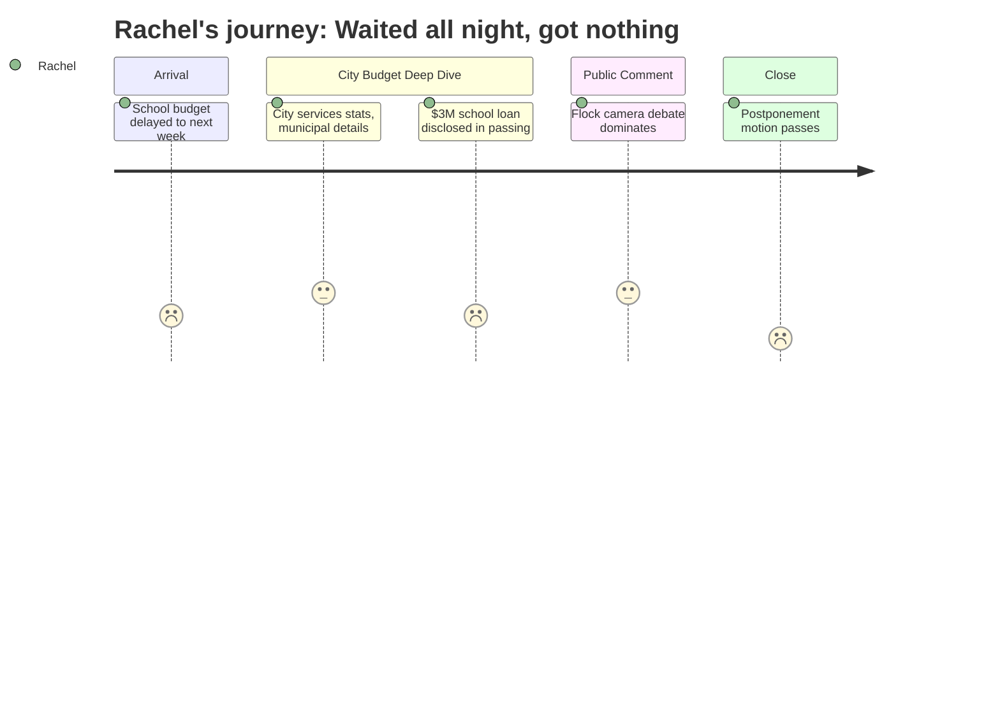

# Interpretation: Rachel (PERSONA-008)
## Meeting: City Council Regular Meeting -- April 7, 2026 -- 2026-04-07

---

### Structured Points

#### 1. School Budget Presentation Pulled from Tonight's Agenda
- **Fact:** The school superintendent's budget presentation was not delivered at this meeting. The city manager confirmed at the very start that the school department "tentatively will be presenting their share of the budget, not tonight, but next week." A motion to formally postpone was passed at the end of the meeting, rescheduling the school presentation to April 14.
- **Source:** Transcript [00:05] and [107:16--108:02]
- **Emotional valence:** negative
- **Threat level:** 2
- **Open question:** true

#### 2. 42 Teachers Among 78 Positions Proposed for Elimination
- **Fact:** The proposed FY27 school budget includes the elimination of 78 positions -- 12% of total staff -- including 42 teachers, 16 ed techs, 14 facilities/food/transport staff, 2 administrators, and 4 non-bargaining employees.
- **Source:** Fiscal context: FY27 budget figures
- **Emotional valence:** negative
- **Threat level:** 5
- **Open question:** true

#### 3. Elementary Enrollment Has Fallen 23% in Four Years
- **Fact:** Elementary enrollment dropped from 1,401 to 1,080 students over the past four years -- a decline of 23%. This is the number the district will use when making the case that current building configurations are no longer sustainable.
- **Source:** Fiscal context: FY27 budget figures
- **Emotional valence:** negative
- **Threat level:** 4
- **Open question:** true

#### 4. School District Is Already Over Budget This Year -- City Prepared a $3M Loan
- **Fact:** The city manager disclosed that the finance director has set aside $3 million as "an anticipated loan to the school department, due to an anticipated budget overage that they'll have to close out this current budget year" -- roughly $2M in operating overages and $1M in food service. The school fund balance is expected to be depleted entirely before the FY27 budget even begins.
- **Source:** Transcript [19:44--20:33]
- **Emotional valence:** negative
- **Threat level:** 4
- **Open question:** false

#### 5. School Board Has Not Yet Voted on a Budget to Send to the Council
- **Fact:** The city manager noted that the school budget numbers he referenced are "as of March 23rd" and that "the school board hasn't actually voted yet to approve a budget to send to the council, so that's also to be taken with a grain of salt."
- **Source:** Transcript [01:38]
- **Emotional valence:** neutral
- **Threat level:** 2
- **Open question:** true

#### 6. Schools Account for 61% of Every Property Tax Dollar
- **Fact:** The city manager stated explicitly: "when you pay $100, every $100 of the property tax bill that you pay, the school gets $61.70." For the average South Portland home valued at $456,100, just over $4,000 of the $6,540 tax bill goes to the school. This framing sets up the school budget as the dominant political target in every conversation about tax relief.
- **Source:** Transcript [24:26--25:15]
- **Emotional valence:** neutral
- **Threat level:** 3
- **Open question:** false

#### 7. State Funding Covers Only 20% of Actual School Costs -- Gap Is Structural, Not Local
- **Fact:** State education funding covers approximately 20% of South Portland's actual school costs, against an expected contribution of 55%. This gap -- roughly 35 percentage points of shortfall -- is the structural driver of the $7.2M budget crisis, not local spending decisions.
- **Source:** Fiscal context: FY27 budget figures
- **Emotional valence:** neutral
- **Threat level:** 3
- **Open question:** false

#### 8. School Budget Referendum Is June 9 -- Voters Have a Direct Vote
- **Fact:** The city manager's timeline slide confirms a June 9 school budget referendum in which South Portland voters will give an up-or-down vote on the school budget. This is the mechanism through which the community has a direct check on what the school board proposes.
- **Source:** Transcript [45:43--46:29] and Agenda, item G.2 budget timeline
- **Emotional valence:** positive
- **Threat level:** 1
- **Open question:** false

---

### Journey Map

---

### Reactions

"So I went to that city council meeting tonight because I thought we were finally going to hear the actual school budget -- like, the numbers, the plan, which schools, which teachers. And literally in the first thirty seconds, the city manager says the school presentation isn't happening tonight, it's next week. I could have stayed home. I sat through almost two hours of golf course mowers and license plate cameras and sewer pipe replacements for nothing.

Here's the part that's actually keeping me up right now though: the city manager mentioned almost in passing that they've already set aside three million dollars to loan to the schools because the district is going to be over budget THIS year before FY27 even starts. The fund balance is gone. And then in the background numbers I looked up, there are 42 teachers on the proposed cut list. Forty-two. My kid has three teachers between homeroom and specials. I have no idea if any of them are on that list. I have no idea if the plan involves moving kids between buildings because elementary enrollment dropped 23% over four years -- that's the number they always cite right before they say a school isn't 'viable' anymore. And we're not getting any of those specifics until next week at the earliest, because the school board hasn't even voted on a budget yet.

The one thing I'm holding onto is that there's a June 9 referendum -- voters actually get to say yes or no on the school budget. That's not nothing. But between now and then, the timeline is really tight and I need to actually be at the April 14 meeting because that's when the school presents. I'm putting it in my calendar right now. And I need to find out what other parents know, because I am not going to be the person who finds out her kid's teacher got cut -- or her kid's school got consolidated -- from a Facebook post the week before it happens."