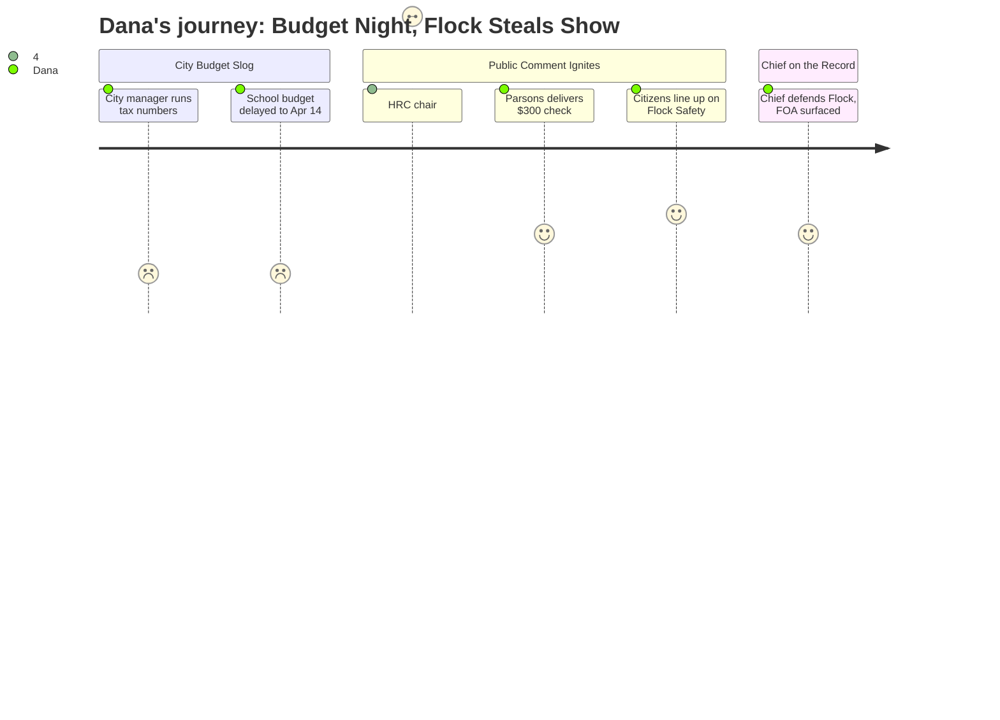

# Interpretation: Dana (PERSONA-009)
## Meeting: City Council Regular Meeting -- April 7, 2026 -- 2026-04-07

---

### Structured Points

#### 1. School Budget Not Presented Tonight -- April 14 Is the Date
- **Fact:** The superintendent's school budget presentation was postponed from April 7 to April 14. The city manager noted at the opening that "the school department tentatively will be presenting their share of the budget, not tonight, but next week." Council voted unanimously to postpone the public hearing on the school portion.
- **Source:** [00:05--00:52] and [107:16--108:02]
- **Emotional valence:** negative
- **Threat level:** 2
- **Open question:** true

#### 2. Flock Safety Surveillance Cameras Dominate Public Comment
- **Fact:** Four members of the public -- along with the Human Rights Commission chair -- each raised concerns about the police department's Flock automated license plate reader system. Speakers raised issues including potential ICE access, use against protesters, and Flock's record in other jurisdictions. The police chief responded at length from the floor, defending the technology and offering to show anyone the audit logs in his office.
- **Source:** [58:07--104:52] (Pedro Vazquez, Lucy Perkins, Olivia Westfall, Alex Redfield public comments; Police Chief Dan Hart response)
- **Emotional valence:** positive
- **Threat level:** 4
- **Open question:** true

#### 3. ACLU FOA Request Pending Five Months -- Waiting on a Check
- **Fact:** Resident Alex Redfield raised a Freedom of Access Act request submitted by the ACLU of Maine on November 5, 2025, seeking information about the police department's relationship with Flock Safety. As of the meeting, the request had not been processed. The city manager explained that as of March 30, the city was still waiting for payment from the requester before beginning document review.
- **Source:** [74:27--75:14] (Redfield public comment); [104:05--104:52] (city manager response)
- **Emotional valence:** negative
- **Threat level:** 3
- **Open question:** true

#### 4. Data Retention: Contract Language vs. Maine Law
- **Fact:** Resident Alex Redfield stated that the Flock contract obtained through a separate FOA request "implies that data can be held for 30 days," while Maine state law requires individual data be held no more than 21 days. The police chief, responding to a council question, said: "The information that we gather from these plate readers are kept for 21 days. That's Maine state law. That's law. That's what we do."
- **Source:** [75:14--76:02] (Redfield public comment); [93:06--93:51] (Chief Hart response)
- **Emotional valence:** negative
- **Threat level:** 4
- **Open question:** true

#### 5. HRC Chair Frames Budget as a Fairness Question, Not Just a Numbers Question
- **Fact:** Human Rights Commission Chair Pedro Vazquez told the council: "Right now, parts of our community are experiencing fear, withdrawal, and uneven access to public systems. There's reduced participation in civic life." He asked the council to consider "not only whether the budget is balanced, but whether it is experienced as fair," and specifically requested additional public review before the Flock camera line item is adopted.
- **Source:** [58:07--62:01]
- **Emotional valence:** positive
- **Threat level:** 3
- **Open question:** false

#### 6. Carlton Parsons Hands a $300 Check to the City at the Podium
- **Fact:** Resident Carlton Parsons delivered a personal $300 check made out to the city at the public comment podium, framing it as a symbolic demonstration of what a progressive revenue strategy could accomplish if replicated across South Portland's nearly 30,000 residents. He argued the city was on a path of firing public workers while ignoring structural revenue alternatives.
- **Source:** [62:47--65:56]
- **Emotional valence:** positive
- **Threat level:** 2
- **Open question:** false

#### 7. "War in Iran" Named as a Live Budget Risk
- **Fact:** Councilor Walker asked the city manager how fuel and food price volatility from "the war in Iran" had been factored into budget projections. The city manager acknowledged it had not been fully incorporated due to budget timing and said affected line items like paving would simply result in "less paving this year."
- **Source:** [55:46--57:21]
- **Emotional valence:** negative
- **Threat level:** 3
- **Open question:** true

---

### Journey Map

---

### Reactions

Okay so here's my pitch. The school budget was supposed to be tonight and it wasn't. They pushed it to April 14, which is fine -- that's actually when we want to be there anyway, 78 positions on the chopping block including 42 teachers, parents in the room, that's the story. Tonight was going to be nothing and then public comment happened. Four people and the Human Rights Commission chair all got up and went after these Flock Safety cameras the police have been running. That's the license plate reader company -- controversial, other cities dropping them. And one of the speakers came with receipts: he said the city's own Flock contract implies 30-day data retention and Maine law says 21. The chief got up and said no, we do 21, but nobody in that room saw the contract. That's a live discrepancy and nobody resolved it. Also there's an ACLU records request that's been sitting five months and the city's excuse is they were waiting for the requester to send a check before they'd start processing it. On camera that sounds like a slow-roll even if it's just paperwork.

The visual story is the HRC chair -- Pedro Vazquez -- he was articulate and measured, no shouting, just: "Is this budget experienced as fair?" That's a clean soundbyte. And there's a guy named Parsons who walked up to the podium and literally handed a $300 personal check to the city as a political prop to make a point about revenue generation. That is b-roll. That is the anchor toss right there. The Flock angle ties it together: city spending money on surveillance cameras while cutting teachers next week, immigrants in the community pulling back from public life, and a records request that took five months to not process.

April 14 is when I send the crew. School presentation, union teachers, parents who are going to be angry. I can set it up with a :20 on Flock tonight if we have anything in archive, then go long on the teacher cuts next Tuesday. I want Pedro Vazquez's number and I want to call the ACLU of Maine contact that Westfall mentioned -- she said they've been researching ALPR cameras statewide. That's my outside voice for the school/surveillance double-header.