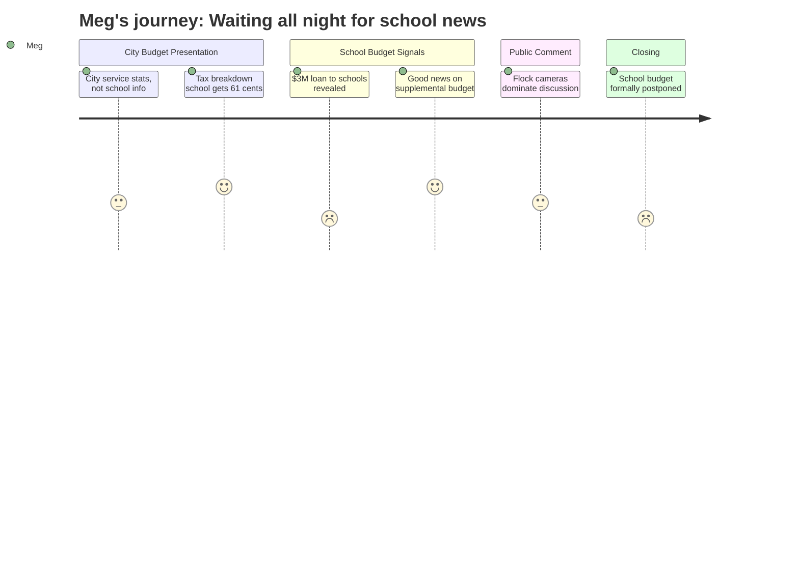

# Interpretation: Meg (PERSONA-011)
## Meeting: City Council Regular Meeting -- April 7, 2026 -- 2026-04-07

### Structured Points

#### 1. School Budget Not Presented Tonight — Postponed to April 14
- **Fact:** The school budget portion of the public hearing was postponed to April 14. The city manager noted at the very top of the meeting that the school department "tentatively will be presenting their share of the budget, not tonight, but next week." A formal motion to postpone was passed at the end of the meeting.
- **Source:** [00:05] and [107:16--108:02]
- **Emotional valence:** negative
- **Threat level:** 2
- **Open question:** true

#### 2. City Is Setting Aside $3M Expecting Schools to Overspend Current Budget
- **Fact:** The city manager disclosed that the city's finance director has set aside $3 million as an anticipated loan to the school department due to an expected current-year budget overage — approximately $2 million in their operating budget and $1 million in food service. He noted this reduces the city's unassigned fund balance and called it a "high estimate" but one they are planning for.
- **Source:** [19:44--20:33]
- **Emotional valence:** negative
- **Threat level:** 4
- **Open question:** true

#### 3. School Gets $61.70 of Every $100 in Property Taxes — Average Home Pays $4,000+ to Schools
- **Fact:** The city manager stated that of every $100 in property taxes, the school receives $61.70. For the average South Portland home (valued at $456,100), just over $4,000 of the total $6,540 tax bill goes to the school department. The school's share of the proposed overall 5.1% tax rate increase amounts to a 3.6% increase on its own.
- **Source:** [24:26--26:02]
- **Emotional valence:** neutral
- **Threat level:** 3
- **Open question:** false

#### 4. Overall Tax Increase Better Than Expected: 5.1% Instead of 6%
- **Fact:** The city manager opened with good news: new construction growth updated the valuation numbers, bringing the proposed overall tax rate increase down from 6% to 5.1%. He cautioned the final number won't be confirmed until the assessor completes work in late July, and it could go lower if more value is found.
- **Source:** [00:52--01:38]
- **Emotional valence:** positive
- **Threat level:** 1
- **Open question:** false

#### 5. School Budget Numbers in Tonight's Presentation Are More Current Than the Budget Books
- **Fact:** The city manager stated that the school budget figures used in his presentation were updated as of March 23 — more recent than the printed budget books distributed to councilors. He added a significant caveat: "the school board hasn't actually voted yet to approve a budget to send to the council, so that's also to be taken with a grain of salt."
- **Source:** [01:38--02:25]
- **Emotional valence:** neutral
- **Threat level:** 2
- **Open question:** true

#### 6. Flock Safety Cameras: ICE Access Question, 5-Month FOIA Delay, Chief Responds
- **Fact:** Multiple community members raised concerns about the police department's use of Flock Safety license plate reader cameras, specifically the risk of ICE accessing the data. The police chief stated that no outside agency can access the cameras or data without his explicit approval, that data is retained 21 days per Maine law, and that all searches are logged and audited. A resident noted the ACLU submitted a FOIA request in November 2025 that has not yet been processed; the city manager explained the ACLU has not yet sent the required processing fee as of March 30.
- **Source:** [89:52--104:52]
- **Emotional valence:** negative
- **Threat level:** 3
- **Open question:** true

#### 7. Governor's Supplemental Budget Has "Good News" for School Funding — No Details Given
- **Fact:** When Councilor West asked whether the governor's recently passed supplemental budget contained any revenue that might benefit the city, the city manager confirmed there was "some good news" in it for the school — but provided no specifics. The school budget presentation where those details would presumably appear was the one postponed to April 14.
- **Source:** [57:21--58:07]
- **Emotional valence:** positive
- **Threat level:** 1
- **Open question:** true

### Journey Map

### Reactions

ok so first thing: school budget is NOT tonight. postponed to april 14. the city manager said it at the very start — superintendent is presenting next week, not now. so if you tuned in for that, same, and we're coming back tuesday the 14th. sorry.

that said — there was one number buried in the city manager's presentation that i haven't seen discussed anywhere and it kind of stopped me. he said the city's finance director has set aside $3 million as a loan they're *expecting* to give the school department because the schools are projected to overspend their current budget. $2M in their operating budget, another $1M in food service. he said he hopes it's a high estimate. but they've already budgeted for it. this is this school year's money being talked about, not FY27. that's new information and it matters. if anyone has more context on that i'd love to hear it before the 14th.

the other things worth knowing: the overall tax rate increase came in at 5.1% instead of the 6% they were projecting — new construction growth helped. of every $100 you pay in property taxes, $61.70 goes to the school. for the average home that's just over $4,000 of your total $6,540 bill. the rest of the meeting was dominated by questions about Flock Safety license plate cameras — the police chief said no outside agency (including ICE) can access the data without his sign-off, and all searches are logged. a resident flagged that an ACLU records request from november still hasn't been processed; city manager said the ACLU hasn't paid the processing fee yet to get it started. chief said come to his office and he'll pull up the logs for anyone who wants to see them. that part of the meeting ran long. april 14 is the one to watch.