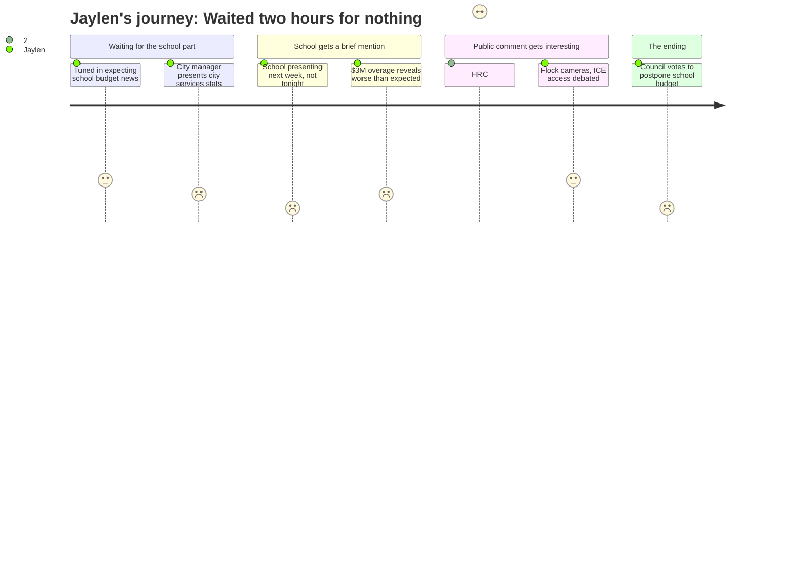

# Interpretation: Jaylen (PERSONA-012)
## Meeting: City Council Regular Meeting -- April 7, 2026 -- 2026-04-07

### Structured Points

#### 1. School budget wasn't even on the table tonight
- **Fact:** The city manager opened by announcing the school department would not present its budget at this meeting — that presentation was moved to April 14. The entire meeting was devoted to the municipal side.
- **Source:** Transcript [00:05] — "the school department tentatively will be presenting their share of the budget, not tonight, but next week."
- **Emotional valence:** negative
- **Threat level:** 3
- **Open question:** true

#### 2. The school board hasn't even voted on a final budget yet
- **Fact:** The city manager noted that the school budget numbers he was referencing were from March 23 — two weeks old — and explicitly cautioned that "the school board hasn't actually voted yet to approve a budget to send to the council."
- **Source:** Transcript [01:38]
- **Emotional valence:** negative
- **Threat level:** 3
- **Open question:** true

#### 3. Schools are already running over budget this year by an estimated $3 million
- **Fact:** The city's finance team set aside $3 million as an anticipated loan to the school department to cover an expected overage — approximately $2 million in the operating budget and $1 million in food service. The city manager described this as money they "can't spend" because the school may need it.
- **Source:** Transcript [19:44]
- **Emotional valence:** negative
- **Threat level:** 4
- **Open question:** true

#### 4. $61.70 of every $100 in property taxes goes to schools — and the total bill is going up
- **Fact:** The city manager stated that of every $100 in property taxes, $61.70 goes to the school department. For the average homeowner, that's roughly $4,000 of a $6,540 tax bill — and the overall rate is rising 5.1% this year.
- **Source:** Transcript [24:26]
- **Emotional valence:** neutral
- **Threat level:** 2
- **Open question:** false

#### 5. The school budget vote is June 9 — and Jaylen can't vote in it
- **Fact:** The city manager laid out the full budget timeline. The school budget referendum — where voters give an up-or-down decision — is scheduled for June 9, 2026.
- **Source:** Transcript [46:29]
- **Emotional valence:** negative
- **Threat level:** 4
- **Open question:** false

#### 6. Multiple community members raised fears that Flock cameras could be used by ICE to track people
- **Fact:** Several public commenters — including the Human Rights Commission chair, Pedro Vazquez, and three individual residents — urged the council to scrutinize the police department's $21,500 budget request to expand its network of Flock license plate readers. A core concern was whether ICE or other federal agencies could access the data. The police chief defended the cameras and stated no outside agency can access data without the department's consent.
- **Source:** Transcript [58:55]–[104:52]
- **Emotional valence:** negative
- **Threat level:** 3
- **Open question:** true

#### 7. The HRC chair described community members pulling back from public life out of fear
- **Fact:** Pedro Vazquez, speaking as chair of the South Portland Human Rights Commission, said parts of the community are currently "experiencing fear, withdrawal, and uneven access to public systems" and noted "reduced participation in civic life." He framed this as the context in which budget decisions — including surveillance technology — take on extra weight.
- **Source:** Transcript [59:43]–[60:28]
- **Emotional valence:** negative
- **Threat level:** 3
- **Open question:** true

#### 8. One small piece of good news: the tax increase came in lower than expected
- **Fact:** The city manager opened with a positive update: due to new construction growth, the projected overall tax rate increase dropped from 6% to 5.1%. He noted this number could still decrease before being finalized in late July.
- **Source:** Transcript [00:52]
- **Emotional valence:** positive
- **Threat level:** 1
- **Open question:** false

---

### Journey Map

---

### Reactions

So I stayed up watching this whole city council meeting because it was supposed to be the public hearing on the school budget. Two hours. And they didn't even do the school part. The city manager literally said in the first minute that the school wasn't presenting tonight — it's next week on the 14th. So everything I actually wanted to know about, the teacher cuts, theater, AP classes, none of it came up. Instead I watched like 45 minutes about potholes and sewer pipes and some guy complaining about the golf course. The city manager did drop one thing that stuck with me though: he mentioned the city is already setting aside three million dollars because the school is probably going to overdraw their budget this year, like before next year's budget even starts. That's not how a healthy situation looks.

The part that actually got me paying attention again was when people came up during public comment to talk about these Flock cameras the police department has. Turns out there are these license plate reader cameras all over the city — at the mall, on 295, near Crockett's Corner — and the police want to add more. A bunch of people came up freaked out about ICE being able to use the data to track people. The HRC chair, this guy Pedro Vazquez, said something that hit different: he talked about how right now parts of the community are "experiencing fear and withdrawal" and pulling back from public life. I thought about some kids at school. That's not abstract to me. The police chief came up and basically said the cameras are totally fine and they've been using them since 2010, but then someone pointed out that the ACLU put in a records request five months ago and still hasn't gotten an answer. The city manager said oh they're just waiting for the check from the ACLU to process it. Fine. Maybe. But that's a weird detail to not have sorted out before a budget meeting.

The thing that's genuinely going to bother me is the June 9th referendum. That's when voters decide whether the school budget passes. I will be 16 years old on June 9th. I cannot vote. My parents can vote. Random homeowners with no kids in South Portland schools can vote. But me — the person who is literally at SPHS every day, who will be a senior next year, who needs to know if my AP classes and theater program are still funded — I get zero say. And all of this is happening while the actual school budget still hasn't been finalized and the board hasn't even voted on it yet. I still don't know which 42 teachers they're cutting. I don't know if that's my AP Bio teacher or the theater director or my cross-country coach. None of that was answered tonight, and April 14th can't come fast enough.