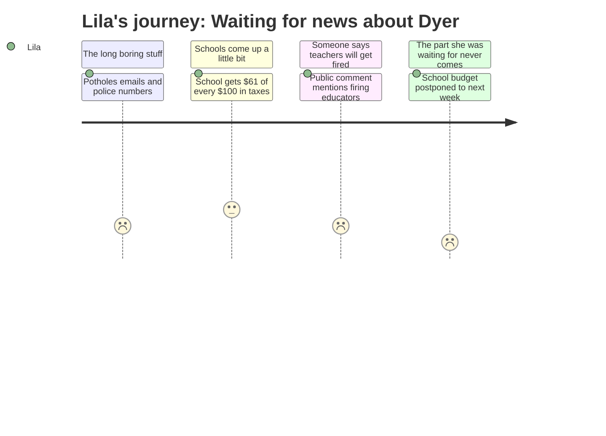

# Interpretation: Lila (PERSONA-014)
## Meeting: City Council Regular Meeting -- April 7, 2026 -- 2026-04-07

### Structured Points

#### 1. The school part never happened
- **Fact:** The school budget presentation was not given at this meeting. The city manager stated at the very start that the school department "tentatively will be presenting their share of the budget, not tonight, but next week." At the end of the meeting, the council voted to officially postpone the school public hearing to April 14.
- **Source:** [00:05] and [107:16--108:02]
- **Emotional valence:** negative
- **Threat level:** 3
- **Open question:** true

#### 2. A person at the microphone said teachers are going to get fired
- **Fact:** A community member named Carlton Parsons spoke during public comment and stated there is "a plan to fire some of our best educators in the state and raise our unemployment rate."
- **Source:** [63:34]
- **Emotional valence:** negative
- **Threat level:** 4
- **Open question:** true

#### 3. Schools get most of the tax money — which is why adults are stressed
- **Fact:** The city manager explained that of every $100 paid in property taxes, $61.70 goes to the schools. The school budget makes up 55% of the general fund. For an average South Portland home, just over $4,000 of the total tax bill goes to schools.
- **Source:** [24:26] and [25:15]
- **Emotional valence:** neutral
- **Threat level:** 2
- **Open question:** false

#### 4. The district is already running out of money this year — before next year even starts
- **Fact:** The city manager disclosed that the city set aside $3 million as an anticipated loan to the school department because the schools are expected to overspend their current budget — approximately $2 million in operating costs and $1 million in food service.
- **Source:** [19:44--20:33]
- **Emotional valence:** negative
- **Threat level:** 3
- **Open question:** true

#### 5. There might be some good news coming from the state for schools
- **Fact:** A councilor asked whether the governor's recently passed supplemental budget contained revenue for the city. The city manager confirmed: "For the school, there was some good news in that budget."
- **Source:** [57:21--58:07]
- **Emotional valence:** positive
- **Threat level:** 1
- **Open question:** true

#### 6. The school board hasn't even voted on the budget yet
- **Fact:** The city manager noted that the school budget numbers presented were as of March 23, and added: "The school board hasn't actually voted yet to approve a budget to send to the council, so that's also to be taken with a grain of salt."
- **Source:** [01:38]
- **Emotional valence:** neutral
- **Threat level:** 2
- **Open question:** true

#### 7. Parents can still speak at next week's meeting
- **Fact:** Before closing public comment, the council confirmed that because the school budget portion was postponed, public comment on the school budget remains open and will be heard at the April 14 meeting.
- **Source:** [79:52--80:41] and [107:16]
- **Emotional valence:** positive
- **Threat level:** 1
- **Open question:** false

---

### Journey Map

---

### Reactions

My mom and dad came home from the meeting and they looked really tired and kind of mad, and I asked them what happened about Dyer and my dad was like "they didn't even do it, they moved it to next week" and I didn't understand because WHY would you have a meeting about the school and then not talk about the school? Like that doesn't even make sense. They talked about potholes and emails and stuff for a really long time and then they just said come back next week. My mom said "we have to go to ANOTHER one" and she sounded really frustrated and I felt bad but also I wanted to know what she found out.

The part that scared me the most was when my dad told me someone at the microphone said they want to fire "some of the best teachers." Like are they going to fire MY teacher? She's been my teacher for two years because we have this special thing called looping and she knows everything about me and she knows I like to draw and she lets me draw when I finish early. What if they fire her? My dad said he doesn't know whose teachers they're talking about yet. That's the thing — nobody knows anything yet and all the adults just keep saying "we'll find out next week" and then next week comes and it's still next week.

The only okay thing my mom said was that someone said there might be some extra money coming from the governor which is good for schools, but she didn't know if it was enough to keep Dyer open or what it even meant for us. I asked her if it meant Dyer wasn't closing and she said she didn't know. I don't understand why no one just tells us yes or no. My friend Margot's mom told Margot's older sister that "it's already decided" but then my parents went to this meeting and nobody said anything about it at all. I drew a picture of my classroom last night. I don't want to go to a different school.