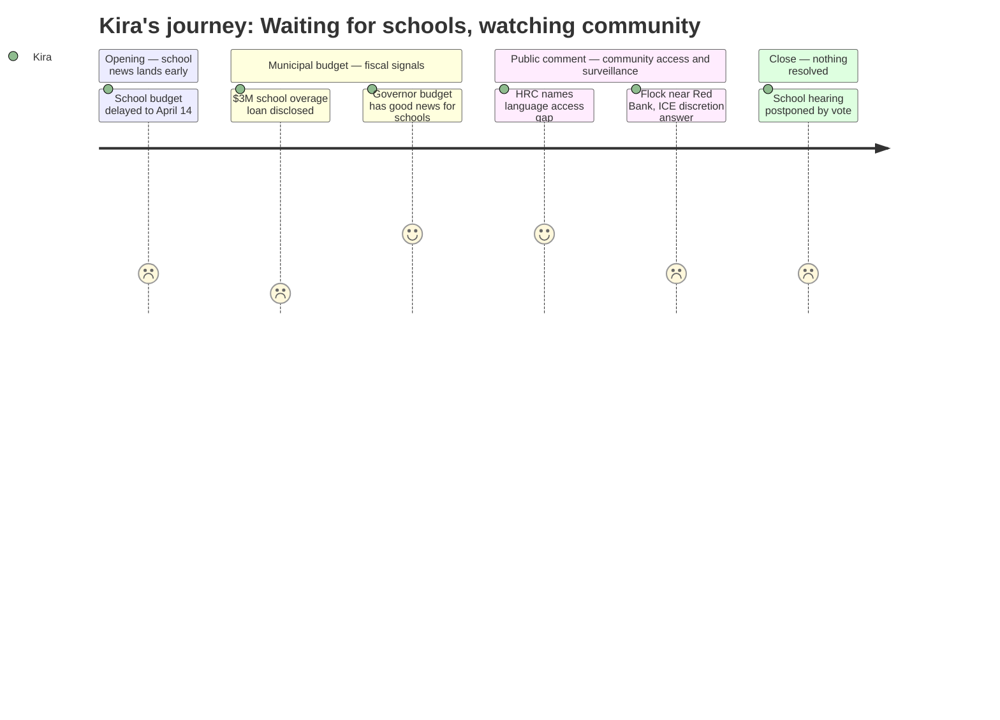

# Interpretation: Kira (PERSONA-015)
## Meeting: City Council Regular Meeting -- April 7, 2026 -- 2026-04-07

### Structured Points

#### 1. School Budget Presentation Postponed Before It Began
- **Fact:** The city manager announced in his opening remarks that the school budget presentation — listed on the agenda for this night — would not happen. The superintendent's presentation was moved to April 14, leaving only the municipal budget to be heard. The council voted to postpone the public hearing on the school budget portion to that date.
- **Source:** [00:05] city manager opening remarks; [107:16] motion to postpone
- **Emotional valence:** negative
- **Threat level:** 2
- **Open question:** true

#### 2. The District Is Already Running a $3M Overage This Year
- **Fact:** The city manager disclosed that the city has set aside $3 million in fund balance as an anticipated loan to the school department for a current-year budget overage — roughly $2 million in operating costs and $1 million in food service. He described it as a high estimate but something finance could not ignore.
- **Source:** [19:44]
- **Emotional valence:** negative
- **Threat level:** 4
- **Open question:** true

#### 3. HRC Names the Gap Between Surveillance Investment and Participation Infrastructure
- **Fact:** Pedro Vazquez, speaking as HRC chair, told the council that the budget strengthens enforcement systems faster than it builds participation infrastructure — specifically naming language access and community engagement as areas where investment has not kept pace. He framed the gap as a human rights concern, not a policy preference.
- **Source:** [58:07]–[62:01]
- **Emotional valence:** positive
- **Threat level:** 1
- **Open question:** false

#### 4. Flock Camera Placed Near Red Bank; ICE Access Depends on Chief's Discretion
- **Fact:** Chief Hart confirmed that one of the seven Flock license plate reader cameras is positioned near the Crockett's Corner / Red Bank area, selected because it is a major city entry point. When asked whether ICE could access the data, he replied: "Could ICE reach out to me and say, 'Hey, we want to see that camera footage'? Then it's got to go through me." He characterized his own approval as the primary safeguard against federal access.
- **Source:** [97:44]; [103:17]
- **Emotional valence:** negative
- **Threat level:** 4
- **Open question:** true

#### 5. FOIA Request for Flock Audit Logs Has Been Stalled Five Months — Over an Unpaid Check
- **Fact:** A community member noted that the ACLU submitted a Freedom of Access request in November 2025 for the Flock contract and communication logs. The city manager reported that as of March 30, the city was still waiting for the requester's payment before processing the request. The chief said he was unaware of the request until that night.
- **Source:** [74:27]; [104:52]
- **Emotional valence:** negative
- **Threat level:** 2
- **Open question:** true

#### 6. Governor's Supplemental Budget Contains Good News for Schools
- **Fact:** When Councilor West asked whether the governor's recently passed supplemental budget contained any new revenue for the city, the city manager confirmed there was "some good news" specifically for the school side, though details were not provided at the meeting.
- **Source:** [57:21]
- **Emotional valence:** positive
- **Threat level:** 1
- **Open question:** true

#### 7. School Board Has Not Yet Voted on Its Own Budget
- **Fact:** The city manager noted that the school budget numbers he was working from were as of March 23 — and cautioned that the school board had not yet voted to approve a budget to send to the council. This means the figures in the budget books distributed to councilors are already outdated, and the timeline to June 9 referendum is running.
- **Source:** [01:38]
- **Emotional valence:** neutral
- **Threat level:** 3
- **Open question:** true

---

### Journey Map

---

### Reactions

So the school budget wasn't even presented. I sat through an hour and forty minutes of golf course mower financing and sewer rate comparisons and the school portion got punted to next week. I get that the school board hasn't voted yet — the city manager said as much right at the top. But it means another week of not knowing what happens to the kids on my caseload at three different buildings. Another week of my colleagues texting me asking what I've heard. The timeline to June 9 is already tight, and we're burning days.

The thing that actually kept me up was the Flock camera placement. The chief said the Crockett's Corner location was chosen because it's a gateway into the city — and then said in the same breath that yes, ICE could ask for that data and the safeguard is that it would "have to go through him." One person. That is the safeguard. I know the families at Red Bank. I service two of those schools. Those parents were already not showing up to IEP meetings this spring because they are scared. What Pedro said at the public comment was exactly right — we are investing in enforcement infrastructure faster than we're investing in the trust infrastructure that makes families actually engage with schools. You can't have a functional MTSS process when the parents of your highest-need kids won't come in the building. That's not a hypothetical. That's my Tuesday.

And then the $3 million. The city manager said, basically in passing, that they've set aside three million dollars because they expect the school district to run out of its own fund balance before the fiscal year ends. Two million in operating, one million in food service. That is not a footnote. That is a signal about the structural hole we're actually in — and we haven't even seen the FY27 budget presented yet. Whatever good news is buried in the governor's supplemental, it is not going to close that gap. I want to know what blew the operating budget this year before I can trust any of the numbers for next year. Nobody asked that question tonight, and nobody answered it.