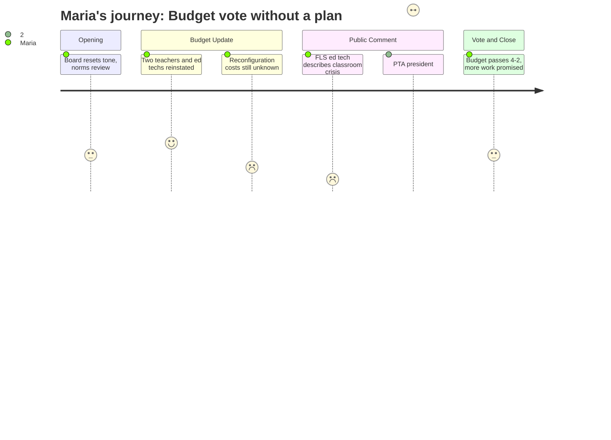

# Interpretation: Maria (PERSONA-001)
## Meeting: School Board Regular Meeting -- April 7, 2026 -- 2026-04-07

### Structured Points

#### 1. Two Classroom Teachers and Two Ed Techs Coming Back
- **Fact:** Because health insurance came in at 5.14% instead of the 11.5% placeholder, the district freed up roughly $655,000. Of that, 36% was allocated toward reinstating two elementary classroom teachers and 18% toward two special education ed techs. Both sets of positions are one-year only and tied to Article 18 recall provisions.
- **Source:** [25:09--26:41]; Special Budget Meeting 4.7.26 slides, "Allocation Proposal Details"
- **Emotional valence:** positive
- **Threat level:** 2
- **Open question:** true — "One-year only" means these positions could disappear again next budget cycle. Is this a real fix or just a one-year hold?

#### 2. Reconfiguration Costs Are Unknown -- and the Board Voted Anyway
- **Fact:** Board Member Richardson pressed for a clear cost estimate on reconfiguration multiple times during the meeting. The administration acknowledged it had not prepared a slide on full reconfiguration costs, that bathroom compliance requirements and teacher movement logistics were still unquantified, and that original estimates ranged from $60,000 to $125,000 depending on the scenario -- before any of this year's scope was added. The board voted 4-2 to advance the budget to city council without those numbers resolved.
- **Source:** [39:12--41:32]; [201:39--202:27]
- **Emotional valence:** negative
- **Threat level:** 4
- **Open question:** true — What is the full cost of reconfiguration, and does it eat into the contingency fund meant to protect against emergencies like a boiler failure?

#### 3. Special Education Classrooms Are Already Unsafe -- and the OTs Are Still Being Cut
- **Fact:** Ed tech Andrew Gigler testified that his functional life skills classroom at Dyer has been short-staffed by one to two ed techs for nearly the entire school year, with no additional pay for staff doing the work of vacant positions. Teacher Caitlin Lefever testified she hasn't taken a full 45-minute lunch in 14 years due to safety concerns, and that special education ed tech openings listed weekly are unfilled. The proposed budget eliminates two OTs embedded in FLS classrooms and replaces them with two newly hired ed tech positions -- roles the district acknowledged are currently vacant and hard to fill.
- **Source:** [93:43--96:00] (Andrew Gigler testimony); [138:13--139:47] (Caitlin Lefever testimony); [55:57--59:30] (board discussion on OT model)
- **Emotional valence:** negative
- **Threat level:** 5
- **Open question:** true — If the district can't currently attract ed techs to fill open slots, what is the actual plan for staffing these rooms in September?

#### 4. The Behavior Strategist Position Is Being Renamed Instead of Recalled
- **Fact:** The existing regular education behavior strategist role -- held by a licensed social worker since 2023 -- was eliminated in the cuts. Rather than recalling that person, the administration proposed a board-certified behavior analyst (BCBA) position, citing stronger credentials. Board Member Richardson pushed back, noting the community had submitted significant feedback in support of the current role, that the strategist position serves as a bridge between general ed and special ed, and that the district recently eliminated two other social workers. The administration described this as a better clinical model; Richardson called it a change she didn't understand given the available recall option.
- **Source:** [54:02--62:38]
- **Emotional valence:** negative
- **Threat level:** 3
- **Open question:** true — Does switching from a social-worker-based behavior strategist to a BCBA model actually meet the same daily needs of general ed teachers in elementary classrooms, or does it narrow the role?

#### 5. No Attendance Zones, No Stagger Times, No Before/After Care Plan -- Five Months Out
- **Fact:** Multiple parents asked directly: How will you decide which students go to which schools? Will start and end times be staggered for families with kids at multiple schools? What will before and after care look like? The superintendent's responses were that attendance zones are "a part of the configuration planning and will be addressed," and that staggered start times had not been considered yet. Listening sessions with staff and parents had begun one week after the board's vote to proceed.
- **Source:** [67:17] (superintendent on listening sessions); [157:39--159:16] (board chair answering attendance zone and stagger time questions); [103:03] (Emily Haynes public comment)
- **Emotional valence:** negative
- **Threat level:** 4
- **Open question:** true — Maria cannot plan childcare or aftercare for next fall without knowing where her child will be assigned or what time school starts.

#### 6. The PTAs Will Have to Dissolve and Rebuild from Scratch
- **Fact:** Skillen PTA President Kate Normandin testified that each school's PTA is an independent nonprofit organization with its own bylaws, elected board, bank accounts, and nonprofit status. Reconfiguration means those organizations would most likely need to be rebuilt from the ground up -- new bylaws, financial reconciliation, new filings -- work requiring months of cross-school coordination done by parents who already have full-time jobs. She noted PTAs fund what the budget won't cover and create the community fabric that helps students feel at home, and that this cost has not been accounted for.
- **Source:** [114:05--116:25] (Kate Normandin testimony)
- **Emotional valence:** negative
- **Threat level:** 3
- **Open question:** true — Is there any district support planned for PTA transition, and how will elementary school community identity be maintained during a year when everything is already in flux?

#### 7. The Teachers Union Survey: 92% Negative Morale, 76% Oppose the Budget
- **Fact:** SPTA Vice President Abby Anderson reported results from a survey sent the night before the meeting with 180 respondents (51% of the bargaining unit). Key findings: 92% have a negative or very negative perception of staff morale. 74% disagreed that central office has been fully transparent with staff about the budget process. 76% opposed the superintendent's proposed budget in its current form. 84% agreed that more cuts should come from higher-level administration rather than student-facing positions. Anderson acknowledged the survey was still open and much of the data was collected before that evening's slides were released.
- **Source:** [89:49--92:11] (Abby Anderson SPTA testimony)
- **Emotional valence:** negative
- **Threat level:** 4
- **Open question:** false — The data is clear. The question of what to do about it remains open to the board, not to Maria.

### Journey Map

### Reactions

Okay so I'm going to try to get through this without spiraling. The good news first: they found some money because the health insurance estimate came in lower than expected, and they're using part of it to bring back two classroom teachers and two ed techs. I know that sounds like "duh, of course they should," but honestly I wasn't sure they were going to do it, so I'll take it. The teachers are one-year-only positions, which — I get it, they're being cautious — but what that means is we're going to be right back here next spring having this exact same fight. It's a patch, not a fix.

But here's what I can't stop thinking about. There was an ed tech who works in a functional life skills classroom at Dyer who stood up and said his room has been short-staffed by one or two people for almost the entire school year. That they've been doing the work of unfilled positions without any extra pay. That there have been safety incidents. And then a teacher stood up right after and said she hasn't taken a full lunch break in 14 years because she can't leave the room. And the response from the superintendent was basically, "I haven't heard that safety is a deficit." I almost said something out loud. Those people are describing the same rooms. And somehow the plan is to cut the two occupational therapists who are embedded in those classrooms and replace them with ed tech positions — positions that have been sitting open and unfilled all year because no one wants them. Someone needs to explain to me how that math works, because no one at that meeting did.

The other thing that's going to keep me up is that they voted to pass this budget to city council without anyone knowing what reconfiguration is actually going to cost. The board literally asked the administration to show them the numbers and was told there wasn't a slide prepared for that tonight. A parent got up and did the math herself — she said transportation budgets in comparable reconfigurations overspent by 20%, and that one line item alone could wipe out the fund balance we just built. And the PTA president from Skillen — she wasn't even against reconfiguration, she said that right at the start — but she pointed out that every school's PTA is its own nonprofit and they'd all have to dissolve and file new paperwork from scratch. Five months. I'm already on the group chat and I don't even think people understand yet how much is about to fall apart at once.