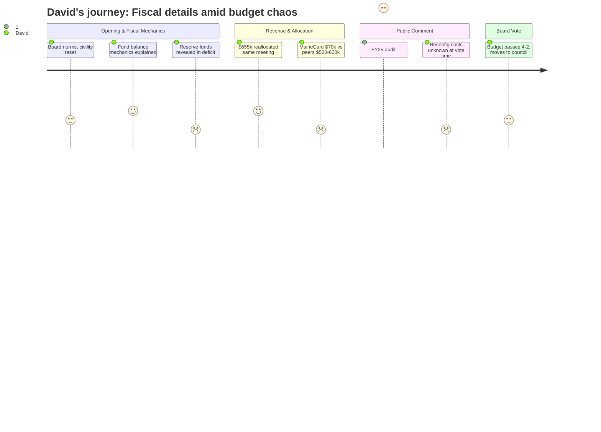

# Interpretation: David (PERSONA-002)
## Meeting: School Board Regular Meeting -- April 7, 2026 -- 2026-04-07

### Structured Points

#### 1. Health Insurance Variance Reallocated in Real Time
- **Fact:** The district received a final health insurance rate of 5.14% — versus the 11.5% placeholder — releasing $655k that had already been budgeted locally. Administration presented an allocation proposal for those dollars at the same meeting.
- **Source:** [06:24–07:10], Budget Slides p.5 and p.10
- **Emotional valence:** positive
- **Threat level:** 1
- **Open question:** false

#### 2. Existing Reserve Funds Are in Deficit
- **Fact:** Finance Director Ketchen confirmed that some of the district's existing reserve accounts have negative balances and "haven't been tended to in many years," with funds expended from those accounts "without the oversight" that governance requires.
- **Source:** [18:06–18:53]
- **Emotional valence:** negative
- **Threat level:** 4
- **Open question:** true

#### 3. MaineCare Billing Gap Is Large and Unaddressed
- **Fact:** The district billed MaineCare $70,000 in FY27. Member Feller noted that Portland billed $600,000 and Rockland — a smaller district — billed roughly $500,000. Administration acknowledged this is "worth exploration" but no action plan exists.
- **Source:** [33:47–35:19]
- **Emotional valence:** negative
- **Threat level:** 3
- **Open question:** true

#### 4. FY25 Audit Findings Cited: $2.37M in Unauthorized Overspending
- **Fact:** A community member (Meredith Diamond) cited the FY25 independent audit, stating the district overspent by $2,370,000 in FY24–25 without board approval, left $400,000 in grant reimbursements unclaimed, over-expended another $35,000 in grants absorbed by the general fund, and under-withheld $600,000 in employee benefit costs. The district did not dispute these figures during the meeting.
- **Source:** Public comment [112:32–113:18]; source document not directly introduced by administration
- **Emotional valence:** negative
- **Threat level:** 5
- **Open question:** true

#### 5. Reconfiguration Costs Were Not Quantified Before the Budget Vote
- **Fact:** At the time the board voted 4-2 to advance the FY27 budget, administration had not prepared cost estimates for the full scope of reconfiguration. The budget included $75k for physical moving costs and $179k in contingency, but bathroom compliance, extended transportation, building readiness, and IEP transition costs remained unestimated. Administration confirmed it had not been asked to prepare a slide on total reconfiguration costs.
- **Source:** [39:12–42:17], [41:32–42:17]
- **Emotional valence:** negative
- **Threat level:** 4
- **Open question:** true

#### 6. Fund Balance Rebuild Pathway Explained for the First Time
- **Fact:** Assistant Superintendent Prince clearly described the only legal mechanism for rebuilding the fund balance: holding dollars in operating contingency during FY27, which — if unspent — sweep into undesignated fund balance for FY28. The Finance Director committed to monthly reporting on contingency balances.
- **Source:** [09:32–10:19], [21:13–21:58]
- **Emotional valence:** positive
- **Threat level:** 1
- **Open question:** false

#### 7. Transportation Budget Up 16% With No Reconfiguration Demand Analysis
- **Fact:** Cost Center 8 (Transportation) rises from $2,830,679 in FY26 to $3,283,248 in FY27 — a $452k increase — before any reconfiguration-driven routing changes are costed. Multiple public commenters, including a current bus driver, warned that driver attrition is ongoing and that cross-district routing would require more drivers than the current 21-person fleet.
- **Source:** Budget Slides p.14; public comment [118:43–119:30]
- **Emotional valence:** negative
- **Threat level:** 3
- **Open question:** true

---

### Journey Map

---

### Reactions

Look, this was actually a more substantive meeting than I expected, and not entirely in a bad way. The health insurance news was real — they got a 5% increase instead of 11.5%, that freed up $655k, and they had an allocation proposal ready the same night. That's responsive. And for the first time I felt like I understood the actual mechanics of how fund balance gets rebuilt: you hold contingency, you don't spend it, it sweeps into undesignated fund balance the following year. Fine. Simple. Why didn't anyone explain that three months ago?

But here's what I can't get past. The Finance Director confirmed — almost in passing — that some of their reserve accounts are sitting in deficit. Negative balances. And she said funds had been "expended from those accounts without the oversight" they described. That's not a budget problem, that's a financial controls problem. And then a parent got up and read from the FY25 audit — which the district is required to submit by December and apparently hadn't raised publicly — $2.37 million in unauthorized overspending, $400k in unclaimed grants just left on the table, $600k in benefits under-withheld from employees. The district didn't push back on a single number. I went home and pulled the audit. She wasn't wrong. That changes how I read this entire budget conversation. A $7M structural gap doesn't appear from nowhere; it compounds from years of this.

The thing I'd flag to anyone who'll listen: the MaineCare billing is a quiet scandal. Portland bills $600,000 a year for the same services. Rockland — smaller than us — bills $500,000. We bill $70,000. That's not a rounding error, that's a missing revenue stream that could fund real positions. Member Feller asked the right question. The answer was basically "yeah, we should look into that." Meanwhile the board voted 4-2 to send a budget to city council that still has reconfiguration costs unquantified. I understand the procedural logic — you need a budget on the table to have the council conversation — but voting on a document with an open tab of unknown size is not what I'd call fiscal discipline. The $179k contingency might cover a boiler emergency. It probably doesn't cover a district-wide school transition that comparable districts routinely overshoot by 20% on transportation alone.