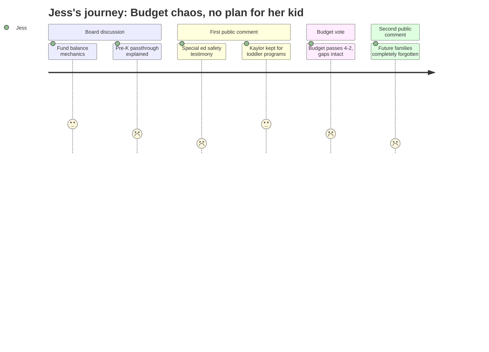

# Interpretation: Jess (PERSONA-003)
## Meeting: School Board Regular Meeting -- April 7, 2026 -- 2026-04-07

### Structured Points

#### 1. Pre-K Funding Is a Pass-Through, Not a Commitment
- **Fact:** The $171,000 in additional EPS funding listed for pre-K programming is a direct expense-and-revenue pass-through for the Head Start classroom. The assistant superintendent stated explicitly: "If we chose to not move forward with the Head Start classroom, we would not retain that revenue. So it's neutral to how it impacts local programming."
- **Source:** [26:41] transcript; Slide page 12, "Updates"
- **Emotional valence:** negative
- **Threat level:** 4
- **Open question:** true — Is the district committed to continuing the Head Start classroom, or is that decision still open? What happens to pre-K access if enrollment or state funding shifts?

#### 2. Kaylor May Be Held for Toddler-Age Child Development Services
- **Fact:** When asked why the district recommended retaining the Kaylor building rather than selling it, the superintendent cited two reasons: demographic uncertainty and the district's "obligations around three and four-year-olds, and the transition that we are on with taking over child development services." She acknowledged there is no state roadmap for this transition at South Portland's scale.
- **Source:** [167:51] transcript
- **Emotional valence:** neutral
- **Threat level:** 3
- **Open question:** true — What does "taking over child development services" mean for families with toddlers right now? Will this create new early childhood programming, and on what timeline?

#### 3. Families Not Yet in the System Are Not Being Reached
- **Fact:** Community member Caroline Bowman stated at the second public comment that families "not currently having children in school, but starting in the next couple of years, have no clue this is happening" — and that the only notification pathway is the superintendent's email list, which requires clicking a secondary link that does not signal a school closure or reconfiguration is under consideration.
- **Source:** [155:18] transcript
- **Emotional valence:** negative
- **Threat level:** 4
- **Open question:** true — Is there any outreach plan for prospective families — those with toddlers or preschoolers — before reconfiguration decisions are finalized?

#### 4. Which School Serves Which Neighborhood Is Still Unknown
- **Fact:** When asked directly how attendance zones would be redrawn, the superintendent replied: "I don't think that we know exactly what those are going to look like. That's a part of the configuration planning and will be addressed." Questions about staggered start times and siblings at different schools were similarly deferred to future listening sessions.
- **Source:** [157:39] and [158:28] transcript
- **Emotional valence:** negative
- **Threat level:** 4
- **Open question:** true — A family planning for kindergarten enrollment in fall 2027 cannot know which school their child will attend, what the bus route will look like, or whether before/aftercare will be available at their assigned building.

#### 5. Special Ed Classrooms Described as Unsafe Throughout This School Year
- **Fact:** An ed tech at Dyer Elementary testified that his functional life skills classroom has been short-staffed by one to two positions for nearly the entire school year, with many days receiving no substitute coverage. A board member separately described visiting a principal who wore running shoes to sprint to FLS rooms multiple times daily due to chronic understaffing.
- **Source:** [93:43] and [64:10] transcript
- **Emotional valence:** negative
- **Threat level:** 3
- **Open question:** true — If specialized classrooms are already strained this year under current staffing, what will the picture look like in fall 2027 after a full reconfiguration and the elimination of two embedded OT positions?

#### 6. Health Insurance Savings Restored a Small Number of Positions
- **Fact:** Health insurance came in at 5.14% instead of the 11.5% placeholder estimate, freeing approximately $655,000. The administration proposed using a portion to restore two elementary classroom teachers and two special education ed techs — all posted as one-year-only positions.
- **Source:** [06:24] transcript; Slide page 10, "Allocation Proposal Overview"
- **Emotional valence:** positive
- **Threat level:** 1
- **Open question:** false — This is a real reduction in harm. Fewer cuts to student-facing staff means a somewhat more stable classroom environment for the children who will be Jess's child's future classmates.

#### 7. Budget Passed 4-2 With Reconfiguration Costs Unresolved
- **Fact:** The board voted 4-2 to advance the FY27 superintendent's budget to city council. The $179,000 contingency is the only financial buffer for unknown reconfiguration costs including potential building modifications, transportation increases, and summer teacher compensation. A community speaker cited the FY25 audit, which found the district overspent by $2.37 million without authorization across FY24-25.
- **Source:** [201:39] budget vote; [112:32] Meredaid Diamond public testimony; [39:12] board discussion on reconfiguration costs; Slide page 12, contingency line
- **Emotional valence:** negative
- **Threat level:** 4
- **Open question:** true — If reconfiguration costs exceed contingency, what gets cut next? And is a budget this structurally fragile likely to stabilize before a child entering kindergarten in 2027 begins school?

### Journey Map

### Reactions

Okay so I stayed up way too late watching this and I have so many feelings. The thing that hit me hardest was near the very end — this woman Caroline Bowman gets up and says that families starting school in the next couple of years have *no idea* this is happening. She said the only way to find out is to be on the superintendent's email list and actually click a second link, and that she herself almost missed it. And she specifically mentioned language barriers and families whose kids aren't in school yet. That is me. I found out about all of this from someone in a mom Facebook group two weeks ago. I had no idea they were potentially changing which school serves which neighborhood — like, I don't even know which school MY kid is going to go to, and now the answer is apparently that nobody knows, because they voted to reconfigure the whole elementary system without drawing the new lines yet.

The pre-K thing really rattled me too. At one point they mentioned $171,000 for pre-K programming and I perked up — finally something for kids my daughter's age — and then I kept listening and the assistant superintendent basically said it's not real money, it just passes through for the Head Start classroom, and if the classroom doesn't continue, the money disappears. It's not a commitment to early childhood, it's a ledger entry that cancels itself. And there was this other moment, kind of buried in the question-and-answer section after public comment, where the superintendent said they're keeping the Kaylor building partly because of "obligations around three and four-year-olds" and some kind of takeover of child development services. Which sounds like it could be huge for families like mine. But nobody explained what it means, when it's happening, or whether it involves actual new programming or just shuffling existing stuff around.

The safety stuff honestly scared me most about the long-term picture. A teacher got up and said his special ed classroom has been short-staffed for basically the whole school year. A board member told a story about a principal in running shoes who has to physically sprint to classrooms multiple times a day. And then they voted to pass a budget that eliminates two occupational therapists from those same classrooms, replacing them with ed tech positions they haven't filled yet. I keep coming back to: if this is what it looks like right now, what does it look like in fall 2027 when my kid walks in the door? The board voted four to two to send this budget forward, and I'm sitting here thinking — they don't even know which schools will serve which neighborhoods, they don't know what reconfiguration is going to cost, and they're already burning through contingency funds on a boiler situation. I love this town and I really want my kid to go to school here. But I genuinely don't know if that's still the right call.