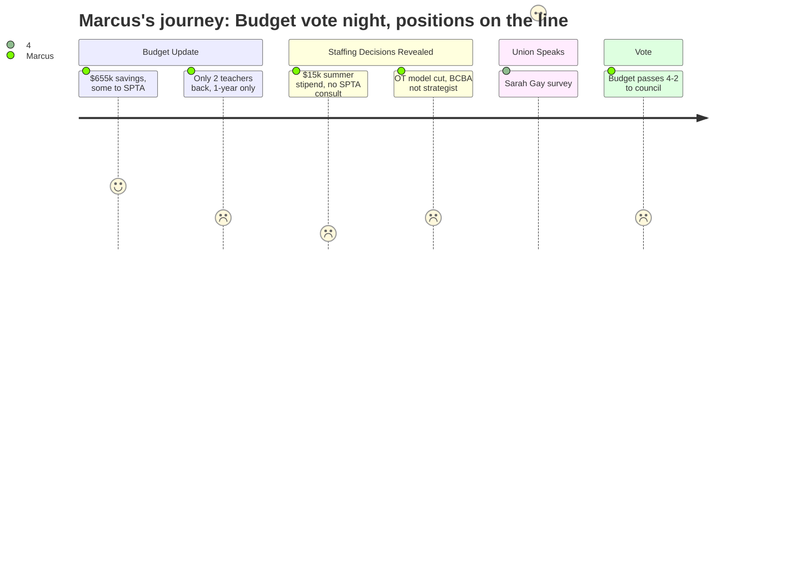

# Interpretation: Marcus (PERSONA-004)
## Meeting: School Board Regular Meeting -- April 7, 2026 -- 2026-04-07

### Structured Points

#### 1. Health insurance savings open a small window -- but the split is telling
- **Fact:** The district learned on April 4 that the health insurance increase came in at 5.14% rather than the 11.5% placeholder, freeing up approximately $655,000. The administration proposed allocating 36.3% ($238,000) to SPTA positions and time beyond contract -- the largest single share of any bargaining unit.
- **Source:** [06:24--07:10]; Budget slides, "Allocation Proposal Overview" (slide 10)
- **Emotional valence:** positive
- **Threat level:** 2
- **Open question:** true

#### 2. Two teachers brought back -- one-year contracts, grade TBD, nothing at the secondary level
- **Fact:** From the $655,000 in savings, administration recommended reinstating exactly two elementary classroom teachers, posted as one-year-only positions subject to Article 18 recall. Grade level would be determined by enrollment. No teaching positions were proposed for restoration at the middle or high school level.
- **Source:** [25:55--26:41]; Budget slides, "Allocation Proposal Details" (slide 11)
- **Emotional valence:** negative
- **Threat level:** 3
- **Open question:** true

#### 3. SPTA was not consulted before tonight's position recommendation slides were released
- **Fact:** When asked whether the teachers' union had specific input on the position decisions presented in tonight's slides, Dr. Prince acknowledged: "to the extent that they had specific input on what was in front of the slides tonight, no, we did not specifically go back to the table." Middle school teacher Jamie Watson testified that five colleagues -- some already applying for jobs elsewhere -- spent the day not knowing whether the vague "related arts teacher" line on the new slide referred to their position.
- **Source:** [171:43--172:29] (Prince on SPTA consult); [134:57--135:52] (Watson testimony)
- **Emotional valence:** negative
- **Threat level:** 4
- **Open question:** true

#### 4. $15,000 budgeted for voluntary teacher summer work -- union president did the math publicly
- **Fact:** Administration proposed approximately $15,000 for optional "time beyond contract" for teachers doing summer reconfiguration work. SPTA President Sarah Gay calculated before the board that this is equivalent to one teacher working 277 hours, or roughly five hours each for 50 teachers -- framing it as a meaningful benchmark of scale before the board voted.
- **Source:** [43:04--43:51] (Prince on $15k estimate); [88:00--88:14] (Gay's calculation)
- **Emotional valence:** negative
- **Threat level:** 3
- **Open question:** true

#### 5. Behavior strategist position redesigned rather than recalled -- the specific person would not return
- **Fact:** Instead of recalling the existing behavior strategist (a social worker role added in 2023 and known to the community), administration recommended a Board Certified Behavior Analyst position with a different credential set. Member Richardson pressed on why the district was not simply recalling the incumbent, noting the district had also cut two other social workers and framing the shift as a de facto decision not to prioritize mental health support.
- **Source:** [59:30--62:00]
- **Emotional valence:** negative
- **Threat level:** 4
- **Open question:** true

#### 6. SPTA survey: 92% report negative morale; 84% say administration should be cut first
- **Fact:** SPTA VP Abby Anderson presented live survey results from 180 members: 92% reported negative or very negative staff morale; 76% opposed the superintendent's proposed budget in its current form; 84% agreed that "there should be more cuts to higher level administration rather than so many cuts to lower paid student-facing positions." The survey was still open and had launched the prior evening.
- **Source:** [91:22--92:11]
- **Emotional valence:** negative
- **Threat level:** 3
- **Open question:** false

#### 7. OT embedded model eliminated; ed tech replacements cannot currently be filled
- **Fact:** Administration proposed eliminating two occupational therapists embedded in functional life skills classrooms and replacing them with two special education ed tech positions. FLS teacher Caitlin Lefever testified that the district is already unable to staff existing ed tech vacancies -- the weekly vacancy list confirms open positions -- and predicted the district would need to hire significantly more than five ed techs for next year, with little confidence they would come.
- **Source:** [56:24--59:30] (Prince on OT model rationale); [138:48--139:47] (Lefever testimony)
- **Emotional valence:** negative
- **Threat level:** 4
- **Open question:** true

#### 8. Budget passes 4-2 and advances to city council
- **Fact:** The board voted 4-2 to advance the FY27 superintendent's budget to city council, with Members Feller and Richardson voting against. Chair DeAngelis and Members Risch, Holman, and Smith voted in favor. Member Holman noted the board could still add money before the final warrant vote; Member DeAngelis described the budget as "not the final step." The budget, as passed, still eliminates a net of roughly 40 teaching positions.
- **Source:** [201:39--202:27]; [193:45--196:13] (DeAngelis remarks before vote)
- **Emotional valence:** negative
- **Threat level:** 4
- **Open question:** true

---

### Journey Map

---

### Reactions

So I got home around 11 and I've been up since 6 thinking about this. The headline is they found $655k and gave us two teachers back. One year only. Grade TBD. Nothing at the middle school, nothing at the high school. That's what they did with the biggest chunk of found money this budget cycle. And look, I get it -- elementary is where the enrollment math is worst -- but there are teachers at SPMS right now who spent all day today staring at a slide that said "related arts teacher" and didn't know if it was their position or someone else's. Jamie Watson said exactly that. Five people. All day. Not because administration was being cruel, but because no one from the district called us before those slides went up. Dr. Prince basically admitted it -- they hadn't gone back to the SPTA specifically about tonight's recommendations. That's not how meet and consult is supposed to work.

The $15,000 for summer reconfiguration -- Sarah did the math right there at the mic and it was brutal. Five hours per person for fifty teachers. Five hours to move a classroom, learn a new grade, meet a new team, before August. Board Member Feller literally said "moving a classroom is like moving a house" and then accepted the explanation that $250 is the negotiated rate and moved on. That $250 is real -- it's in the contract -- but what Sarah was talking about was the curriculum work, the team building, the prep time. That's what the $15k is supposed to cover. It doesn't cover anything. And the behavior strategist piece genuinely worries me. Member Richardson nailed it -- we know who that person is, we know what they do, the community has been flooding the board with emails about it, and the response is to post a different credential entirely. That's not a recall. That's a workaround.

The budget passed 4-2. Feller and Richardson voted no, and I respect why -- Richardson in particular named the positions that are still wrong: OT, related arts, behavior support. But the other four moved it forward. DeAngelis said it's "not the final step," and technically that's true -- the city council presentation is Tuesday and there's still a warrant vote coming. But once you vote a budget out of the board and put it in front of council, you've handed away a lot of leverage. The fight isn't over, but it just got harder. What I'm watching for now is whether the SPTA's survey data -- 76% of our members opposed, 92% negative morale -- actually changes anything before those warrant articles get finalized. Because right now the math is: 42 teachers gone, 2 coming back, and none of us know yet which two.