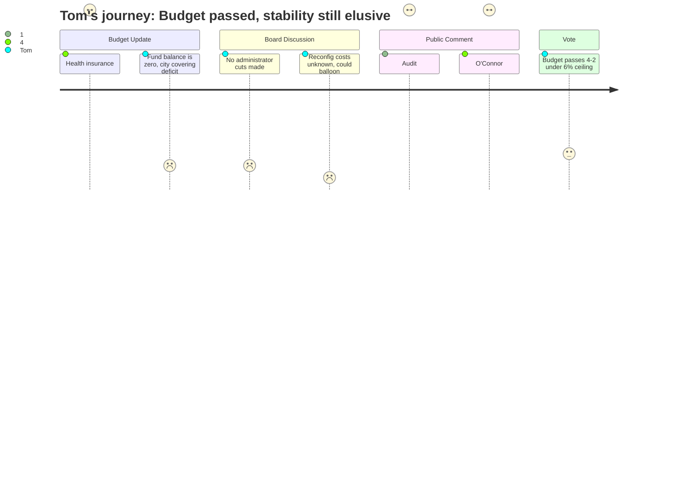

# Interpretation: Tom (PERSONA-006)
## Meeting: School Board Regular Meeting -- April 7, 2026 -- 2026-04-07

---

### Structured Points

#### 1. Health Insurance Came In Lower Than Expected
- **Fact:** The district had budgeted an 11.5% health insurance increase as a placeholder. On the Friday before the meeting, the actual figure came in at 5.14%, freeing up approximately $655,000.
- **Source:** Transcript [06:24–07:10]; Special Budget Meeting 4.7.26 slides, Slide 5
- **Emotional valence:** positive
- **Threat level:** 1
- **Open question:** false

#### 2. The District's Savings Account Is Empty — And Already Overdrawn This Year
- **Fact:** The assistant superintendent confirmed the fund balance — the district's financial cushion — is at zero. The district is projecting a deficit in FY26 and will need to draw from the *city's* fund balance to cover it. There is no reserve to absorb unexpected costs.
- **Source:** Transcript [18:53–19:38]; Special Budget Meeting 4.7.26 slides, Slides 8–9
- **Emotional valence:** negative
- **Threat level:** 5
- **Open question:** true

#### 3. The FY25 Audit Shows $2.37 Million Spent Without Authorization
- **Fact:** A public commenter cited the district's FY25 audit, stating the district overspent by $2,370,000 in FY24–25 without board approval or authorization. The same audit identified $400,000 in grant funds forfeited due to missed reimbursement deadlines, a $123,000 repayment to the state for overstated grants, and $600,000 in employee benefit costs that were under-withheld and had to be absorbed. No one from the administration disputed these figures.
- **Source:** Transcript [112:32–113:18], public comment by Meredith Diamond
- **Emotional valence:** negative
- **Threat level:** 5
- **Open question:** true

#### 4. No Real Cuts to Administrators or Directors
- **Fact:** Board Member Richardson stated explicitly that the budget contains "no real cuts from the director roles" and described the changes as "a shifting of responsibilities." She noted that the high school retains four building administrators while the middle school has three, and that no redundancies in administrative structure have been resolved.
- **Source:** Transcript [62:38–63:24], Member Richardson
- **Emotional valence:** negative
- **Threat level:** 4
- **Open question:** false

#### 5. Reconfiguration Costs Are Unquantified and Could Erode Any Savings
- **Fact:** When Member Richardson asked for a clear cost estimate for elementary reconfiguration, the administration acknowledged they did not have a prepared analysis. The meeting budget includes $75,000 for moving costs and up to $179,000 in contingency, but the administration could not confirm whether bathroom retrofits, additional busing, or full summer planning costs were captured in those figures. Original estimates from earlier planning ranged from $60,000 to $125,000 depending on approach — but those figures predate the current scope.
- **Source:** Transcript [39:12–42:17], exchange between Member Richardson and Dr. Prince
- **Emotional valence:** negative
- **Threat level:** 4
- **Open question:** true

#### 6. The District Bills MaineCare for Only $70,000 — Portland Bills $600,000
- **Fact:** Board Member Feller noted that the district currently recovers $70,000 through MaineCare billing for services provided to eligible students. Portland schools billed $600,000 last year for comparable services. Even Rockland, a smaller district, billed $500,000. The assistant superintendent acknowledged this gap is "worth exploring."
- **Source:** Transcript [33:47–35:19], Member Feller and Dr. Prince
- **Emotional valence:** neutral
- **Threat level:** 2
- **Open question:** true

#### 7. The Budget Passed 4–2 and Moves to City Council Under the 6% Ceiling
- **Fact:** The board voted 4–2 to advance the superintendent's budget to the city council as the board's formal proposal. Members Feller and Richardson voted no. The budget as passed remains below a 6% local tax increase. Board members noted this is not the final version — changes may still occur before the warrant articles are voted.
- **Source:** Transcript [201:39–202:27]
- **Emotional valence:** positive
- **Threat level:** 2
- **Open question:** true

---

### Journey Map

---

### Reactions

So I sat through the whole thing Tuesday night — nearly four hours. Here's what I'm telling anyone who asks. The one piece of real good news was that the health insurance increase came in lower than they planned. They'd budgeted for 11.5% and it came in at around 5%. That freed up $655,000. That's actual money they didn't expect to have. And what did they do with it? Put some into positions they'd already cut, some into a contingency fund. I get that people need their jobs back. But that's the first time I've heard about a surprise savings in this whole process, and it went right back out the door.

What got my attention — and I mean I sat up straight in my chair — was a woman named Meredith Diamond who got up during public comment with the district's own FY25 audit. She read from it out loud. Said the district spent $2.37 million more than was authorized in the last two years. No board vote. No approval. Just spent it. She also said they lost $400,000 in grant money because they missed reimbursement deadlines, had to write a $123,000 check back to the state, and somehow had $600,000 in employee benefits that were under-withheld and had to be absorbed. Nobody from administration stood up and said she had her facts wrong. That's the organization they're asking us to trust with more money. And they're doing it from a fund balance of zero — there's no cushion left. If something breaks this winter, they are drawing on the city's savings, not their own.

The other thing that stuck with me was an older guy, John O'Connor, semi-retired, said his taxes went from $4,200 to over $10,000 in five years. He ran a 1,500-person operation for decades. He stood up and said this district is top-heavy — five or six people could run the whole department — and pointed out they're billing Portland $160,000 to fix their buses when that number should be three or four times higher. The board nodded. Nobody wrote anything down. The budget still passed 4–2 and goes to the city council. They held the 6% ceiling, which is what they said they'd do. I'll give them credit for that. But with an audit showing unauthorized spending and zero money in the bank, I don't feel a lot better than I did before I walked in.