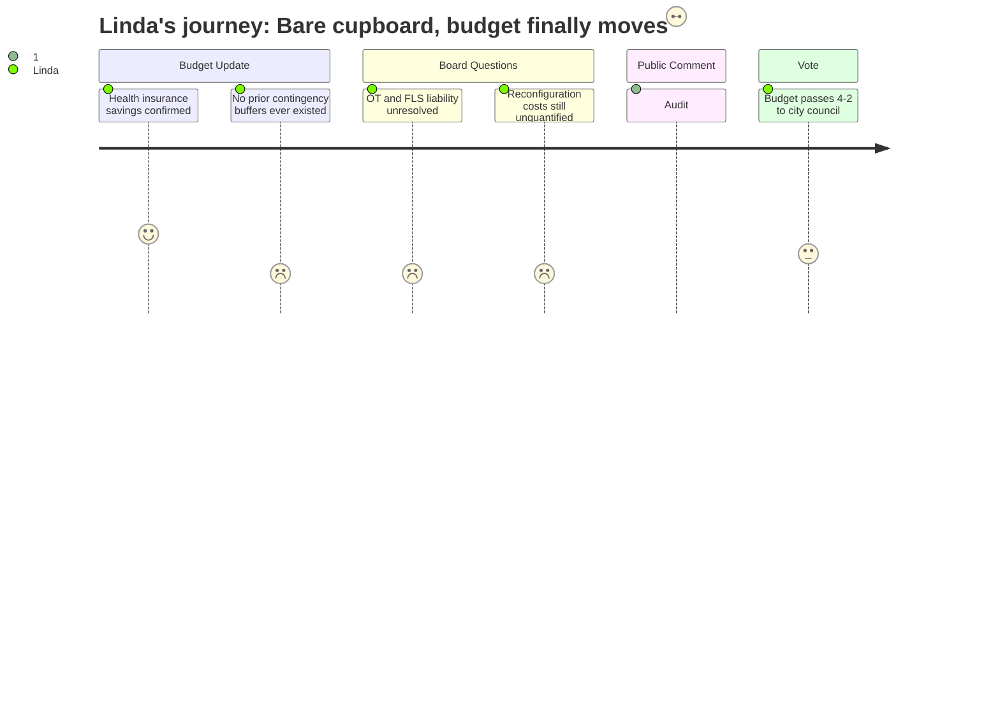

```markdown
---
schema_version: "1.0"
meeting_id: "2026-04-07-school-board"
persona_id: "PERSONA-007"
persona_name: "Linda"
meeting_date: 2026-04-07
meeting_title: "School Board Regular Meeting -- April 7, 2026"
interpretation_date: 2026-04-15
interpreter_model: "claude-sonnet-4-6"
---

# Interpretation: Linda (PERSONA-007)
## Meeting: School Board Regular Meeting -- April 7, 2026 -- 2026-04-07

### Structured Points

#### 1. Health insurance correction frees $655k for reallocation
- **Fact:** The district learned the Friday before the meeting that health insurance would increase 5.14% rather than the 11.5% placeholder, freeing approximately $655,000. Administration presented a specific allocation proposal — 27% to contingency, 36% to SPTA positions and time-beyond-contract, roughly 18% each to SPESPA and SEA — before board discussion began.
- **Source:** [06:24–07:10]; Source: Special Budget Meeting 4.7.26, Slide 10
- **Emotional valence:** positive
- **Threat level:** 1
- **Open question:** false

#### 2. No genuine contingency buffers existed in prior budgets
- **Fact:** Director of Finance Abigail Ketchen confirmed that accounts labeled "contingency" in prior budgets were actually earmarked for specific purposes — no genuine unallocated operating buffer had existed. The district is proposing to create a true contingency line for the first time in FY27.
- **Source:** [20:25–21:13]
- **Emotional valence:** negative
- **Threat level:** 3
- **Open question:** true — How did this gap persist across multiple budget cycles without the board requiring a contingency line? What does this mean for the reliability of prior years' budget-to-actuals reporting?

#### 3. Reserve accounts are in deficit; financial oversight gaps acknowledged
- **Fact:** Director Ketchen disclosed that several existing reserve accounts are in deficit, the result of expenditures made without proper oversight over multiple years. She described the reserves as needing "cleanup" and flagged a con of adding new reserve funds before that cleanup is complete.
- **Source:** [18:06–18:53]
- **Emotional valence:** negative
- **Threat level:** 4
- **Open question:** true — Which accounts, what total deficit balances, and what corrective process is planned? This should be a finance committee agenda item before the warrant articles are finalized.

#### 4. FY25 audit findings cited in public comment: $2.37M spent without authorization
- **Fact:** Community member Meredith Diamond cited findings from the FY25 audit in public comment: $2,370,000 overspent without approval in FY24-25; $400,000 in grant funds left unreimbursed and absorbed into the general fund; $123,000 paid back to the state for over-stated grant expenditures; $600,000 in benefit under-withholding absorbed by the district. These findings were not addressed by administration or board members during the meeting.
- **Source:** [112:32–113:18]
- **Emotional valence:** negative
- **Threat level:** 5
- **Open question:** true — Was this audit formally presented to the board? What corrective controls have been put in place? The board's oversight responsibility here is unresolved.

#### 5. OT/FLS staffing gap: IEP compliance and safety liability unresolved
- **Fact:** Board members Richardson and Feller pressed on the elimination of OT positions embedded in functional life skills classrooms. Administration confirmed the two proposed replacement ed tech positions have no candidates on the recall list and would require new hires. An ed tech testified in public comment that his FLS classroom had been short-staffed for nearly the entire year with no substitute coverage and no additional compensation paid. Assistant Superintendent Prince acknowledged the OT replacement model warranted further stakeholder review.
- **Source:** [53:58–58:44]; [93:43–96:00]; [161:38–164:46]
- **Emotional valence:** negative
- **Threat level:** 4
- **Open question:** true — If students with IEPs are not receiving prescribed OT services, the district faces a compliance exposure that goes beyond staffing inconvenience. No plan has been produced.

#### 6. SPTA not consulted on which positions to reinstate
- **Fact:** Assistant Superintendent Prince acknowledged that while associations had been engaged in meet-and-consult over the past five weeks, administration did not bring the union back to the table before releasing tonight's reinstatement proposals. She stated, "I apologize if we missed the correct procedural invitation there."
- **Source:** [171:43–172:29]
- **Emotional valence:** negative
- **Threat level:** 3
- **Open question:** true — Does this create a procedural obligation that could complicate or delay recall and placement decisions this summer?

#### 7. Budget passes 4-2; path to city council secured
- **Fact:** The board voted 4-2 (Holman, Smith, DeAngelis, and Risch in favor; Feller and Richardson opposed) to advance the FY27 superintendent's budget to city council as the board's proposal. Chair DeAngelis noted the budget is not in final form and can still be revised before the warrant articles are voted.
- **Source:** [201:39–202:27]
- **Emotional valence:** positive
- **Threat level:** 2
- **Open question:** true — Richardson and Feller's concerns about OT roles, the behavior strategist position, and related arts are on record and unresolved. A scheduled additional session before the warrant vote will be needed.

#### 8. Reconfiguration cost estimate remains unproduced
- **Fact:** Board member Richardson pushed for a full cost estimate of reconfiguration beyond the $75,000 moving budget, noting that original planning documents quoted $125,000 for the full reconfiguration scenario versus $60,000 for Kaylor closure alone. Administration acknowledged no comprehensive cost estimate was prepared for this meeting and that bathroom and facility modification costs had not been fully assessed.
- **Source:** [39:12–42:17]
- **Emotional valence:** negative
- **Threat level:** 3
- **Open question:** true — The $179,000 contingency may be inadequate to absorb unknown facility and transition costs, and no independent cost estimate has been commissioned.

---

### Journey Map



---

### Reactions

We got the vote. 4-2, and that's what we needed to get to the council on Tuesday. But I have to be honest — that margin is thin and both of the no votes had legitimate things on the table. Richardson was right that we don't have the OT replacement plan nailed down, and Feller was right that we haven't exhausted the conversation with the city. I'm going to support where the chair landed: we have to show up with a budget before we can ask for anything more. We pass it, we present it, and we keep working.

What's going to stay with me from tonight isn't the vote. It's what that community member — Meredith Diamond — read into the record about the FY25 audit. Two-point-three-seven million dollars spent without authorization across FY24 and FY25. Grant reimbursements missed, $400,000 left on the table. Money paid back to Augusta. Benefit withholding errors that the general fund had to absorb. And nobody at the table responded. I sat there thinking: when was this audit formally presented to this board? Is it in our minutes? Because if those findings were delivered and the board didn't act, that's our failure, not just administration's. And if it wasn't formally presented to us — that's a different problem, but it's still ours to own. Abigail also confirmed tonight that existing reserve accounts are in deficit because they weren't tended to for years. We're in April of 2026 and we're only now getting a clear explanation of what a contingency fund actually is and that we've never had one. That's not a staff failure in isolation. The finance committee has to get to the bottom of the audit findings before we finalize the warrant articles.

The OT situation worries me on a completely different track — that's liability. That ed tech who testified described working essentially the entire year short-staffed, no subs, no extra pay, while students with IEPs are in the room. If we can't produce ed tech hires to cover those classrooms by September, and the kids aren't getting their prescribed services, we're not talking about a staffing inconvenience — we're talking about an IEP compliance problem with real legal consequences. Prince said tonight the replacement model warrants more stakeholder conversation. That's true, but "warrants more conversation" is not a plan, and a parent's attorney is not going to accept that answer in September. I need the finance committee to get eyes on the special ed staffing projections — actual hiring pipeline, not just positions on paper — before we vote the warrant articles.
```