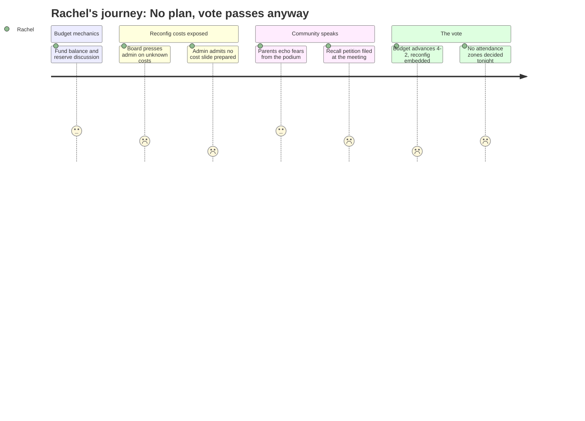

```
---
schema_version: "1.0"
meeting_id: "2026-04-07-school-board"
persona_id: "PERSONA-008"
persona_name: "Rachel"
meeting_date: 2026-04-07
meeting_title: "School Board Regular Meeting -- April 7, 2026"
interpretation_date: 2026-04-15
interpreter_model: "claude-sonnet-4-6"
---
```

# Interpretation: Rachel (PERSONA-008)
## Meeting: School Board Regular Meeting -- April 7, 2026 -- 2026-04-07

### Structured Points

#### 1. Attendance zone decisions do not exist yet
- **Fact:** When the board chair asked how the district plans to address attendance zone lines, Assistant Superintendent Prince responded that adjustments will be needed but "that's a detail that we do not have at this point."
- **Source:** School Board Meeting — 2026-04-07 [transcript], [157:39–158:28]
- **Emotional valence:** negative
- **Threat level:** 5
- **Open question:** true

#### 2. Start time logistics for multi-child families not addressed
- **Fact:** When asked whether staggered start times would be considered for families with children at two different schools post-reconfiguration, the administration said that had not been considered and would be addressed through the listening sessions.
- **Source:** School Board Meeting — 2026-04-07 [transcript], [158:28–159:16]
- **Emotional valence:** negative
- **Threat level:** 3
- **Open question:** true

#### 3. Reconfiguration costs still unknown at time of budget vote
- **Fact:** Board Member Richardson pressed for a clear cost estimate for reconfiguration; the administration acknowledged they were not prepared to present that tonight, and that known line items ($75k moving costs, up to $179k contingency) may not capture all costs, including potential bathroom construction and building modifications.
- **Source:** School Board Meeting — 2026-04-07 [transcript], [39:12–42:17]
- **Emotional valence:** negative
- **Threat level:** 4
- **Open question:** true

#### 4. Listening sessions launched after the vote, not before
- **Fact:** A public speaker asked why listening sessions were set up after the reconfiguration vote rather than before it. Assistant Superintendent Prince acknowledged the criticism directly, saying "we can take the community feedback that that should've been done earlier."
- **Source:** School Board Meeting — 2026-04-07 [transcript], [169:21–170:07]
- **Emotional valence:** negative
- **Threat level:** 3
- **Open question:** false

#### 5. Budget passes 4-2, advancing with reconfiguration embedded
- **Fact:** The board voted 4-2 (Holman, Smith, DeAngelis, Risch in favor; Feller and Richardson opposed) to advance the FY27 superintendent's budget to city council. The budget contains moving costs and contingency funds premised on reconfiguration proceeding by August.
- **Source:** School Board Meeting — 2026-04-07 [transcript], [201:39–202:27]
- **Emotional valence:** negative
- **Threat level:** 3
- **Open question:** true

#### 6. Two classroom teachers reinstated -- but as one-year-only positions
- **Fact:** The updated budget proposal adds back two elementary classroom teachers to reduce class size. These are posted as one-year-only positions subject to Article 18 recall provisions. Grade level and school assignment are to be determined based on enrollment.
- **Source:** Special Budget Meeting 4.7.26 [document], Slide 11; School Board Meeting — 2026-04-07 [transcript], [25:55–26:40]
- **Emotional valence:** positive
- **Threat level:** 2
- **Open question:** true

#### 7. Teacher morale at crisis level: 92% report negative sentiment
- **Fact:** SPTA Vice President Abby Anderson presented survey results showing 92% of surveyed staff have a "negative or very negative" perception of staff morale. A separate item found 74% disagree that central office has been fully transparent with staff about the budget process and how the district got here.
- **Source:** School Board Meeting — 2026-04-07 [transcript], [90:36–92:11]
- **Emotional valence:** negative
- **Threat level:** 4
- **Open question:** true

---

### Journey Map



---

### Reactions

They passed it. Four to two. And I sat in that room for almost four hours, and at the end of it I still cannot tell you which school my kid is going to next fall. The board chair actually asked -- asked out loud, into the microphone -- how the district plans to figure out attendance zone lines. And the assistant superintendent said they know there will be "some adjustments" but "that's a detail that we do not have at this point." That was said after the vote was clearly heading toward yes. I cannot believe that is where we are.

The thing that I cannot stop thinking about is the cost exchange. Member Richardson looked up the original proposals and found figures ranging from $60,000 to $125,000 depending on the scenario -- so someone, at some point, put numbers on this -- and she pushed the administration to explain what reconfiguration is actually going to cost now. And the assistant superintendent said, and I'm quoting, "I didn't realize that was something the board was looking for us to present on tonight, so we don't have a slide prepared for that." They have been talking about this for months. There is no slide. They've got $75k for moving costs and $179k in contingency and they're calling it sufficient. A parent stood at the microphone and said that peer districts overspent their transportation budgets by 20% during reconfiguration -- just transportation. Nobody pushed back on that number. And now the budget that moves forward is the one that assumes this all works out fine by August.

The two things that kept me from losing it completely: Richardson and Feller voted no. Richardson said she couldn't even "visualize" a school without the behavior support positions that are still cut, and she sounded genuinely frightened by this timeline. She was the only one up there asking the questions parents in this room needed someone to ask. And the listening sessions -- I'm going. I will be at every one. Because someone has to be the person who shows up and asks "what happens when a family has kids at two different schools and the start times don't line up?" A parent asked that exact question tonight and the response was they haven't considered it. That is the answer we got. I'm not waiting for them to figure it out on their own.