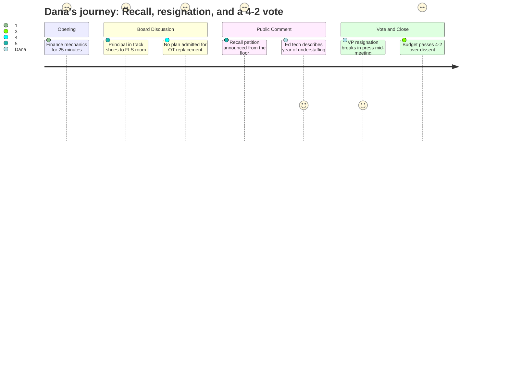

# Interpretation: Dana (PERSONA-009)
## Meeting: School Board Regular Meeting -- April 7, 2026 -- 2026-04-07

---

### Structured Points

#### 1. Recall Petition Filed Against Board Chair — From the Floor
- **Fact:** Parent Ali Aldaman announced she had already filed an affidavit with the city clerk initiating a recall of Board Chair Rosemary DeAngelis. She cited the board's reconfiguration vote without a plan or adequate community input, invited voters to collect petition signatures, and directed people to find her mid-meeting for paperwork.
- **Source:** [84:18--85:53]
- **Emotional valence:** negative
- **Threat level:** 4
- **Open question:** true — How many signatures are required, and does the recall organizers' coalition have the capacity to collect them?

#### 2. Vice Chair Resignation Breaks in the Press During the Meeting
- **Fact:** Near the end of public comment, parent Jenny Facey announced that the Portland Press Herald had just published a story reporting that Vice Chair Adrian Dowling had resigned — information the board had not disclosed to the community. The chair confirmed only that Dowling was absent and that details would come at a future meeting.
- **Source:** [205:37--206:23]
- **Emotional valence:** negative
- **Threat level:** 3
- **Open question:** true — Why did the board not announce this themselves, and under what circumstances did Dowling resign?

#### 3. Principal Wears Track Shoes to Sprint to Understaffed Special Ed Classrooms
- **Fact:** Board member Feller described visiting an elementary school and noticing the principal wore running shoes and carried a radio — because she routinely has to sprint to a life skills classroom when it loses staff control, multiple times a day. He raised the anecdote to question whether staying under the 6% tax cap was compatible with safely staffing special education.
- **Source:** [64:10--64:55]
- **Emotional valence:** negative
- **Threat level:** 4
- **Open question:** false

#### 4. Ed Tech: FLS Classroom Understaffed Nearly All Year, No Pay for Filling Vacant Roles
- **Fact:** Ed tech Andrew Gigler testified that his Dyer Elementary functional life skills classroom had been short one to two ed techs for nearly the entire school year, with no substitutes provided on many of those days. He stated that he and colleagues had done the work of the vacant positions without additional pay, and that no one had explained where the unspent wages went.
- **Source:** [93:43--95:59]
- **Emotional valence:** negative
- **Threat level:** 5
- **Open question:** true — Where did the money from unfilled ed tech positions go during the school year?

#### 5. Teachers Union Survey: 92% Negative Morale, 76% Oppose Budget
- **Fact:** SPTA VP Abby Anderson presented preliminary results from a union survey launched the night before: 92% of respondents reported negative or very negative staff morale; 76% opposed the superintendent's proposed budget in its current form. Over 180 of 290 SPTA members responded within roughly 24 hours.
- **Source:** [90:36--92:57]
- **Emotional valence:** negative
- **Threat level:** 4
- **Open question:** true — The survey was still open; updated results were expected the following week.

#### 6. Administration Acknowledges: No Plan Yet to Replace OTs in Life Skills Classrooms
- **Fact:** When the board chair asked what the plan was for replacing occupational therapists in functional life skills classrooms, Dr. Prince responded: "I don't think there is a specific plan right now." She acknowledged the theme of concern from public comment and stated the team had focused its energy on meeting the budget deadline.
- **Source:** [161:38--163:10]
- **Emotional valence:** negative
- **Threat level:** 4
- **Open question:** true — What is the actual staffing model for these classrooms in fall 2026?

#### 7. Budget Passes 4-2 — Advanced to City Council
- **Fact:** The board voted 4-2 to advance the FY27 superintendent's budget to the city council, with Members Richardson and Feller dissenting. Both dissenting members cited concerns about special education staffing risks, unresolved reconfiguration costs, and the need for further conversation with the council about tax flexibility. The chair noted the vote is not final and the budget can still be revised before the warrant vote.
- **Source:** [201:39--202:27]
- **Emotional valence:** neutral
- **Threat level:** 2
- **Open question:** true — Will the city council's April 14 workshop change the budget's shape, and will the board convene again before the final warrant vote?

---

### Journey Map

---

### Reactions

Okay, I finally finished watching this thing. Four hours. Here is what you need to know. The lede is a parent stood up at the mic and announced she had already filed paperwork with the city clerk to recall the board chair — Rosemary DeAngelis — over the school reconfiguration vote. This happened in real time, on camera, in the room. She told people to find her in the back for petition sheets. That's a story. That's not just a protest, that's a legal process that is now officially underway. You want that woman on camera, and you want her walking us through what happens next. The board chair did not address it. Nobody addressed it.

The second story dropped during the meeting. A parent walked up to the mic and said the Portland Press Herald just published that the vice chair resigned — and the community was hearing it from her, not from the board. The chair confirmed it, said details later, moved on. That is a transparency problem and a personnel story in one. Two stories for the price of one meeting. We probably need two packages, or at least a web sidebar.

But the human story is in the special ed classrooms, and it is genuinely alarming. A board member described visiting an elementary school where the principal wears track shoes to sprint to understaffed life skills rooms multiple times a day. Then an ed tech named Andrew Gigler walked up and said his classroom had been short-staffed for basically the entire school year, that he and his coworkers did the work of the vacant positions with no extra pay, and nobody has explained where that money went. The FLS teacher from Dyer came in from Westbrook — she said she drove back because she felt compelled — to say they cannot attract ed techs, the OTs they're cutting are irreplaceable, and she hasn't taken a full lunch break in 14 years. That is your segment. That is the mom crying in the parking lot when she found out the OT was being cut. That is the face of the story. The April 14th city council meeting is the next one worth sending a crew to — the budget lands there next week and that's where the pressure point is.