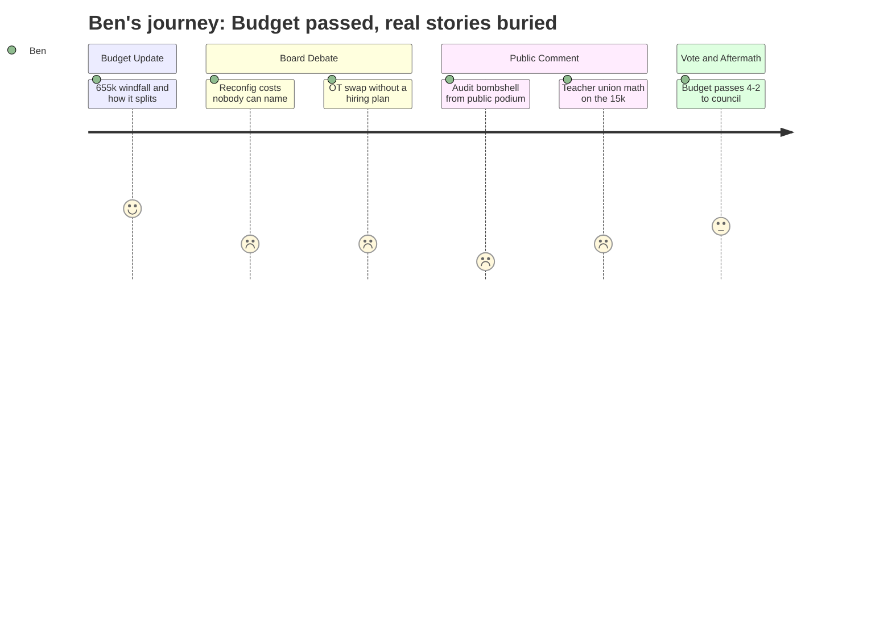

# Interpretation: Ben (PERSONA-010)
## Meeting: School Board Regular Meeting -- April 7, 2026 -- 2026-04-07

### Structured Points

#### 1. $655k Health Insurance Windfall Reshuffles the Budget
- **Fact:** The district learned the day before the meeting that its health insurance renewal would come in at 5.14% rather than the 11.5% placeholder, freeing approximately $655,000. The administration proposed splitting it: 27% to a new contingency line, 36% to classroom teacher positions, 18% to ed techs, and 18% to transportation and custodial staff.
- **Source:** [05:38–07:10] (Johanna Prince, assistant superintendent); "Special Budget Meeting 4.7.26" slides, slides 5 and 10
- **Emotional valence:** positive
- **Threat level:** 1
- **Open question:** true

#### 2. Fund Balance, Reserve, Contingency: A Framework Readers Can Actually Use
- **Fact:** Assistant Superintendent Prince and Finance Director Ketchum walked through a three-way distinction for the first time in plain language: undesignated fund balance (the depleted savings account), reserve funds (separate designated accounts, some currently in deficit from years of neglect), and contingency (a new line item in FY27 designed to seed fund balance in FY28 if left unspent). Ketchum noted some reserve accounts are in deficit because they "haven't been tended to in many years."
- **Source:** [06:24–21:58] (Prince and Ketchum); "Special Budget Meeting 4.7.26" slides, slides 6–9
- **Emotional valence:** positive
- **Threat level:** 1
- **Open question:** true

#### 3. Teachers' Union Does the Math the District Didn't
- **Fact:** SPTA President Sarah Gay calculated that the $15,000 budgeted for optional teacher summer work — using an average salary of $69,000, or roughly $54/hour — equals approximately 277 hours for one teacher, five hours each for 50 teachers, or a little over five hours each for all 50 if spread evenly. She did not challenge the line item's legitimacy but offered the arithmetic as context for its scale relative to the scope of reconfiguration.
- **Source:** Public comment, Sarah Gay (SPTA President), first public comment session; approximately [87:27–88:14]
- **Emotional valence:** negative
- **Threat level:** 3
- **Open question:** true

#### 4. A Parent Cited the FY25 Audit. The Administration Did Not.
- **Fact:** Community member Meredith Diamond cited the district's FY25 audit in public comment, stating that in FY24 and FY25 the district overspent by $2.37 million without authorization; that $400,000 in grant funds were lost because the district missed the reimbursement window; that $123,000 was repaid to the state for overstated grant expenditures; and that an additional $35,000 in over-expended grants had to come from the general fund. She noted the audit was required to be delivered to the board by December 30, 2025. None of this appeared in the administration's presentation.
- **Source:** Public comment, Meredith Diamond, first public comment session, approximately [111:43–114:05]
- **Emotional valence:** negative
- **Threat level:** 4
- **Open question:** true

#### 5. The OT-to-Ed-Tech Substitution Has No Staffing Plan
- **Fact:** The FY27 budget replaces two occupational therapists embedded in functional life skills classrooms with two new ed tech positions. A teacher from one of those classrooms stated in public comment that the classroom has been short-staffed for nearly the entire year, that the weekly staffing postings for special education ed techs were quietly removed last week, and that she does not believe current ed techs plan to return next year. The administration confirmed the replacement positions have not been filled and acknowledged no one on the recall list is expected to fill them.
- **Source:** [55:35–59:30] (board discussion, Prince and Entwistle); public comment, Caitlin Lefever (FLS teacher, Dyer Elementary), approximately [138:13–139:48]
- **Emotional valence:** negative
- **Threat level:** 4
- **Open question:** true

#### 6. Reconfiguration Cost: The Board Voted Three Weeks Ago; Nobody Has a Number
- **Fact:** Member Richardson noted that the original options matrix quoted reconfiguration costs at $60,000 to $125,000 depending on the model chosen, but the current budget holds only $75,000 for moving costs and $179,000 in contingency for reconfiguration-related expenses. When pressed for a comprehensive cost estimate covering bathrooms, busing changes, and transition planning, the administration said it was not prepared to present one that evening. A public commenter also cited a peer-district analysis showing transportation budgets typically overshoot by 20% during reconfiguration.
- **Source:** [39:12–47:43] (board discussion); "Special Budget Meeting 4.7.26" slides, slides 11–12; public comment, Aidan Renahan, approximately [81:59–84:18]
- **Emotional valence:** negative
- **Threat level:** 4
- **Open question:** true

#### 7. Budget Passes 4-2; Richardson's Dissent Is Quotable
- **Fact:** The board voted 4-2 to advance the FY27 superintendent's budget to city council, with Members Feller and Richardson dissenting. Richardson's floor statement argued the board had given the administration an impossible constraint, that the resulting cuts carried unacceptable legal and safety risk in special education, and that school resource officer costs could potentially shift to the police budget — restoring teaching positions in exchange. She stated she could not approve a budget this size without clearer answers on the occupational therapist, behavior strategist, and related arts positions.
- **Source:** [184:19–202:27] (board deliberation and vote); Richardson floor statement approximately [189:50–192:58]
- **Emotional valence:** neutral
- **Threat level:** 2
- **Open question:** true

#### 8. Board Vice Chair's Resignation Broke via Press During the Meeting
- **Fact:** During the second public comment, a parent announced that the Portland Press Herald had published a story about Board Vice Chair Adrian Dowling's resignation approximately one hour earlier. Earlier in the same meeting, the board chair had told the room only that Dowling "is not able to be present tonight." No board member announced the resignation; the parent at the microphone is how the room learned.
- **Source:** Public comment, Jenny Facey, second public comment session, approximately [205:37–206:23]; board chair statement approximately [159:16–160:04]
- **Emotional valence:** negative
- **Threat level:** 3
- **Open question:** true

---

### Journey Map

---

### Reactions

Okay so here's where I'm at after watching this one. Budget passed, 4-2, heading to the council Tuesday. That's the news. Feller and Richardson voted no — and Richardson gave a floor statement worth pulling quotes from. She said out loud that the board handed the administration a number that was always going to cause harm, and the staff losing jobs are the proof of that. That's the institutional accountability through-line I've been trying to build all season. She also raised something I want to chase down: she asked why school resource officer costs can't shift to the police budget. Nobody answered that. I'm going to ask the business manager.

But the story that's keeping me up is actually something a parent pulled out of the city's own audit at the public comment mic. Woman named Meredith Diamond — I need to verify the spelling — cited the FY25 audit: $2.37 million overspent without authorization across two fiscal years, $400k in grants lost because the district missed the reimbursement window, $123k written back to the state for overstatements. The administration's presentation said nothing about any of this. That audit was due to the board by December 30, 2025. So first thing tomorrow I'm calling the city clerk's office to get that document. The headline writes itself: a district in financial crisis didn't surface its own audit findings at a public meeting where it was asking for trust.

The other piece that's ready to write is the OT-to-ed-tech substitution — that's the human story. The district is cutting two occupational therapists out of special ed classrooms and replacing them with positions that haven't been filled, according to the teacher who actually works in one of those rooms. She said the weekly staffing postings for those roles were quietly removed last week, and she doesn't expect her current colleagues to come back next year. The administration said on the record the replacement slots aren't staffed. And then Sarah Gay from the teachers' union did the math at the mic that I needed: $15,000 for teacher summer work, at the district's average wage, buys you five hours each for 50 teachers. That's the lede. That's what "budget-neutral reconfiguration" looks like on the ground for a person being asked to move a classroom. Two things I still need before I write: I want to get the FY25 audit in hand to verify Diamond's numbers myself, and I need a real answer on reconfiguration costs before the piece can claim the district genuinely doesn't know — or before I can say it does know and isn't saying. Also: the vice chair resigned and the board let people find out from the Portland Press Herald during the meeting. That's a sidebar, but it's going in.