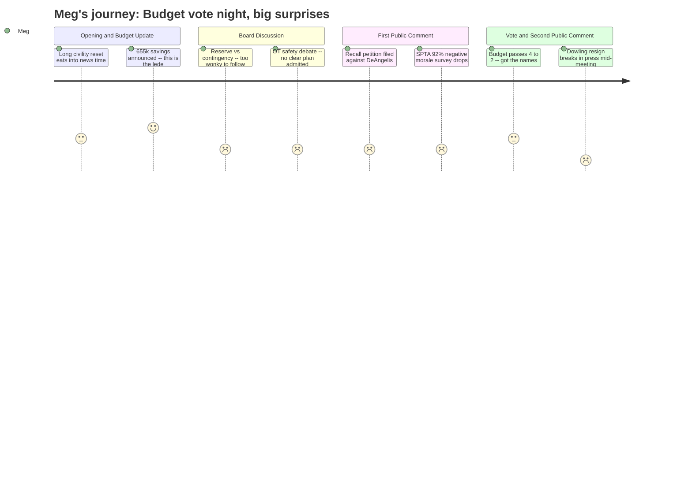

# Interpretation: Meg (PERSONA-011)
## Meeting: School Board Regular Meeting -- April 7, 2026 -- 2026-04-07

### Structured Points

#### 1. Dowling Resignation Broke in the Press During the Meeting
- **Fact:** During second public comment, parent Jenny Facey informed the board — and the live audience — that the Portland Press Herald had just published an article announcing Vice Chair Adrian Dowling's resignation while the meeting was still in progress. Facey stated the community "deserved to hear it before the press broke it." Board Chair DeAngelis had earlier told the audience only that Dowling "is not able to be present tonight" and that further details would come at the next meeting.
- **Source:** Transcript [01:59:00–02:06:23], second public comment, Jenny Facey
- **Emotional valence:** negative
- **Threat level:** 4
- **Open question:** true — Was the board aware of the resignation before the meeting? When will the seat be filled, and does this affect upcoming votes?

#### 2. Budget Passed 4-2, Advancing to City Council
- **Fact:** The board voted 4-2 to adopt the FY27 superintendent's budget as the board's proposal to city council. Holman, Smith, DeAngelis, and Risch voted yes. Feller and Richardson voted no. Richardson cited unresolved risks in special ed staffing, missing information on OT and behavior strategist roles, and opposition to cuts in related arts. Feller said the board should first exhaust options with the city council before locking in the proposal.
- **Source:** Transcript [02:01:39–02:02:27]; Source: Special Budget Meeting 4.7.26 [document], slide 17-18
- **Emotional valence:** neutral
- **Threat level:** 3
- **Open question:** true — The chair confirmed this is not the budget's final form. A follow-up meeting before the April 14 city council presentation is expected, potentially changing figures.

#### 3. Two Teachers and Two Ed Techs Added Back — Elementary, One Year Only
- **Fact:** The administration recommended using approximately $357,000 of the $655,000 health insurance savings to reinstate 2 classroom teachers and 2 special education ed techs at the elementary level. Both teacher positions are posted as one-year only but remain subject to recall and Article 18 of the contract. Exact grade level and school assignment are still to be determined based on enrollment.
- **Source:** Transcript [00:25:09–00:26:00]; Source: Special Budget Meeting 4.7.26 [document], slide 11
- **Emotional valence:** positive
- **Threat level:** 2
- **Open question:** true — "One-year only" means these positions could be eliminated again after FY27. Which schools? Which grades? Parents of elementary kids have no answer yet.

#### 4. Recall Petition Filed Against Board Chair DeAngelis
- **Fact:** Parent Ali Aldaman announced during first public comment that she had filed an affidavit with the city clerk under South Portland City Charter 10-13 to begin a recall of Board Chair Rosemary DeAngelis. Aldaman cited the board's reconfiguration vote without a plan, dismissal of parent opposition, and staffing cuts as her reasons. She had petition sheets available at the meeting for interested registered voters.
- **Source:** Transcript [00:84:18–00:85:53], Ali Aldaman public comment
- **Emotional valence:** negative
- **Threat level:** 4
- **Open question:** true — A separate speaker, Wheeler Boyd Bofa, also announced he had requested petitions from the city clerk to challenge the Kaylor closure. Two parallel petition efforts are now underway.

#### 5. SPTA Survey: 92% of Staff Report Negative Morale, 76% Oppose Budget
- **Fact:** SPTA VP Abby Anderson reported preliminary results from a union survey of 180 members: 92% reported a negative or very negative perception of staff morale; 76% opposed the superintendent's budget in its current form; 84% agreed cuts should come from higher administration rather than student-facing positions; 74% disagreed that central office had been transparent about the budget. The survey was still open at time of the meeting; all data was collected before tonight's slides were released.
- **Source:** Transcript [00:91:22–00:92:11], SPTA VP Abby Anderson public comment
- **Emotional valence:** negative
- **Threat level:** 4
- **Open question:** true — Full survey results close Sunday and will be shared at the next meeting. Board Member Richardson specifically asked teachers to contact the board directly with concerns.

#### 6. No Clear Plan for OT Staffing in Special Ed Classrooms
- **Fact:** Two occupational therapists embedded in functional life skills (FLS) classrooms are being eliminated; the budget proposes replacing them with 2 ed tech positions. FLS teacher Caitlin Lefever stated the district "cannot attract ed techs" and that their classroom would not be safely staffed. Ed tech Andrew Gigler testified that his Dyer FLS classroom had been short-staffed by 1-2 people for nearly the entire school year with no additional compensation and multiple safety incidents. When Board Chair DeAngelis asked what the plan was for replacing the OTs, Dr. Prince acknowledged: "I don't think there is a specific plan right now."
- **Source:** Transcript [00:57:57–00:59:30] board discussion; [00:93:43–00:96:00] Andrew Gigler public comment; [01:38:01–01:39:48] Caitlin Lefever public comment; [01:61:38] Dr. Prince response to Board Chair's question
- **Emotional valence:** negative
- **Threat level:** 5
- **Open question:** true — The district confirmed replacement ed tech positions are not currently filled or on the recall list. These are open hires heading into a school year that begins in August.

#### 7. Reconfiguration Cost Is Still Unknown — Board Acknowledged It
- **Fact:** Board Member Richardson pressed the administration on the full cost of reconfiguration, noting the original budget documents quoted a range of $60,000–$125,000 depending on the option, but the current budget shows only $75,000 for moving costs plus ~$179,000 in contingency. Assistant Superintendent Prince responded that a detailed cost breakdown was not prepared for tonight because "I didn't realize that was something the board was looking for us to present on tonight," despite acknowledging "that question has been asked a number of times." The district confirmed classroom bathrooms must be within 40 feet but stated all buildings meet this — a claim contested by a public commenter with personal experience in a Scarborough school construction project suggesting the 40-foot rule applies from anywhere in the classroom, not from the door.
- **Source:** Transcript [00:39:12–00:42:17], board discussion; [01:17:11–01:19:30], John O'Connor public comment
- **Emotional valence:** negative
- **Threat level:** 4
- **Open question:** true — No comprehensive cost estimate for reconfiguration has been presented. The contingency cap is $179,000; whether that is sufficient is unresolved.

#### 8. Potential $302K in State Emergency Funds Could Add Two More Positions
- **Fact:** The administration reported preliminary indication from Augusta of two potential emergency appropriations: $152,620 for students from lower socioeconomic backgrounds and $150,000 for McKinney-Vento homeless youth. These funds are not yet confirmed. If received, the administration's recommendation is to use them to add an elementary BCBA (board-certified behavior analyst) and a middle school related arts teacher, both posted as one-year only, with remaining funds to contingency. Member Smith asked for a timeline; Dr. Prince said the lower-SES funds "might be visible in our allocation towards the end of next week" but had no official confirmation.
- **Source:** Transcript [00:27:27–00:29:49]; Source: Special Budget Meeting 4.7.26 [document], slide 13
- **Emotional valence:** positive
- **Threat level:** 2
- **Open question:** true — Funds are not confirmed. Board cannot vote on prospective dollars. The behavior analyst role would replace — but not be identical to — the behavior strategist role that drew significant public advocacy.

---

### Journey Map

---

### Reactions

OK so here is everything from tonight, verified. Lead item: Vice Chair Dowling resigned and the board didn't tell us — we found out because the Portland Press Herald published it DURING the meeting. A parent literally read it out loud from her phone during public comment. The chair had said earlier he "wasn't able to attend tonight." That's it. No heads up to the community. I'm not saying it was intentional but that's a bad look when the whole room is there asking for transparency.

Budget passed 4-2. Yes votes: DeAngelis, Smith, Holman, Risch. No votes: Feller and Richardson. Richardson said the cuts to OTs, behavior support, and related arts are a risk she can't accept. Feller wanted to talk to city council first before locking in numbers. The chair was clear this is NOT final — there's a city council presentation on Tuesday the 14th and potentially another board meeting before that. The big news on the budget itself: they found $655k in health insurance savings (came in at 5.14% instead of 11.5%), and they're using most of it to add back 2 elementary classroom teachers and 2 elementary special ed ed techs. All four positions are one-year only. Grade and school TBD.

The thing that's going to keep me up: the special ed OT situation. A Dyer ed tech testified that his FLS classroom has been short-staffed by 1-2 people for basically the entire school year, no extra pay, safety incidents. The FLS teacher at Dyer came in from home to say they can't hire ed techs — "we cannot attract ed techs, it's hard work" — and that without the OTs it won't be safe. When a board member asked what the plan is for replacing the OTs, Dr. Prince said: "I don't think there is a specific plan right now." That's a direct quote. The replacement ed tech positions aren't filled and nobody's on the recall list to fill them. These are open hires for August. If you have a kid in a life skills classroom, you need to be watching this closely. Also: SPTA survey, 180 members, 92% negative morale, 76% oppose the budget. That number was collected before tonight's slides even came out.