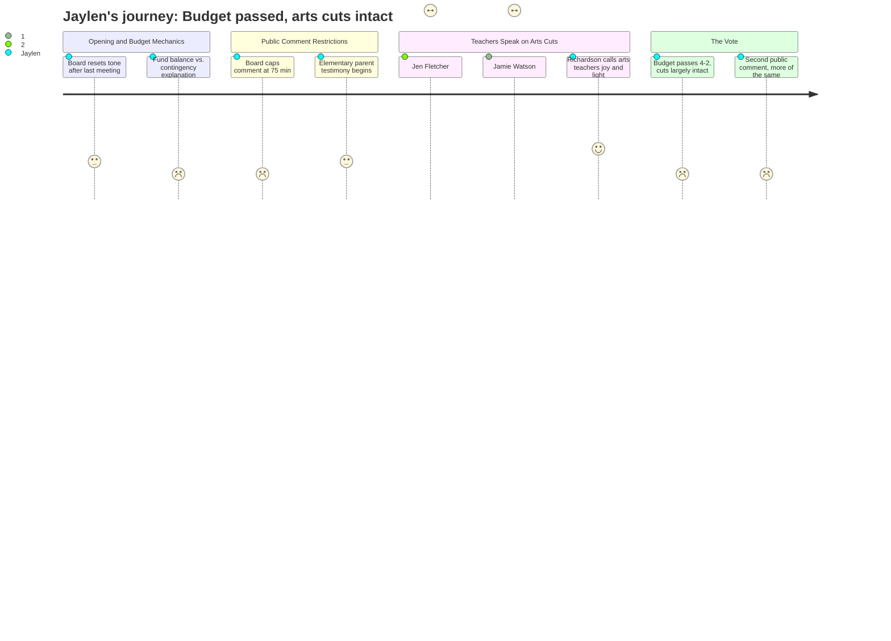

# Interpretation: Jaylen (PERSONA-012)
## Meeting: School Board Regular Meeting -- April 7, 2026 -- 2026-04-07

### Structured Points

#### 1. Middle school loses nearly its entire arts and elective curriculum
- **Fact:** Middle school teacher Jen Fletcher testified that the district is cutting "the entire computer science curriculum, one of two STEM teachers, and two physical education teachers" at the middle school level, in addition to the already-proposed percussion instructor elimination. Even with one related arts position potentially restored, she said it is "not enough to meaningfully restore access."
- **Source:** Transcript [132:41--134:17]
- **Emotional valence:** negative
- **Threat level:** 4
- **Open question:** true — if the middle school is losing this much, what does that signal about what will be left by the time current eighth graders cycle through? And what does it mean for SPHS programs that feed from those pipelines?

#### 2. Five teachers spent all day not knowing if they still had jobs
- **Fact:** Middle school teacher Jamie Watson testified that when the updated budget slides dropped that day, five teachers — including two who already had to apply for other jobs — spent the entire day in uncertainty about whether a single unnamed "related arts" line item referred to them. Watson said: "We had no idea who it was, what it was going to be teaching."
- **Source:** Transcript [134:XX--135:52]
- **Emotional valence:** negative
- **Threat level:** 3
- **Open question:** true — if teachers are this in the dark, how would students or parents even begin to know what's actually changing?

#### 3. One related arts position may come back — but only if state money arrives, and only for one year
- **Fact:** The administration's budget slides identify "SPMS Related Arts" as a potential 1-year-only position, contingent on approximately $302,000 in anticipated (but not yet confirmed) state dollars. The position would be subject to recall provisions and could be eliminated again after one year.
- **Source:** Budget slides, Slide 13; Transcript [28:14--29:49]
- **Emotional valence:** neutral
- **Threat level:** 3
- **Open question:** true — which subject? Which teacher? Under what conditions does the position disappear again next year?

#### 4. A board member said arts teachers are "the joy and the light" — then the budget passed anyway
- **Fact:** Member Richardson, arguing against the budget, said: "We're cutting related arts positions that stabilize the mental health of our youth. Middle school is a dark time, and these related arts teachers are the joy and the light." The budget passed 4-2, with Richardson as one of the two no votes.
- **Source:** Transcript [190:38--191:25]; Vote at [201:39]
- **Emotional valence:** negative
- **Threat level:** 2
- **Open question:** false — the outcome is clear: the budget passed with the cuts intact.

#### 5. The percussion instructor position is gone and the board essentially said community opposition didn't matter
- **Fact:** Teacher Jen Fletcher testified that families, students, and educators showed up repeatedly, emailed extensively, and spoke at multiple meetings — and were told "directly or indirectly that it would not make a difference, and that it did not matter how many emails were sent." The position remains eliminated in the passed budget.
- **Source:** Transcript [132:41--133:28]
- **Emotional valence:** negative
- **Threat level:** 3
- **Open question:** true — if this is how the district responds to sustained, organized advocacy, what's the point of showing up?

#### 6. SPHS is essentially invisible in a three-hour-forty-nine-minute meeting held at SPHS
- **Fact:** The entire meeting was focused on elementary school reconfiguration and middle school staffing. No board member, administrator, or public commenter specifically addressed any program, position, or cut at South Portland High School. The meeting was physically held in the SPHS lecture hall.
- **Source:** Meeting duration 03:49:14; full transcript
- **Emotional valence:** negative
- **Threat level:** 2
- **Open question:** true — what cuts are actually happening at SPHS, and why is no one talking about them in these meetings?

#### 7. The board voted to cap public comment at 75 minutes per session, no yielding allowed
- **Fact:** Member Risch moved, and the board voted unanimously, to limit each public comment session to 75 minutes with no time-yielding — citing approximately 20 prior hours of public testimony and a missed city council deadline. Member Feller called it "a little draconian" but supported it.
- **Source:** Transcript [71:57--74:17]
- **Emotional valence:** negative
- **Threat level:** 1
- **Open question:** true — if students wanted to testify, would a 3-minute hard cap with no flexibility actually give them enough time to make a case?

#### 8. The computer science program at the middle school is being eliminated entirely
- **Fact:** A community member testified that the district is eliminating "the entire computer science curriculum" at the middle school, arguing that middle school is "a pivotal stage where students form interests and confidence" and that removing CS education "disproportionately affects students who may not otherwise be exposed to these opportunities."
- **Source:** Transcript [211:52--213:26]
- **Emotional valence:** negative
- **Threat level:** 3
- **Open question:** true — if the CS pipeline from middle school disappears, what does that mean for AP computer science or similar options at SPHS?

---

### Journey Map

---

### Reactions

So they held this three hour and forty-nine minute meeting *at our school* — like, in our lecture hall — and nobody talked about SPHS once. Not one person. The whole thing was about elementary school reconfiguration drama and whether middle school kids will still have PE. Which I get, that stuff matters. But I'm a junior. I'm trying to figure out if my AP classes exist next year, if theater gets gutted, and nobody in that room even brought it up. It was like high school students weren't part of the conversation, even though we're literally the people the budget is supposedly for.

The part that actually hit me was this teacher — Jamie Watson from the middle school — who got up and said that when the new slides dropped earlier that day, five teachers spent the whole day not knowing if the "related arts" line item on the slide was them. Five people. Just sitting in their classrooms teaching kids while not knowing if they had a job. And there was also this other teacher, Jen Fletcher, who laid out what's actually being cut at the middle school: the *entire* computer science program, one of the two STEM teachers, two PE teachers, the percussion instructor. And some board member actually said "related arts teachers are the joy and the light" of middle school — which, okay, real, I felt that — but then four of them voted to pass the budget anyway. So like, what does it matter if you *say* that?

The thing that's going to bother me is this: I've talked to my coach about what's happening, I've watched some of this stuff online, I even came to a board meeting once. And every time I show up or pay attention, the district is either talking about stuff I can't decode — like what's the difference between a reserve fund and a contingency, who cares — or they're in a full elementary school crisis mode and SPHS just doesn't exist to them. Jen Fletcher straight up said that when communities pushed back on the percussion cut, they were told it wouldn't make a difference. That's not a small thing. That's them telling us advocacy doesn't work. I don't know if I believe that yet, but it's the kind of thing that makes you want to stop showing up — and I really, really don't want to stop showing up.