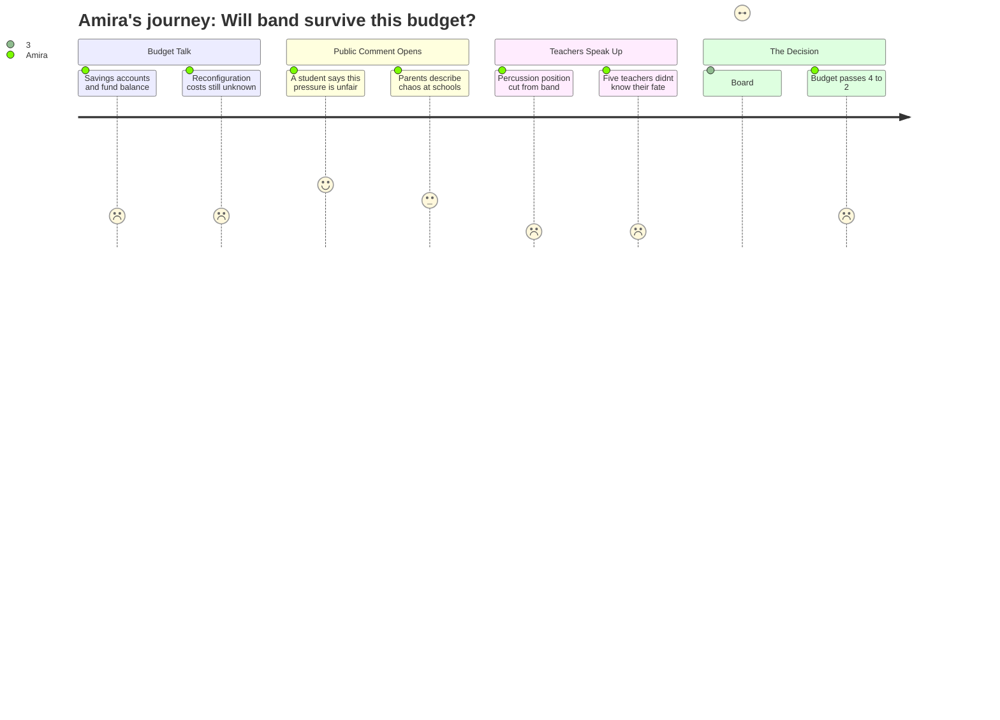

# Interpretation: Amira (PERSONA-013)
## Meeting: School Board Regular Meeting -- April 7, 2026 -- 2026-04-07

---

### Structured Points

#### 1. The percussion instructor position is being cut
- **Fact:** Middle school teacher Jen Fletcher told the board that the "512 percussion instructor position" is proposed for elimination. She described it as "foundational to a program that reaches students who may not find their place elsewhere" — not a luxury, but where many students "connect to school, discover strengths, and find their place."
- **Source:** Transcript, Jen Fletcher public comment [01:32:41–01:34:17]
- **Emotional valence:** negative
- **Threat level:** 4
- **Open question:** true — if one arts position comes back, will it be percussion, or something else?

#### 2. Computer science and two PE teachers are also going away
- **Fact:** Jen Fletcher also stated the middle school is losing "our entire computer science curriculum, one of two STEM teachers, and two physical education teachers" alongside the percussion cut. Even restoring one arts position, she said, "is not enough to meaningfully restore access."
- **Source:** Transcript, Jen Fletcher public comment [01:33:00–01:33:30]
- **Emotional valence:** negative
- **Threat level:** 4
- **Open question:** false

#### 3. Five middle school teachers spent the whole day not knowing their jobs
- **Fact:** Middle school teacher Jamie Watson described how five staff members were "on edge" all day after a budget slide was released that said only "related arts teacher" — no subject, no name. Two of those teachers had already begun applying to jobs in other districts while continuing to teach their classes.
- **Source:** Transcript, Jamie Watson public comment [01:34:50–01:35:30]
- **Emotional valence:** negative
- **Threat level:** 3
- **Open question:** true — which specific teachers are staying, and will Amira's teachers be among them?

#### 4. A kid stood up and said it wasn't fair
- **Fact:** A student named Cass, who attends Small School, came to the public comment microphone and said: "I just don't think it's fair that teachers and kids have to be in this pressure."
- **Source:** Transcript, first public comment [01:10:56]
- **Emotional valence:** positive
- **Threat level:** 1
- **Open question:** false

#### 5. One board member named the arts teachers "the joy and the light"
- **Fact:** Board Member Richardson, announcing she would vote against the budget, said: "Middle school is a dark time, and these related arts teachers are the joy and the light." She listed the related arts cuts — alongside behavior and occupational therapy positions — as reasons she could not approve the budget. She was outvoted 4–2.
- **Source:** Transcript, board deliberation before vote [approximately 01:58–02:01]
- **Emotional valence:** positive
- **Threat level:** 2
- **Open question:** true — what changes, if any, can still be made before the final warrant vote?

#### 6. One arts job might come back — but only maybe, and it's unspecified
- **Fact:** The administration proposed that if roughly $300,000 in unconfirmed state funding actually arrives, one "SPMS Related Arts" position could be reinstated for one year only. The specific subject or teacher was not named, and the state money had not been confirmed as of the meeting date.
- **Source:** Transcript, budget update [28:14]; Slide 13, "Potential Additional Dollars"
- **Emotional valence:** neutral
- **Threat level:** 3
- **Open question:** true — which arts position? For how long?

#### 7. The board voted to advance the budget — cuts are still in it
- **Fact:** The board voted 4–2 to send the superintendent's budget to city council. Members Holman, Smith, DeAngelis, and Risch voted in favor; Feller and Richardson opposed. The budget passed to council with the middle school percussion, computer science, and PE cuts still in place.
- **Source:** Transcript [02:01:39]: "All those in favor? Holman, Smith, DeAngelis, and Risch. And opposed? Feller and Richardson, opposed."
- **Emotional valence:** negative
- **Threat level:** 4
- **Open question:** true — the chair noted the budget "can change again" before the final warrant vote; Amira has no way of tracking whether that happens

---

### Journey Map

---

### Reactions

Mama, I watched the recording of the meeting last night after you went to sleep. You know how I've been worried about band? It's real. A teacher named Mrs. Fletcher came up to the microphone and said the percussion instructor position is being cut. Like, completely gone. And that's not even all of it — she said we're also losing all of computer science, which I just started this year, and two PE teachers. She kept saying these aren't extras, they're where kids actually feel like they belong. And she's right. I know kids who only come to school because of those classes. I thought maybe the board would actually listen after she said all that, but they voted yes on the budget anyway.

The part that really got to me though — there was this other teacher, Ms. Watson, and she talked about how five teachers at the middle school were on edge all day today. Like, all day, while parent-teacher conferences were happening. The board put out a slide that just said "related arts teacher" and didn't say which one, and two of those teachers had already started applying for jobs in other schools. While they were still teaching us. They didn't know if they still had a job, and we didn't know either, and nobody told anybody. That felt really wrong to me. Oh — and there was a kid named Cass who goes to Small School, they actually came up to the microphone and said they didn't think it was fair that teachers and kids had to be in this pressure. An actual kid said that at a school board meeting. I kind of wished I was there.

The one thing that surprised me was this board member, Ms. Richardson — she said out loud that "middle school is a dark time, and these related arts teachers are the joy and the light." She actually said those words. And she voted no because she thought the budget was wrong. But four other people voted yes, so the budget passed anyway and is going to the city council. They said there might be money coming from the state that could bring back one arts position — but they didn't say which one, and the money isn't even confirmed yet. So I don't know if it's the percussion teacher or something else. Nobody does. I'm going to tell my friends tomorrow, but I don't even know what to tell them.