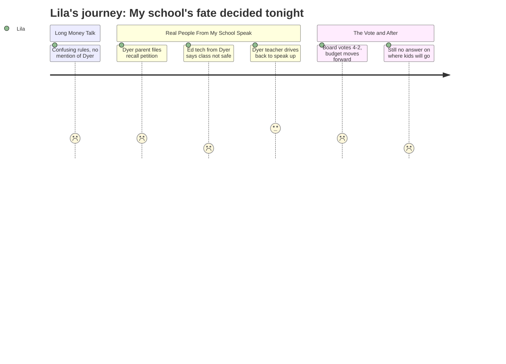

# Interpretation: Lila (PERSONA-014)
## Meeting: School Board Regular Meeting -- April 7, 2026 -- 2026-04-07

### Structured Points

#### 1. Someone from Dyer's classroom said it's not safe there right now
- **Fact:** Andrew Gigler, an educational technician in the functional life skills classroom at Dyer Elementary, told the board that his room has been short-staffed by one to two ed techs for nearly the entire school year, with many days when no substitute was sent. He said this created safety concerns for students throughout the year.
- **Source:** [93:43--96:00]
- **Emotional valence:** negative
- **Threat level:** 4
- **Open question:** false

#### 2. A Dyer parent filed papers to remove the board chair
- **Fact:** Ali Aldaman, a parent of two children at Dyer Elementary, announced he had filed an affidavit with the city clerk to recall Board Chair DeAngelis. He named "closure of one of our community schools" as one of the explicit reasons.
- **Source:** [84:18--85:53]
- **Emotional valence:** negative
- **Threat level:** 3
- **Open question:** false

#### 3. The FLS teacher at Dyer drove back from Westbrook to speak
- **Fact:** Caitlin Lefever, a functional life skills teacher at Dyer Elementary, said she had started the meeting at home in Westbrook but felt compelled to return. She warned the board that the district cannot attract ed techs to hard FLS work and that, without the two OT positions, her room would be unsafe.
- **Source:** [138:13--139:48]
- **Emotional valence:** neutral
- **Threat level:** 3
- **Open question:** false

#### 4. Nobody knows which school Dyer kids will go to next year
- **Fact:** When a public commenter asked how the district plans to draw attendance zone lines and assign students to schools, the superintendent responded that attendance zone details "are a part of the configuration planning" and are "a detail that we do not have at this point."
- **Source:** [157:39--158:28]
- **Emotional valence:** negative
- **Threat level:** 5
- **Open question:** true

#### 5. A teacher said research shows moving schools sets kids back
- **Fact:** Lynn McEwen, a teacher who served on the 2023-24 Boundaries and Configuration Steering Committee, told the board that research shows school transitions "carry a negative effect size" — meaning moving from one school to another actively sets students back. She added that long-term integration benefits outweigh this harm if the transition is well-supported.
- **Source:** [99:55--101:30]
- **Emotional valence:** negative
- **Threat level:** 3
- **Open question:** true

#### 6. Two classroom teachers are being added back to elementary schools
- **Fact:** The budget proposal includes two classroom teaching positions at the elementary level to reduce class sizes. They are one-year-only positions, and neither the exact grade level nor the school placement has been determined yet — both will depend on enrollment figures.
- **Source:** [25:55--26:41]
- **Emotional valence:** positive
- **Threat level:** 1
- **Open question:** true

#### 7. The board voted to pass the budget and send it to city council
- **Fact:** After board discussion, the vote on the FY27 budget passed 4-2, with Members Feller and Richardson opposed. Board Chair DeAngelis noted that the budget will go to city council on April 14 "in its present form, but that doesn't mean that's its final form."
- **Source:** [201:39--202:27]
- **Emotional valence:** negative
- **Threat level:** 4
- **Open question:** true

---

### Journey Map

---

### Reactions

So my mom went to the meeting last night and when she came home she was really quiet. She said the vote went through, which I don't totally understand but I know it's bad because of how her face looked. They talked about money for a really long time and I guess it was like hours of just numbers and stuff. None of it made any sense to me, like what is a contingency and why does it matter. But then real people started talking, people from actual Dyer, and that's when I really started listening. This man named Andrew, he actually works in the room down the hall from my classroom, the one with Ms. Lefever. And he said it's been not safe there all year because they didn't have enough people. Like he said they were short-staffed almost the WHOLE YEAR. I didn't know that was happening in my school. That's scary.

And then Ms. Lefever — she wasn't even there at the start, she was at home in a different city — but she came all the way back just to talk to them. She said if they get rid of the OT people it won't be okay. The parent of kids in my school, Mr. Aldaman, he said he's trying to get rid of the board chair because of what they're doing to our school. That's a really big deal, like I didn't know you could even do that. And Caleb Collins, his kids go to Dyer, and he talked too but he said maybe it was okay if Dyer closed if that was the best thing, which felt really weird to hear because it's OUR school. The thing I still don't understand is WHERE AM I GOING. Someone asked that exact question at the meeting and the answer was basically "we don't know yet." How is that possible? School starts in August.

That's the part that keeps bugging me. My teacher — I've had her for two years because of the looping thing — and I don't know if she's coming to whatever school I'm going to. I don't know if my friends are coming. I don't even know what school it is. A teacher at the meeting talked about how research says moving schools actually makes kids do worse, not better. She said it gets better eventually but it's bad at first. I want to ask: what if it doesn't get better for me? The vote went through and nothing got answered and my mom came home quiet. My little sister doesn't know any of this is happening yet. She's in first grade. I don't know how to explain it to her when I can't even explain it to myself.