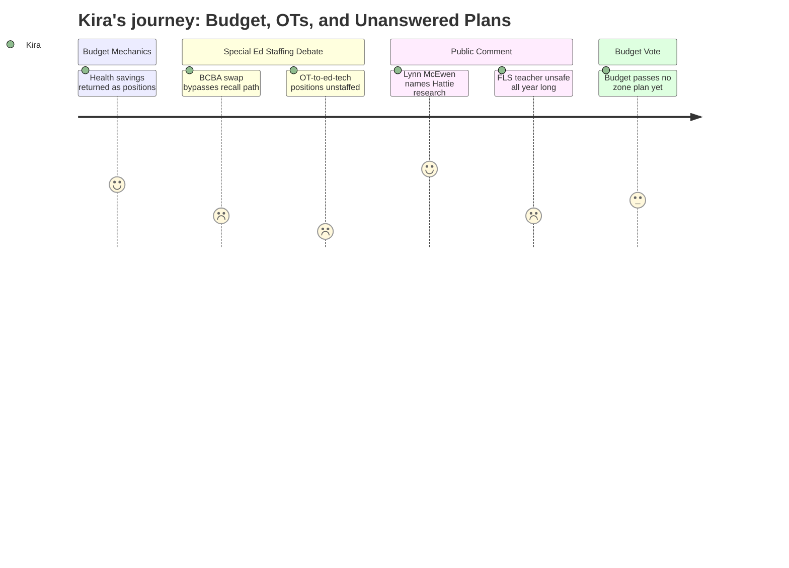

# Interpretation: Kira (PERSONA-015)
## Meeting: School Board Regular Meeting -- April 7, 2026 -- 2026-04-07

---

### Structured Points

#### 1. BCBA credential requirement eliminates recall path for incumbent behavior strategist
- **Fact:** The district proposed reposting the general education behavior strategist role with a board-certified behavior analyst credential requirement, which effectively blocks recall of the current incumbent. Member Richardson pushed back directly, describing the strategist role as "a real bridge between general ed and special ed" and "a lifeline for general ed teachers to help manage the behaviors of kids right away when they come into the district before they even have an IEP." The superintendent confirmed the strategist position was added only in 2023 and asserted a BCBA would provide the same services, but did not address the recall gap or the social work credential the incumbent holds.
- **Source:** [54:47–62:38] transcript
- **Emotional valence:** negative
- **Threat level:** 4
- **Open question:** true

#### 2. Embedded OT model eliminated; replacement ed tech positions are currently unfilled and off recall list
- **Fact:** The district plan removes two embedded occupational therapists from functional life skills classrooms and replaces them with two special education ed tech positions. The superintendent noted the embedded OT model currently operates in only two of six elementary FLS classrooms. FLS teacher Caitlin Lefever testified that ed tech openings are consistently unfilled and visible on the district's weekly staffing emails; she said she has not taken a full 45-minute lunch break in 14 years due to safety constraints. The administration confirmed the two replacement ed tech positions are not currently staffed and are not on the recall list.
- **Source:** [55:35–59:30] transcript; [138:13–139:48] transcript (Lefever testimony)
- **Emotional valence:** negative
- **Threat level:** 5
- **Open question:** true

#### 3. Potential emergency state funding could restore an elementary BCBA and middle school arts position
- **Fact:** The district identified approximately $302,000 in preliminary emergency state appropriations — $152,620 for lower-SES students and $150,000 for McKinney-Vento homeless youth — not yet confirmed in the state allocation. If received, the administration's recommendation is to use those funds for an elementary BCBA, a middle school related arts teacher, and additional contingency. Both positions would be posted as one-year only, subject to Article 18 recall provisions.
- **Source:** [28:14–29:10] transcript; Budget Presentation Slide 13
- **Emotional valence:** positive
- **Threat level:** 2
- **Open question:** true

#### 4. Boundaries Committee member cites Hattie research and names the sidelined prior process
- **Fact:** Lynn McEwen, who served on the 2023–24 Boundaries and Configuration Subcommittee, cited John Hattie's synthesis of over 1,000 meta-analyses: school transitions carry a negative effect size, but socioeconomic integration carries a meaningful positive effect size, especially for low-income students, and the benefit compounds over years if the transition is well-supported. She stated directly that "many of us who invested deeply in that dialogue feel like we're watching this issue resurface without the benefit of that knowledge," and directed the public to source materials still available on the district website.
- **Source:** [99:08–101:30] transcript
- **Emotional valence:** positive
- **Threat level:** 2
- **Open question:** false

#### 5. SPTA survey: 92% of members report negative or very negative staff morale; elementary staff support reconfiguration but want more time
- **Fact:** The South Portland Teachers Association reported results from a survey sent the previous evening: 92% of respondents reported negative or very negative staff morale; 76% opposed the superintendent's budget in its current form (collected prior to that evening's updated slides); 84% agreed cuts should come from administration rather than student-facing positions. Notably, 51% of elementary respondents supported reconfiguration — but with a preference for a longer timeline.
- **Source:** [89:49–92:57] transcript (Abby Anderson, SPTA VP)
- **Emotional valence:** negative
- **Threat level:** 4
- **Open question:** false

#### 6. $15,000 summer curriculum budget translates to roughly five hours per person across fifty staff
- **Fact:** SPTA president Sarah Gay calculated that the $15,000 budgeted for optional summer curriculum and reconfiguration planning work equates to approximately 277 hours for one teacher at the district's average hourly rate of $54, or roughly five hours each for fifty people. The administration confirmed this estimate was rough and would depend on who fills the positions and their salary lanes. No plan had been developed for which teachers would be invited to do the work or how many would be needed.
- **Source:** [87:27–88:14] transcript (Gay testimony); [43:51–45:23] transcript (board discussion of summer work estimate)
- **Emotional valence:** negative
- **Threat level:** 3
- **Open question:** true

#### 7. Budget passes 4–2 to advance to city council; attendance zone question left unanswered
- **Fact:** The board voted 4–2 to advance the superintendent's budget to city council (Feller and Richardson opposed). When a public commenter asked how attendance zone lines would be drawn for reconfigured schools, the administration responded that this is "part of the configuration planning and will be addressed." No equity rubric, draft zones, or criteria for student assignment were presented. The board chair noted the budget can still be revised before the final warrant vote.
- **Source:** [201:00–202:27] transcript (vote); [157:39–158:28] transcript (attendance zone question)
- **Emotional valence:** negative
- **Threat level:** 3
- **Open question:** true

---

### Journey Map

---

### Reactions

The budget passed 4–2 to go to city council, which I knew was coming. But the behavior strategist question is still eating at me. Member Richardson kept pressing — why are we posting for a BCBA credential instead of just recalling the strategist who's been doing the work? The admin kept saying it's the same services, but it's not. I cross four buildings. I know how that referral pipeline actually works. The strategist is who a general ed teacher calls before there's even an IEP — someone who knows the kid, knows the history, can walk into a classroom same day. You post for a different credential requirement and you've blocked the recall, changed who the role serves, and lost the institutional knowledge in one move. And the person who was in that role is apparently gone now. Richardson even said we'd "pummeled" the previous board for cutting social emotional learning and that we've now eliminated two social workers. Nobody had a real answer. That's the kind of thing I see play out building by building — we study the equity problem, we lose the people doing the equity work, and then we wonder why nothing changes.

Then Caitlin from Dyer comes in late — said she started watching from home and drove back into the city because she couldn't stay quiet. She works in an FLS classroom. She confirmed what I see on the weekly staffing emails: ed tech positions in functional life skills classrooms are consistently unfilled. The district's plan is to replace two embedded OTs with two ed tech openings that aren't staffed and aren't on the recall list. The superintendent said they were "staffed for those needs." Caitlin said otherwise and named her own lunch break as the evidence. I'm in that building once a week. I know who's telling the truth. And what keeps me up is that this is one classroom in one school — I'm thinking about all four buildings.

The one moment where I felt like someone actually got it right was Lynn McEwen. She was on the Boundaries and Configuration Committee — that was real work, multilingual outreach, research reviews, community forums. She cited Hattie directly: transitions hurt in the short term, but socioeconomic integration helps, especially for low-income kids, and the benefit compounds over years if the transition is well-supported. That's the case for doing reconfiguration right, not for skipping it. And we still have no attendance zone plan. Nobody could say how the lines would be drawn — no equity rubric, no criteria, no draft. If we close Kaylor and don't redistrict in a way that actually rebalances the demographics, we will move kids around and make the concentration worse. I've been watching this exact pattern for years across these buildings. Tonight felt like a real chance to break it, and we passed a budget to go to city council without a single answer about where any of these kids are going.