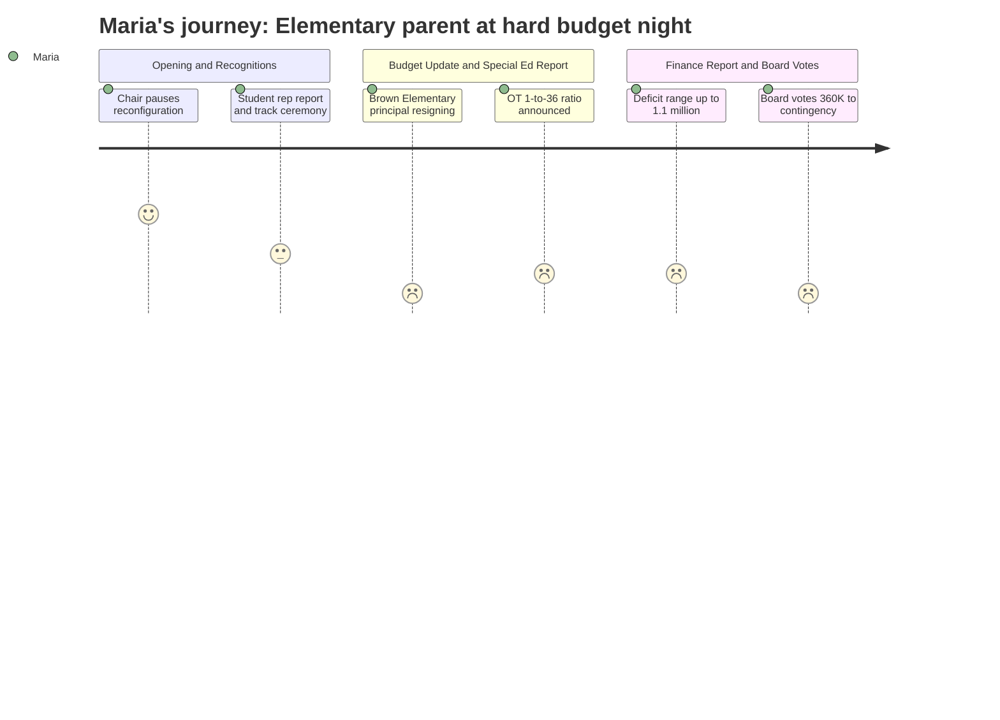

# Interpretation: Maria (PERSONA-001)
## Meeting: School Board Regular Meeting -- April 13, 2026 -- 2026-04-13

### Structured Points

#### 1. Board Announces Reconfiguration Pause
- **Fact:** At the opening of the meeting, Chair DeAngelis announced that the board will vote on April 29th to halt the reconfiguration process for September 2026, citing "strong support on this board to delay the action" and stating that "slowing down is what's best for all." The Reconfiguration Committee will continue working toward a future year implementation.
- **Source:** Transcript [03:16–04:48]; Board Slides, slide 2
- **Emotional valence:** positive
- **Threat level:** 1
- **Open question:** true — The chair was explicit that reconfiguration itself is only delayed, not abandoned. The committee continues with two board representatives. It is not yet clear what a revised timeline looks like, what criteria will govern community input, or whether the eventual plan will differ substantively from the one paused tonight.

#### 2. Brown Elementary Principal Is Leaving
- **Fact:** Superintendent Entwistle reported that Beth Kellogg, principal of Brown Elementary School, has submitted her resignation, effective June 30, 2026 — just weeks before FY27 staffing transitions begin. The superintendent noted the recall list would cover the two departing classroom teachers but made no equivalent statement about the principal vacancy.
- **Source:** Transcript [42:35]; Board Slides, slide 5
- **Emotional valence:** negative
- **Threat level:** 4
- **Open question:** true — No search timeline, transition plan, or interim leadership arrangement was mentioned for Brown. The departure takes effect during the same period that the district is executing large-scale staffing changes across all elementary schools.

#### 3. Embedded OT Model Ends; Caseload Ratio Rises to 1:36
- **Fact:** Director of Instructional Support Kat Cox announced that the district is discontinuing the embedded OT model at elementary life skills classrooms and returning to a pull-out and consultative approach. With 3.8 OT positions districtwide serving a projected 138 students, the new ratio will be 1:36. Cox stated explicitly that she was "not advocating for them to have that many kids" — the state legal limit is 50.
- **Source:** Transcript [43:20–48:51]; Board Slides, OT staffing slides
- **Emotional valence:** negative
- **Threat level:** 3
- **Open question:** true — Member Richardson raised that because the embedded model was in place during both data years shown in the restraint and seclusion chart, the presented data cannot tell us what losing the embedded model will do. Cox acknowledged: "we can't know what the impact of the loss of the OT model really is." No comparison of outcomes under the two models was provided.

#### 4. Ed Tech Shortages Acknowledged With No Concrete Hiring Timeline
- **Fact:** Cox outlined ongoing systemic difficulty hiring Ed Tech 2s and 3s and described potential actions including referral incentives, job platform expansion, and possible outside agency partnerships for BHP-credentialed staff. Two special education ed tech positions are being reinstated in FY27. She acknowledged that IEP-based staffing assignments are not yet finalized and will shift through the end of the school year.
- **Source:** Transcript [51:57–60:27]; Board Slides, ed tech staffing slides
- **Emotional valence:** negative
- **Threat level:** 3
- **Open question:** true — The teachers' association president asked during public comment whether the cost of subcontracting BHP staff would exceed the cost of direct hiring. The superintendent acknowledged the question but did not provide comparative figures. [Transcript 149:30–150:00; 170:38–171:26]

#### 5. Current Year Deficit Could Reach $1.1 Million
- **Fact:** Finance Director Abigail Ketchen reported that with 75% of the fiscal year elapsed and 95% of funds expended or encumbered, the projected FY26 deficit range has widened to $80,000–$1.1 million. The fund balance is depleted. During finance committee discussion, Member Holman additionally noted that internal budget reports had flagged — in yellow — an unquantified SPTA time-beyond-contract expense that will also hit FY26, which Ketchen confirmed was not yet estimated.
- **Source:** Transcript [92:40–95:51]; Transcript [97:28–100:30]; Board Slides, Finance Committee report slide
- **Emotional valence:** negative
- **Threat level:** 4
- **Open question:** true — The final deficit figure, the mechanism for covering it, and the payback arrangement with the city were all described as unresolved. The full cost of SPTA time-beyond-contract was characterized as unknown pending submissions from staff.

#### 6. Board Votes to Direct $360K to Savings, Not Restore Positions
- **Fact:** The board voted 3–2 (Smith, Risch, DeAngelis in favor; Richardson and Holman opposed) to direct any savings from a proposed $360,000 city offset of SRO and snow removal costs into the contingency fund rather than restoring laid-off positions. The majority rationale was preventing a repeat budget crisis. Members Richardson and Holman stated they wanted the money used to restore positions — Richardson specifically named elementary support and middle school related arts.
- **Source:** Transcript [121:32–145:48]; Board Slides, New Business slide
- **Emotional valence:** negative
- **Threat level:** 3
- **Open question:** true — The $360,000 offset depends entirely on city council approval, which had not been granted as of this meeting. Even if approved, the contingency allocation would not restore any of the 78 eliminated positions.

#### 7. FY28 Budget Already Flagged as Requiring "Careful Planning"
- **Fact:** In the budget update, Ketchen told the board that her early FY28 modeling suggests the district "will have to do some careful planning ahead if we want to remain under 6% the following year," citing health insurance, the EPS formula update, and what she described as "worldwide events" as major swing factors. She declined to make a specific prediction.
- **Source:** Transcript [37:37–39:30]; Board Slides, slide 10
- **Emotional valence:** negative
- **Threat level:** 3
- **Open question:** true — No FY28 scenarios or cut ranges were presented. A teacher (Chloe Bartlett, Dyer Elementary, third year) asked directly during public comment whether staff would face another year of fear and uncertainty. Ketchen's response did not rule that out. [Transcript 84:49–90:19]

---

### Journey Map

---

### Reactions

Okay so the big headline tonight is they're pausing reconfiguration, and yes — I'm relieved, I've been up at night over this for weeks. But I'm watching the group chat and people are popping off like it's done, and it's not. The committee keeps going, they've already picked two board members for it, and the chair said multiple times that this is a delay, not a cancellation. So it's good news, but let's be honest about what it actually is.

The thing that sucker-punched me came twenty minutes later when the superintendent was reading off resignations like it was a grocery list — and one of them was Beth Kellogg. Brown's principal. Leaving by end of June. She's leaving. And they just moved on. No plan mentioned, no interim, no search timeline, nothing. That's our principal. She knows every single kid in that building. And they said the recall list covers the two teachers who resigned, but nobody said anything about what happens with leadership at Brown. I'm genuinely worried about September now in a way I wasn't when I walked in tonight.

Then there was this whole hour on occupational therapy and ed tech staffing, and I'm trying to follow it, but the bottom line is: they're cutting the embedded OT model, the new ratio is going to be one OT for every 36 kids, and the director said — right into the microphone — that she would not advocate for those numbers. So she's telling us it's too many. And the ed tech situation is the same story they've been telling for years — it's hard to hire, we're working on it, here's a list of things we're going to try. Meanwhile there are classrooms right now where kids on IEPs are having their routines disrupted because aides are being moved around. The teachers' association president asked whether it would actually cost *more* to outsource ed tech staff than to just hire them directly. Nobody had an answer. That question should have an answer before they move forward.

The part that frustrated me most was near the end. The board had a chance to ask the city to cover $360,000 in snow plowing and SRO costs, and two board members wanted to use that money to bring back some of the positions they cut. Three members voted to put it into savings instead. I understand the contingency argument — I really do, especially after the finance director dropped that the current year deficit might be as high as $1.1 million. I did not know that number before tonight and it scared me. But we just cut 78 people, 42 of them teachers, and the answer when $360K comes back is a savings account? And then at the very end of the meeting, almost as a footnote, Ketchen said FY28 is going to need "careful planning" to stay under 6% too. So I'm going home wondering: does my kid have a principal in September? Is FY28 going to be another year of this? Three hours in that room and those are the questions keeping me up.