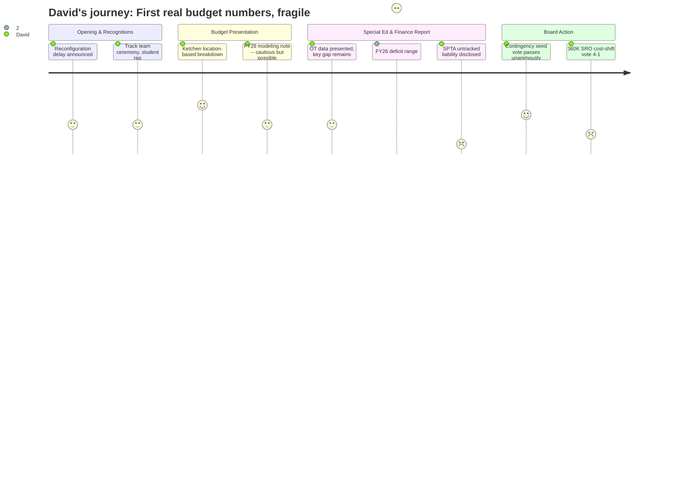

# Interpretation: David (PERSONA-002)
## Meeting: School Board Regular Meeting -- April 13, 2026 -- 2026-04-13

---

### Structured Points

#### 1. Location-Based Budget Breakdown Corrects a Material Misconception
- **Fact:** Finance Director Ketchen presented the first location-sorted budget analysis, showing that closing Kaylor carries roughly a $4 million impact on the full FY27 budget -- not the ~$400K facilities figure that had circulated in prior sessions and created confusion. The $400K had represented only a facilities line adjustment, not the school's full allocated cost.
- **Source:** [32:30--36:24]; Board Slides slide 9 (Budget Development, Sorted by Location)
- **Emotional valence:** positive
- **Threat level:** 1
- **Open question:** false

#### 2. FY26 Deficit Range Is Extremely Wide, With an Unquantified Liability Still Pending
- **Fact:** The finance committee report placed the current-year deficit in a range of $80K to $1.1 million -- a 13x spread. On top of that, the assistant superintendent disclosed that SPTA time-beyond-contract hours have been untracked all year and not yet submitted; when those figures come in, they will add to whatever deficit is already running.
- **Source:** [92:40--95:51]; [97:28--100:30]; Board Slides slide 21 (Finance Committee)
- **Emotional valence:** negative
- **Threat level:** 4
- **Open question:** true

#### 3. Multi-Year Unreconciled Accounts Are an Active Audit Finding
- **Fact:** Ketchen disclosed that benefits and withholding accounts have been unreconciled "for years" and that reconciling them is a current focus. Separately, an FY23 special education invoice flagged as a repeat audit finding was only paid in this reporting period. The board requested a slide at the next meeting listing all audit findings, their status, and what remains outstanding.
- **Source:** [93:28--96:40]; [103:35 area -- consent agenda exchange re audit finding]
- **Emotional valence:** negative
- **Threat level:** 3
- **Open question:** true

#### 4. FY28 Early Modeling Is Cautiously Reassuring but Rests on Long List of Unknowns
- **Fact:** Ketchen stated she has built a preliminary FY28 roll-forward model and believes the district can stay under 6% next year "with some light attrition," but she explicitly named health insurance, EPS formula changes, city valuation, new SEA contract terms, and "worldwide events" as variables that could swing the result significantly in either direction. She declined to commit to a specific projection.
- **Source:** [37:10--41:03]; Board Slides slide 10 (Budget Information for Discussion)
- **Emotional valence:** neutral
- **Threat level:** 2
- **Open question:** true

#### 5. OT Staffing Model Change Is Data-Supported but a Key Counterfactual Remains Open
- **Fact:** The district presented specific numbers for the FY27 OT transition: 3.8 positions, 138 projected students requiring services, a 1:36 ratio -- all within state limits. However, Member Richardson pressed on whether the restraint-and-seclusion data can isolate the impact of removing the embedded OT model, and Director Cox acknowledged it cannot, because the embedded model was only in two of the six life skills classrooms.
- **Source:** [43:20--60:27]; Board Slides slides 14-18 (OT Staffing, EdTech Staffing, Restraint & Seclusion)
- **Emotional valence:** neutral
- **Threat level:** 2
- **Open question:** true

#### 6. Board Votes Unanimously to Ask City for 1% Tax Increase to Seed Contingency
- **Fact:** The board passed a motion unanimously directing staff to bring a 1% tax increase request to the city council, with the express purpose of rebuilding the fund balance rather than restoring laid-off positions. Ketchen's slide showed 1% equals approximately $540K. The motion to use a potential 0.5% increase to restore positions failed for lack of a second.
- **Source:** [128:30--135:39]; Board Slides slide 10 and slide 26 (New Business 8.2)
- **Emotional valence:** positive
- **Threat level:** 1
- **Open question:** false

#### 7. Board Votes 4-1 to Ask City to Absorb $360K in Service Costs -- Member Raises Cost-Shifting Concern
- **Fact:** The board voted 4-1 to ask the city council to absorb the cost of SROs (~$220K) and snow removal/sanding (~$140K), totaling $360K. One member voted against, arguing explicitly that both items draw from the same taxpayer pool and simply shift dollars between city and school budgets without reducing the aggregate burden.
- **Source:** [106:47--127:43]
- **Emotional valence:** neutral
- **Threat level:** 2
- **Open question:** true

#### 8. Three Resignations Include a Building Principal, Adding Hiring Costs to an Already Stressed FY27
- **Fact:** The superintendent reported three resignations effective at the end of the school year: two classroom teachers (special education at Skillin, grade 1 at Dyer) and the principal of Brown Elementary. The two teacher positions are expected to be filled from the recall list; the principal position is not.
- **Source:** [41:49--42:35]; Board Slides slide 5 (Superintendent's Report)
- **Emotional valence:** negative
- **Threat level:** 2
- **Open question:** true

---

### Journey Map

---

### Reactions

So tonight was actually the first meeting where I felt like I got a real number to work with. The finance director built a location-based budget breakdown -- sorted by school, not cost center -- and it finally explained why the "$400K" figure for closing Kaylor never made sense to me. That was just facilities. The full allocated cost of running Kaylor, when you properly distribute transportation, central services, and instruction, is closer to $4 million. That's roughly half of all the reductions the district has made this cycle. That is a significant data point that should have been in every presentation since February.

The part that's going to bother me is the FY26 deficit. We're three-quarters through the year and the range is $80K to $1.1 million. That's not a range, that's a shrug. And then right after that, the assistant superintendent stood up and basically said: we have SPTA time-beyond-contract hours that haven't been submitted for payment yet, going back to when the contract was ratified, and when those come in, they land on top of whatever deficit we're already sitting on. The books also have unreconciled benefits and withholding accounts that have been a known problem for years and are only now getting cleaned up. I'm not calling it mismanagement, but those are real governance flags and the range is going to move before the year closes.

On the upside: the board voted unanimously to ask the city for a 1% tax increase specifically to seed the contingency fund -- not to restore positions, not to spend it, just to start rebuilding reserves. That's exactly right. You cannot run a $75 million organization with no cushion. I actually would have supported more than 1%, but I understand the political math. The SRO and snow removal ask is different -- one board member made the right point that it's the same tax dollars moving between buckets. Maybe there's a rationale for it as a short-term arrangement while the district stabilizes, but I'd want to see whether the city actually absorbs it or just passes it back through the mill rate. If they do absorb it, the board voted to put those savings into contingency too, which at least makes it consistent. The FY28 question is still unanswered -- we won't have the new EPS numbers until February, and that formula change could swing things significantly. I'm watching that.