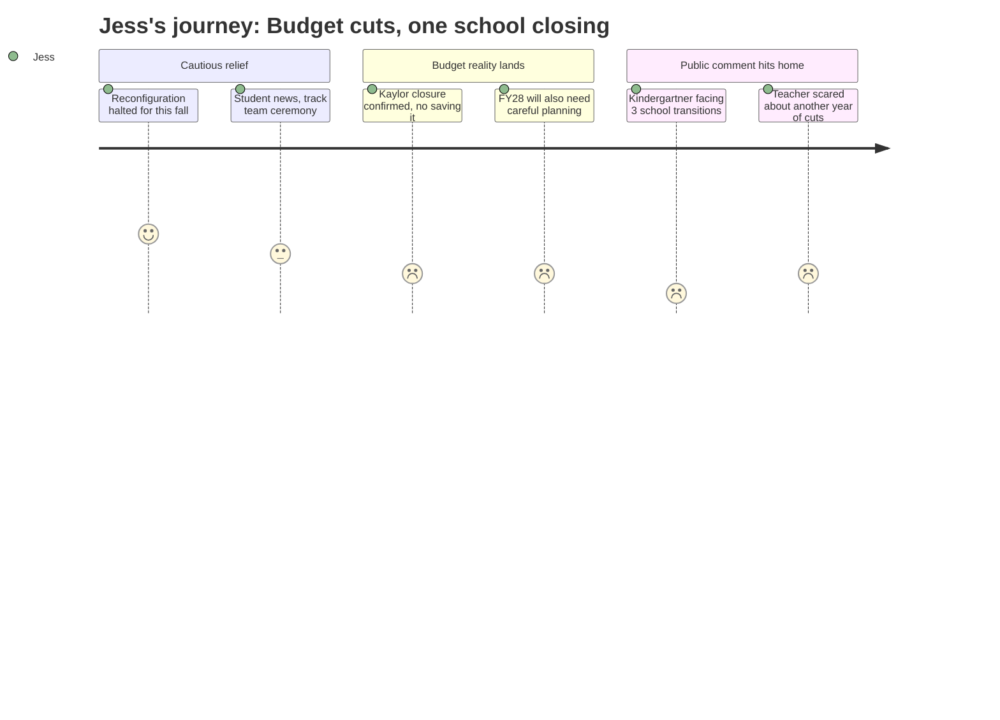

# Interpretation: Jess (PERSONA-003)
## Meeting: School Board Regular Meeting -- April 13, 2026 -- 2026-04-13

### Structured Points

#### 1. Reconfiguration halted for this September -- but only delayed, not canceled
- **Fact:** The board chair announced at the meeting's opening that a formal vote to halt school reconfiguration for September 2026 would happen at the April 29th special meeting, with strong board support for the delay. The chair was explicit, however, that reconfiguration itself -- the redistribution of students across schools -- remains the board's goal, with a new target of fall 2027.
- **Source:** [04:02] transcript
- **Emotional valence:** positive
- **Threat level:** 2
- **Open question:** true

#### 2. Kaylor Elementary is closing this year, and there is no financial path to save it
- **Fact:** When a board member asked directly whether it was still possible to keep Kaylor open, the finance director said: "I really don't think so. I'm very sorry. If I thought there was a real path there financially, I would love to see that be true. I don't think that's the financial path forward."
- **Source:** [91:05] transcript
- **Emotional valence:** negative
- **Threat level:** 3
- **Open question:** true

#### 3. A kindergartner could face three school transitions in three years
- **Fact:** A Brown School parent speaking during public comment described his kindergartner as "facing the potential of three school transitions in three years" under reconfiguration scenarios. He also noted that parents of young children at neighborhood birthday parties and playdates "didn't realize this was happening" and felt they had no time to engage.
- **Source:** [70:39] transcript
- **Emotional valence:** negative
- **Threat level:** 4
- **Open question:** true

#### 4. The finance director warned that FY28 will also require careful planning
- **Fact:** The district's finance director stated that early modeling suggests the district "will have to do some careful planning ahead if we want to remain under 6% [tax increase] the following year," citing major unknowns including health insurance rates, state funding formula changes, and "worldwide events."
- **Source:** [37:10] transcript; Board Slides p. 10
- **Emotional valence:** negative
- **Threat level:** 4
- **Open question:** true

#### 5. Brown Elementary's principal resigned, effective end of June
- **Fact:** Principal Beth Kellogg submitted her resignation from Brown Elementary, effective June 30, 2026. Two classroom teachers at Skillin and Dyer also resigned, effective end of August.
- **Source:** [42:35] transcript; Board Slides p. 5
- **Emotional valence:** negative
- **Threat level:** 3
- **Open question:** true

#### 6. A third-year teacher described being scared and asked whether next year would be the same
- **Fact:** Third-grade teacher Chloe Bartlett told the board she was "shaking" and said: "Next March, are we going to be going through another year of fear of being cut? Are we going to go through another year of not knowing? How are you going to ensure that the trauma, stress, and loss that we felt through the communities aren't repeated a third time in a row?"
- **Source:** [84:49] transcript
- **Emotional valence:** negative
- **Threat level:** 3
- **Open question:** true

#### 7. Special education classrooms may still be understaffed when the new school year starts
- **Fact:** The director of instructional support acknowledged that ed tech hiring has been "consistently difficult" across the district and state, that shortages force principals to regularly reassign staff and disrupt student routines, and that the district is exploring referral incentives and outside agency partnerships -- with no certainty those strategies will close staffing gaps before fall.
- **Source:** [54:16] transcript; Board Slides (Ed Tech Hiring Challenges & Actions)
- **Emotional valence:** negative
- **Threat level:** 3
- **Open question:** true

---

### Journey Map

---

### Reactions

Okay so I finally made myself watch the school board meeting because I keep seeing things about it on the neighborhood Facebook group and I needed to know what was actually happening. The first thing the chair said was basically: we're not doing the big school reshuffle this September, we're delaying it. And I felt this wave of relief. Like, okay, things aren't blowing up right now. But then I kept watching and slowly realized that one school IS still closing this year -- that's done, the finance person said there's literally no financial path to keep it open -- and the reshuffle is just moving to the year after. So by the time my kid starts kindergarten, the whole map of which school goes where could be completely different and nobody actually knows what it'll look like.

The part that really got me was this dad who stood up during public comment. He was a Brown School parent and he said his kindergartner -- who just started school this year -- could end up switching schools three times in three years. Three times. And he mentioned that he'd been talking about this at a birthday party and other parents had no idea it was even happening. That's me. That's exactly me. I'm the parent at the birthday party who doesn't know. And now I'm thinking, is my kid going to start kindergarten and then get moved to a different school the next year, and then maybe again the year after? Because they're talking about reconfiguring everything for 2027, which is exactly when she'd be starting.

And then there was this teacher -- I think she said it was her third year at Dyer -- and she was literally shaking at the podium. She said her heart was broken and she asked the board directly: "Are we going to go through another year of fear of being cut? How do you make sure this doesn't happen a third time?" The finance director's answer was kind of... not reassuring? She said FY28 is going to need "careful planning" and there are a lot of unknowns. The principal at Brown Elementary just resigned. Teachers are resigning. And someone mentioned they can't even reliably hire enough classroom aides. I want to believe South Portland is a good place to raise a family and send my kid to school. But this doesn't feel like a district that knows what it's going to look like in two years. It feels like they're managing a crisis one year at a time and hoping it stabilizes, and my daughter is going to walk into the middle of it.