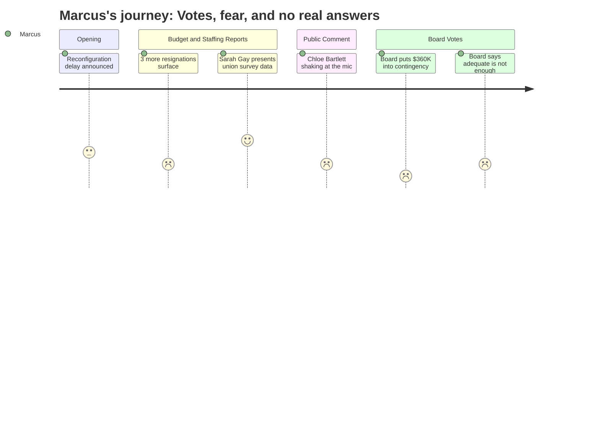

# Interpretation: Marcus (PERSONA-004)
## Meeting: School Board Regular Meeting -- April 13, 2026 -- 2026-04-13

---

### Structured Points

#### 1. Reconfiguration halted for September 2026 -- some breathing room
- **Fact:** The chair announced at the meeting's open that the board will vote on April 29th to halt the September 2026 reconfiguration timeline, citing "strong support on this board to delay the action." The reconfiguration committee will continue its work, with Smith and Richardson as board representatives.
- **Source:** Transcript [03:16--05:35]; Board Slides 4.13.26, Slide 2
- **Emotional valence:** positive
- **Threat level:** 2
- **Open question:** true -- The chair distinguished between halting "this process right now" and halting the plan itself. Member Holman explicitly said she "doesn't envisage any halt." Marcus does not yet know what reconfiguration looks like in FY28, or what it means for current SPHS staffing stability.

#### 2. Three more resignations -- the bleeding continues
- **Fact:** The superintendent reported resignations from Victoria Argese (special education teacher, Skillin, effective 8/31/26), Katelyn Field (grade 1 teacher, Dyer, effective 8/31/26), and Beth Kellogg (principal, Brown, effective 6/30/26). A board member confirmed the two classroom teachers will go to the recall list, but the principal will not.
- **Source:** Transcript [41:49--42:35]; Board Slides 4.13.26, Slide 5
- **Emotional valence:** negative
- **Threat level:** 3
- **Open question:** true -- These are three more departures layered on top of 42 proposed teacher eliminations. Marcus would want to know how many positions from the recall list have actually been filled, and whether voluntary attrition is now accelerating ahead of the formal cuts.

#### 3. SPTA survey: 85.6% of member respondents say transparency has been lacking
- **Fact:** SPTA President Sarah Gay presented results from a member survey with 187 respondents (approximately 66% of the bargaining unit). Key findings: 85.6% feel transparency has not characterized how information about cuts has been communicated; 75.4% want the board or city council to approve more funding; 77.5% still do not approve of the budget. Gay also stated that a "lengthy" impact bargaining process still lies ahead.
- **Source:** Transcript [67:28--69:51]
- **Emotional valence:** negative
- **Threat level:** 4
- **Open question:** true -- Gay's data puts specific numbers behind what Marcus has been feeling, but the board did not formally respond to the survey findings during the meeting. Whether this data shapes upcoming impact bargaining or board decisions is unresolved.

#### 4. A third-year teacher's testimony: "Are we going through another year of fear?"
- **Fact:** Chloe Bartlett, a third-grade teacher at Dyer in her third year in the district, testified that her "heart was broken" repeatedly since February and asked directly: "Next March, are we going to be going through another year of fear of being cut? Are we going to go through another year of not knowing?" The board offered no direct answer to this question.
- **Source:** Transcript [84:49--85:35]
- **Emotional valence:** negative
- **Threat level:** 4
- **Open question:** true -- Finance Director Ketchen's subsequent FY28 modeling remarks (see Point 7) gave a partial answer, but no board member addressed the human experience Bartlett named.

#### 5. Board votes 3-2 to route any city relief into contingency, not position restoration
- **Fact:** After the board voted to ask the city for $360,000 to offset SRO and snow removal costs, members debated where those dollars would go if approved. Members Richardson and Holman argued for restoring positions (specifically middle school related arts). Members Smith, Risch, and DeAngelis argued for contingency. The motion to direct the funds to contingency passed 3-2 (Smith, Risch, DeAngelis in favor; Richardson and Holman opposed).
- **Source:** Transcript [140:17--145:48]
- **Emotional valence:** negative
- **Threat level:** 5
- **Open question:** true -- The $360,000 would not restore positions even if the city approves it. Marcus would track this vote as a concrete statement of priorities: the board's first instinct with new revenue was institutional financial repair, not restoring what was cut from classrooms.

#### 6. Middle school related arts positions named repeatedly -- still no path to restoration
- **Fact:** Multiple public commenters named specific middle school positions at risk -- computer science (Mr. Wetzel), phys ed/STEM (Ms. Hellyer), athletics equipment (Mrs. Watson), and unified basketball (Mr. Lenson). Members Holman and Richardson both stated support for restoring related arts positions but were in the 3-2 minority on the contingency vote. No formal motion to restore any position was offered or seconded during the meeting.
- **Source:** Transcript [115:17--116:03], [155:51--158:56]
- **Emotional valence:** negative
- **Threat level:** 4
- **Open question:** true -- SPHS students arrive from this middle school. If those programs collapse, Marcus sees the downstream effects: students who never had computer science, who were disconnected in middle school, who show up at SPHS having missed the foundational years.

#### 7. Finance director signals FY28 will require "careful planning" to stay under 6%
- **Fact:** Abigail Ketchen stated that her early FY28 roll-forward modeling "puts us a touch over 6%" under current assumptions, with major unknowns including health insurance (separately projected at 12% increase for FY27), EPS formula changes, and the new SPTA contract. She added: "I know enough that it's not going to be like this next year," but immediately qualified that with "pending some of these big drivers" and "worldwide events."
- **Source:** Transcript [37:10--39:30], [89:30--90:19]; Board Slides 4.13.26, Slide 10
- **Emotional valence:** negative
- **Threat level:** 3
- **Open question:** true -- The SPTA contract was specifically identified as a roll-forward unknown. The district is entering contract negotiations while its financial picture for FY28 is genuinely uncertain. Marcus would want to know how the union can bargain effectively without reliable projections.

---

### Journey Map

---

### Reactions

So I walked out of there last night genuinely frustrated, and I've been thinking about how to explain why to people who weren't there. Here's the thing: the chair stood up and said reconfiguration is paused, and there was this wave of relief in the room. And I get it -- for the parents, that was a real thing. But I'm sitting there thinking, we still have 42 teachers cut, and nobody's talking about *that*. Then Abigail Ketchen gets up and says closing Kaylor accounts for about half the total cuts, which means the other half -- the teachers, the ed techs, the programs -- those cuts are still happening regardless of whether any school closes. The reconfiguration pause didn't undo a single one of those.

Sarah Gay did exactly what needed to be done. She walked up there with actual data -- 187 respondents, two-thirds of our bargaining unit, 85.6% saying they don't think the district has been transparent with us. That is not a handful of angry people. That is a documented, verified response from the people who deliver education in this city, and the board just... moved on. And then Chloe Bartlett -- third-year teacher, shaking at the microphone -- asked the question everyone in the room was thinking: "Are we going to go through another year of fear?" Nobody answered her. Ketchen came close, said it probably won't be as bad as this year, but she also said there are massive unknowns including health insurance and the new contract. So the honest answer to Chloe's question is: we don't know. And the board didn't have the decency to say that out loud.

The vote that will stick with me is the 3-2 on where to put the $360,000 if the city comes through. Richardson and Holman both said bring back positions -- Holman specifically named related arts at the middle school. But Smith, Risch, and DeAngelis voted to drop it into contingency. I understand the financial argument. I genuinely do. The fund balance is gone, FY28 looks rough, you need a cushion. But here's what that vote says to every teacher and ed tech in this district who's been waiting: when there was a chance to bring someone back, the board's first move was to save it for later. Meanwhile my colleagues are walking out the door -- three more resignations just last night, two of them teachers -- and we're sitting here watching the recall list grow while the board builds its reserve. That's a message, whether they intend it to be one or not.