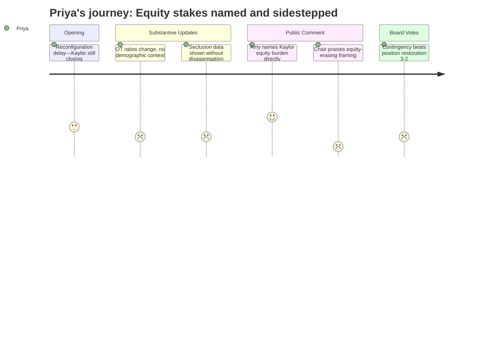

# Interpretation: Priya (PERSONA-005)
## Meeting: School Board Regular Meeting -- April 13, 2026 -- 2026-04-13

---

### Structured Points

#### 1. Kaylor Closure Bears Disproportionate Equity Burden — Named Publicly
- **Fact:** A Kaylor parent testified that Kaylor has the highest percentage of renters, the highest rate of free and reduced lunch eligibility, the second-highest proportion of multilingual learners, and the second-highest proportion of children of color among district elementary schools — and that this community is being asked to absorb the full impact of closure on an accelerated timeline while other schools receive more deliberation time.
- **Source:** [80:07--81:43] Amy, Kaylor parent, first public comment session
- **Emotional valence:** negative
- **Threat level:** 5
- **Open question:** true

#### 2. Reconfiguration Delay Is Asymmetric — Other Schools Get Time, Kaylor Does Not
- **Fact:** The board chair announced that a motion would be brought April 29 to halt reconfiguration for September 2026, citing community pressure and the need for a more thorough process. No equivalent pause applies to Kaylor's closure, which the Finance Director confirmed is not financially reversible. The chair acknowledged Kaylor families' loss is "real" but offered no structural remedy.
- **Source:** [03:16--05:35] Chair opening remarks; [91:05--91:51] Finance Director response to "is it still possible to keep Kaylor open?"
- **Emotional valence:** negative
- **Threat level:** 4
- **Open question:** true

#### 3. OT Staffing Model Changed to 1:36 Ratio Without Demographic or School-Level Breakdown
- **Fact:** The district's FY27 plan eliminates the embedded OT model from two life skills classrooms, returning to a pull-out model with a projected 1:36 student-to-OT ratio across 3.8 FTE OTs districtwide. The presentation did not disaggregate which student populations — by school, disability category, race, or economic status — are most affected by this change, and did not identify which schools currently rely most heavily on the embedded model.
- **Source:** [43:20--48:51] Kat Cox, Director of Instructional Support; Board slides, OT staffing slides 1 and 2
- **Emotional valence:** negative
- **Threat level:** 3
- **Open question:** true

#### 4. Restraint and Seclusion Data Presented Without Demographic Disaggregation
- **Fact:** The district presented year-over-year restraint and seclusion data as a single aggregate bar chart. No breakdown was provided by school, race, disability type, or grade level. A community member noted that restraint and seclusion incidents represent a subset of all dangerous classroom incidents and questioned the completeness of the reporting. The district indicated comprehensive incident data is accessible through the state ESEA dashboard but is not routinely published by the district in board-facing reports.
- **Source:** [59:40--60:27] Kat Cox; [166:42--167:30] Lauren, second public comment; [173:03--174:00] Superintendent response
- **Emotional valence:** negative
- **Threat level:** 3
- **Open question:** true

#### 5. Per-Pupil Spending Disparities by School Surface in Public Comment — District Does Not Engage
- **Fact:** A parent noted that location-based budget data on the Finance Director's slide suggests per-pupil spending at Small Elementary is roughly $10,000 higher than at Skillin Elementary. The Finance Director cautioned against using those numbers due to coding complexity but did not offer an alternative per-school equity analysis. No disaggregated per-pupil spending by demographic composition has been presented in this budget cycle.
- **Source:** [71:25--72:12] Aiden Ranahan, first public comment; Board slides, slide 9 (Budget Development Sorted by Location)
- **Emotional valence:** negative
- **Threat level:** 3
- **Open question:** true

#### 6. Ed Tech Shortage Acknowledged — Proposed Solutions Remain Exploratory and Unsupervised
- **Fact:** The Director of Instructional Support acknowledged persistent ed tech shortages affecting special education classrooms statewide and locally, and proposed exploring subcontracting to outside BHP-credentialed agencies. She noted, however, that outside agency staff are supervised by the agency rather than the district. No cost comparison between subcontracting and direct hiring was available at the meeting. No committed staffing levels for special education classrooms were presented.
- **Source:** [53:30--56:34] Kat Cox; [149:37--150:24] Sarah Gay, second public comment
- **Emotional valence:** negative
- **Threat level:** 3
- **Open question:** true

#### 7. Board Votes 3-2 to Seed Contingency Rather Than Restore Positions
- **Fact:** After passing a motion asking the city to offset $360,000 in SRO and snow removal costs, the board voted 3-2 on how to use that savings if received: Members Smith, Risch, and DeAngelis voted to direct the funds to contingency; Members Richardson and Holman voted to restore positions, specifically citing middle school related arts and elementary support roles. The contingency motion passed.
- **Source:** [140:17--145:48] Board deliberation and vote; [141:50--142:38] Member Richardson's position on restoring positions
- **Emotional valence:** negative
- **Threat level:** 3
- **Open question:** false

---

### Journey Map

---

### Reactions

So I need you to hear what happened with Amy tonight, because that's the moment I keep coming back to. She walked up to that mic and named it directly — Kaylor has the highest renters, the highest free lunch, the second-highest multilingual learners, the second-highest children of color of any elementary school in this district. And she said, plainly: while everyone else in this room is breathing a sigh of relief because the board is slowing down, Kaylor families don't get that. Their closure goes forward on the original timeline. She was not wrong, and she was not exaggerating. That's in the budget slides. The board heard it, thanked her, and moved on. Then a few speakers later, a different parent said we all need to stop being Kaylor parents or Brown parents and start being "South Portland parents," and the board chair called that "elegant." I understand what that speaker was going for — solidarity, shared stakes — but when you use that framing immediately after Amy just laid out exactly which community is absorbing the most concentrated harm, "we're all in this together" lands like erasure. And the chair praised it. That's the thing that's going to be in my head for days.

The special ed section was its own quiet alarm. They showed restraint and seclusion data as a single aggregate bar — two bars, this year vs. last year, no school breakdown, no race or disability category. A community member in the second comment session asked the right question: where can the public access comprehensive incident data? And the answer was essentially, check the state ESEA dashboard. That means the district isn't proactively publishing it. There was also a real question about what happens to these classrooms when the embedded OT model disappears from two life skills rooms — the district said the new 1:36 ratio is within state limits, but that's a floor, not a standard. What I want to know, and what was never answered, is which students are in those two classrooms, which schools they're at, and what their demographic profile looks like. That information exists. It just wasn't presented.

Here's what I'm doing this week: pulling the May 2024 board minutes on the Boundaries and Configuration Steering Committee vote. The board directed a resource equity report for high-need schools by August 2024, annual demographic reporting by November 30, and a consultant engagement on attendance zones by January 2025. None of those appear in tonight's meeting. The district is moving forward with reconfiguration planning — slower now, but still moving — on top of a closure that disproportionately impacts the district's most economically disadvantaged students, without having delivered the equity analysis that was supposed to inform exactly this kind of decision. That's not a conspiracy. That's a sequence problem that needs to be named publicly. And if those reports don't exist, I want to know that in writing.