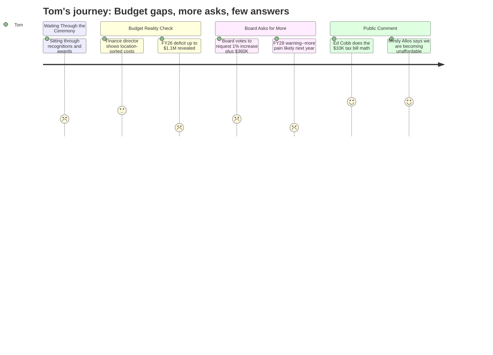

# Interpretation: Tom (PERSONA-006)
## Meeting: School Board Regular Meeting -- April 13, 2026 -- 2026-04-13

### Structured Points

#### 1. Current-Year Budget May Already Be in Deficit -- With No Cushion Left
- **Fact:** The finance director reported an updated FY26 deficit range of $80,000 to $1.1 million, and noted that a deep reconciliation of benefit and withholding accounts -- unreconciled for years -- is still underway. The fund balance is already depleted, meaning there is no reserve to absorb any shortfall.
- **Source:** Transcript [91:51--96:40]; Board Slides, Finance Committee Report slide
- **Emotional valence:** negative
- **Threat level:** 5
- **Open question:** true

#### 2. Board Voted to Ask the City for More Money on Top of the Already-Painful 6% Cap
- **Fact:** The board voted unanimously to ask the city council to approve an additional 1% tax increase -- on top of the 6% ceiling already set -- to seed the fund balance. They also voted 4-1 to ask the city to absorb $360,000 in SRO and snow-removal costs. The combined ask, if granted, would push the effective tax impact to roughly 7%.
- **Source:** Transcript [121:32--145:48]; Board Slides, New Business item 8.2
- **Emotional valence:** negative
- **Threat level:** 4
- **Open question:** false

#### 3. Finance Director Warned That FY28 Will Also Require "Careful Planning" to Stay Under 6%
- **Fact:** Director of Finance Abigail Ketchen stated that her early FY28 modeling shows the district will need careful planning to remain under a 6% tax increase next year as well, citing health insurance, the EPS formula, worldwide events, and other large unknowns as potential swing factors.
- **Source:** Transcript [37:10--41:03]; Board Slides, "Budget information for discussion" slide
- **Emotional valence:** negative
- **Threat level:** 4
- **Open question:** true

#### 4. A Community Member Did the Math -- and the Numbers Are Alarming
- **Fact:** South Portland resident Ed Cobb told the board that at a 6% annual increase, the average homeowner's current $6,266 tax bill would exceed $10,000 in less than a decade. He specifically noted that the school department accounts for roughly 60-62% of the total tax bill, and he questioned whether taxpayers can absorb that trajectory.
- **Source:** Transcript [159:43--161:17]
- **Emotional valence:** neutral
- **Threat level:** 3
- **Open question:** false

#### 5. One Public Speaker Directly Said the District Is Becoming Unaffordable -- and Opposed Asking for More
- **Fact:** South Portland resident Mindy Allos, who volunteered 16 months on the Boundaries and Configuration Steering Committee, told the board: "I discourage asking for more money from the city. We're becoming unaffordable. If we want to just push people out and only have privileged folk here, then sure, let's keep raising taxes."
- **Source:** Transcript [82:32--84:04]
- **Emotional valence:** positive
- **Threat level:** 1
- **Open question:** false

#### 6. Location-Sorted Budget Revealed Wide Variation in Per-School Spending -- Without Clear Explanation
- **Fact:** The finance director's new location-sorted budget analysis showed per-school spending ranging from $5.7M (Kaylor, being closed) to $7.8M (Skillin). A public commenter noted this implies per-pupil spending as high as $38,000 at one school versus $28,000 at another. The director acknowledged the numbers carry coding caveats but did not provide a plain-English explanation of the gap.
- **Source:** Transcript [31:41--36:24]; Board Slides, "Budget Development, Sorted by Location" slide; Transcript [71:25--72:12]
- **Emotional valence:** negative
- **Threat level:** 3
- **Open question:** true

#### 7. An Unquantified Labor Cost From a New Contract Was Just Disclosed -- and It Will Add to the Deficit
- **Fact:** Assistant Superintendent Johanna Prince disclosed that time worked above 15 hours under the new SPTA contract has not yet been calculated or paid. This unidentified expense will hit the FY26 budget and add to the current-year deficit. The amount is unknown; submissions from staff are just now being collected.
- **Source:** Transcript [97:28--100:30]
- **Emotional valence:** negative
- **Threat level:** 4
- **Open question:** true

#### 8. The Finance Director's Presentation Was Substantive and Showed Clear Fiscal Awareness
- **Fact:** Abigail Ketchen presented a detailed location-sorted budget analysis, flagged FY28 risks proactively, disclosed the FY26 deficit range honestly, and acknowledged she personally tracks these numbers because it is her "personal agenda to go from one fiscal year to another without layoffs and without strife."
- **Source:** Transcript [31:41--37:10]; [86:22--91:04]
- **Emotional valence:** positive
- **Threat level:** 1
- **Open question:** false

---

### Journey Map

---

### Reactions

Forty minutes in, they finally got to the actual budget. And here's what I learned: the school department might already be running a deficit this year -- anywhere from $80,000 to $1.1 million -- and there's nothing left in the savings account to cover it. The finance lady said there are benefits accounts that haven't been properly reconciled in years. Years. And on top of that, they just found out there's a pile of extra labor costs from a new contract that nobody's calculated yet. So that deficit number is probably going to move. And the board's response to all this? They voted to go ask the city council for more money. A 1% bump on top of the 6% we already knew about, plus $360,000 for SRO and snowplowing costs. I sat there thinking -- we're already at a breaking point, and you're coming back for a second helping.

The finance director at least seems to know what she's doing. She was straight with people -- said FY28 is going to require "careful planning" to stay under 6% too. That's the most honest thing I've heard from this district in a long time. But one honest person doesn't fix the structural problem. One guy in the audience, Ed Cobb, did the math out loud: at 6% a year, average tax bills hit $10,000 in less than a decade. The school department eats 60-plus percent of that bill. I've been saying this to my neighbors for two years. Nice to hear it said at the microphone. And there was one woman -- Mindy Allos -- who flat out told them: we're becoming unaffordable. She wasn't anti-school. She volunteered on a committee for over a year. But she said what needed to be said and the room didn't want to hear it.

What's going to keep me up is FY28. The finance director warned the board, right there in the meeting, that even after all these cuts and all this pain -- 78 positions gone, a school closed -- next year could require the same fight. Health insurance going up 12%. State funding still only covering 20 cents on the dollar when it should be covering 55. These aren't surprises. They've been building for years. The board is asking the city for a Band-Aid when the patient needs surgery. And at the end of the day, whoever is left holding property in this city is the one writing the check.