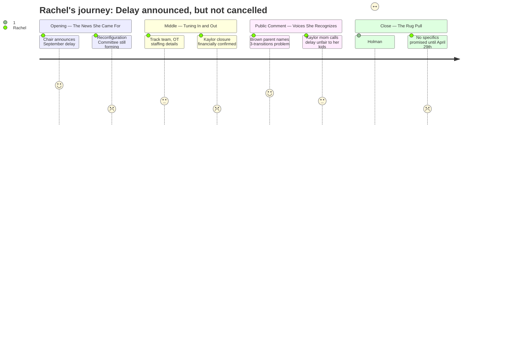

# Interpretation: Rachel (PERSONA-008)
## Meeting: School Board Regular Meeting -- April 13, 2026 -- 2026-04-13

---

### Structured Points

#### 1. Chair Announces Reconfiguration Delay Before the Meeting Even Really Starts
- **Fact:** Chair DeAngelis opened the meeting by announcing that the board will vote on April 29th to halt reconfiguration for September 2026, stating "there is strong support on this school board to delay the action" and framing slowing down as "what's best for all."
- **Source:** Transcript [03:16--04:48]
- **Emotional valence:** positive
- **Threat level:** 2
- **Open question:** true

#### 2. Reconfiguration Committee Is Forming Now and Will Keep Moving
- **Fact:** DeAngelis announced that a Reconfiguration Committee will continue its work, with Board Members Smith and Richardson appointed as board representatives -- meaning the planning process for eventual reconfiguration is active and ongoing even as the September timeline is paused.
- **Source:** Transcript [04:48--05:35]
- **Emotional valence:** negative
- **Threat level:** 3
- **Open question:** true

#### 3. Kaylor Closure Is Financially Confirmed -- No Path Back
- **Fact:** Finance Director Ketchen stated plainly, "I really don't think so" when asked if it is still possible to keep Kaylor open, and added that she could not recommend that path financially. A location-based budget analysis assigned Kaylor approximately $5.7M in the full budget, representing roughly half of all the reductions made.
- **Source:** Transcript [91:05--91:51]; Board Slides, Budget Update slide
- **Emotional valence:** negative
- **Threat level:** 3
- **Open question:** false

#### 4. Board Member Holman Clarifies: This Is a "Change in Pace," Not a Halt
- **Fact:** Near the end of the meeting, Member Holman explicitly stated: "I do want to just say, in my mind, I heard the word halt referred to on reconfiguration, and I don't envisage any halt. I think we're talking about a change in pace." DeAngelis confirmed she meant halting the September 2026 timeline specifically, not the reconfiguration plan itself.
- **Source:** Transcript [177:43--178:29]
- **Emotional valence:** negative
- **Threat level:** 4
- **Open question:** true

#### 5. A Brown School Parent Names the Three-Transitions Problem Directly
- **Fact:** Parent Aiden Ranahan, describing his kindergartner's situation, raised the concern that a child could face three school transitions in three years under the current reconfiguration approach, and called for a phased model or grade-level approach that would reduce that disruption. He explicitly said "I don't know if it's a phased approach... but I think there can be a better way."
- **Source:** Transcript [70:39--73:03]
- **Emotional valence:** positive
- **Threat level:** 2
- **Open question:** true

#### 6. No Specifics About What Reconfiguration Actually Looks Like for Non-Kaylor Schools
- **Fact:** Throughout the entire meeting, no presenter or board member described which grade levels would move to which buildings, what the new attendance boundaries would be, or which schools would receive students displaced from Kaylor. Member Richardson asked for a transition plan to be presented on April 29th, but the administration only committed to presenting "a process" -- not specific placement proposals.
- **Source:** Transcript [175:23--177:43]; no corresponding detail in Board Slides
- **Emotional valence:** negative
- **Threat level:** 4
- **Open question:** true

#### 7. Brown Elementary Principal Resignation Announced Mid-Meeting
- **Fact:** Superintendent Entwistle listed among resignations: Beth Kellogg, Principal, Brown Elementary School, effective June 30, 2026. This resignation was noted without context about whether a replacement search is underway.
- **Source:** Board Slides, Superintendent's Report slide; Transcript [41:49--42:35]
- **Emotional valence:** negative
- **Threat level:** 3
- **Open question:** true

---

### Journey Map

---

### Reactions

So I went, and honestly I felt such a rush of relief when DeAngelis literally opened the meeting -- like within the first five minutes -- and said they're not doing reconfiguration in September. She said it before they even did the pledge of allegiance almost. I texted you right away, remember? That was real. The board has support to delay it. It's going to the April 29th meeting as a formal vote.

But then I sat there for almost three hours and I have to tell you, by the end I felt sick to my stomach again. Because this one board member, Holman, said something right near the end that I keep replaying. She said -- and I wrote this down -- "I don't envisage any halt. I think we're talking about a change in pace." A change in pace. So this is still happening. They're forming a committee right now. Smith and Richardson are on it. They're going to keep planning which kids go where, and we just... don't know anything yet. There was a dad from Brown who got up and said his kindergartner could face three school transitions in three years, and he put it so well, and the board nodded, but then nobody actually said "here's how we prevent that." They just said there'd be a process presentation on the 29th.

And then there's Kaylor, which is definitely closing -- the finance person said so outright, no path to keeping it open. And I feel terrible for those families, I genuinely do. That community is going through something awful right now. But what I keep thinking is: those kids are going somewhere. And wherever they go, that's going to change something for the kids already there. And we still don't know which grades go where, which school absorbs what, what the new zones look like. Brown's principal just resigned, which... great timing for a leadership vacuum. I left that meeting cautiously less panicked than I walked in, but I'm not sleeping well. The 29th is what matters now.