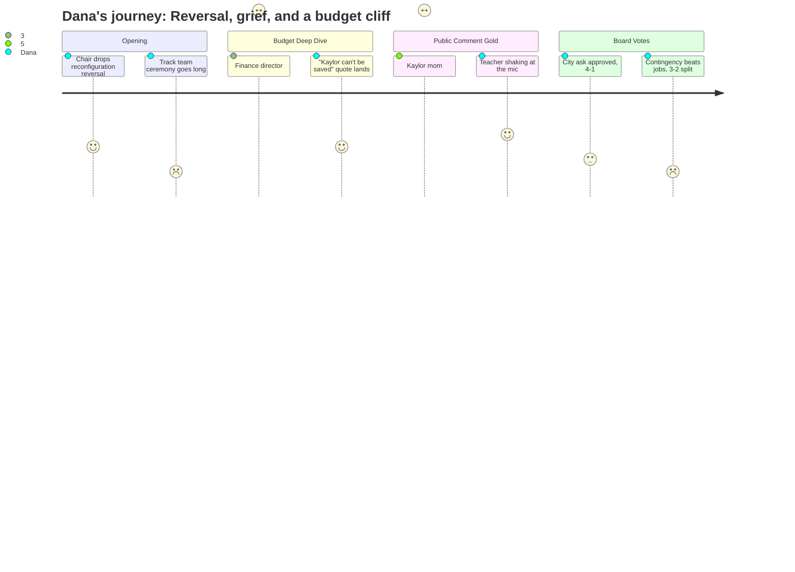

# Interpretation: Dana (PERSONA-009)
## Meeting: School Board Regular Meeting -- April 13, 2026 -- 2026-04-13

### Structured Points

#### 1. Board Chair Announces Reconfiguration Reversal at Minute Three
- **Fact:** Before any other business, Chair DeAngelis announced from the dais that a vote to halt the September 2026 reconfiguration timeline would appear on the April 29th agenda, and stated plainly: "It is clear that this board supports that delay." The reversal was disclosed before the pledge of allegiance was fully out of the way.
- **Source:** Transcript [03:16–04:48]; Board Slides, slide 2 (Important Dates)
- **Emotional valence:** positive
- **Threat level:** 2
- **Open question:** true — The April 29th vote hasn't happened yet; the story isn't closed.

#### 2. Kaylor Parent Names the Equity Dimension Out Loud
- **Fact:** A Kaylor parent identifying herself as Amy told the board that while parents at other schools were exhaling in relief, her school — "the highest amount of renters, the highest amount of free lunch or discounted lunch, the second highest of multilingual learners, and the second highest in children of color" — was not being afforded the same pause. She said it "feels profoundly unfair" and referenced hateful online comments about Kaylor, including one that called it "the Petroleum Oil Farm School."
- **Source:** Transcript [80:07–81:43]
- **Emotional valence:** negative
- **Threat level:** 4
- **Open question:** true — No board member or administrator directly responded to the equity framing she raised.

#### 3. Third-Grade Teacher Shakes at the Microphone
- **Fact:** Dyer Elementary third-grade teacher Chloe Bartlett, who said it was her third year in the district, approached the mic visibly distressed: "I'm shaking. I'm so sad and scared to be up here." She asked whether next March would bring another round of fear and uncertainty, and whether the board could ensure "the trauma, stress, and loss that we felt through the communities aren't repeated a third time in a row."
- **Source:** Transcript [84:49–85:36]
- **Emotional valence:** negative
- **Threat level:** 3
- **Open question:** false — Her question was the story; the board acknowledged it but gave no specific commitment.

#### 4. Finance Director Says Kaylor Cannot Be Saved
- **Fact:** When asked directly by a board member whether it was still possible to keep Kaylor open, Finance Director Ketchen said: "I really don't think so. I'm very sorry. If I thought there was a real path there financially, I would love to see that be true. I don't think that's the financial path forward."
- **Source:** Transcript [91:05–91:51]
- **Emotional valence:** negative
- **Threat level:** 5
- **Open question:** false — Ketchen was unambiguous; this is a definitive quote from the district's numbers person.

#### 5. Board Votes to Bank Any City Money Rather Than Restore Jobs
- **Fact:** After a contested exchange, the board voted 3–2 to direct any funds recovered from the city's absorption of SRO and snowplowing costs ($360,000) into contingency reserves — not toward recalling laid-off employees. Members Richardson and Holman dissented, with Richardson explicitly saying she wanted related arts and elementary support positions restored.
- **Source:** Transcript [143:25–145:48]
- **Emotional valence:** negative
- **Threat level:** 3
- **Open question:** true — The city has not yet agreed to absorb those costs; the outcome is contingent on a budget workshop the next night.

#### 6. FY26 Deficit Projected Up to $1.1 Million — Reserves Already Gone
- **Fact:** The finance committee report disclosed that the current-year (FY26) deficit could range from $80,000 to $1.1 million, and a separate exchange confirmed that fund balance reserves are effectively depleted. A community member during second public comment said this aloud: "our reserve is already in the negative."
- **Source:** Finance Committee slide, slide 21; Transcript [95:02]; public comment [152:44]
- **Emotional valence:** negative
- **Threat level:** 4
- **Open question:** true — The final figure depends on unresolved accruals, electricity invoices, and a time-beyond-contract payroll line that hasn't been calculated yet.

#### 7. Brown Elementary Principal Resigns Mid-Crisis
- **Fact:** The superintendent's report included three resignations: two classroom teachers and Beth Kellogg, principal of Brown Elementary, effective June 30. The principal departure was acknowledged but not discussed beyond a passing board question about whether teacher vacancies would go to the recall list.
- **Source:** Transcript [42:35]; Board Slides, slide 5
- **Emotional valence:** negative
- **Threat level:** 3
- **Open question:** true — No public explanation was offered for the principal's departure or what it means for Brown's leadership during a year of significant disruption.

#### 8. Former Board Member Describes a District in Internal Crisis
- **Fact:** Ralph Baxter, a former board member, described conditions he said troubled him: executive sessions about board member roles, a member's resignation (Vice Chair Dowling), police presence at meetings, a police report filed by a board member about harassment, and recall elections. He said he doubted the board had signed up for this and urged them to "stop sniping and start problem-solving."
- **Source:** Transcript [77:45–79:19]
- **Emotional valence:** negative
- **Threat level:** 3
- **Open question:** true — The specifics behind the police report and harassment claim are not addressed in this meeting's public record.

---

### Journey Map

---

### Reactions

Okay so here's my pitch. The lede writes itself: the board reversed course on the school consolidation plan tonight — but the parent of a kid at the school that's *still* closing didn't feel like celebrating. Amy, Kaylor mom, goes to the mic and says — and this is verbatim — "we are not afforded that luxury." She names exactly who goes to Kaylor: the highest rates of renters, free lunch, kids of color. While everybody else was breathing a sigh of relief, she's saying her school got thrown under the bus. That's your story. That's the whole thing in one human moment.

The other piece I need — and I don't know if we have the SPC-TV recording yet — is the third-grade teacher at Dyer, Chloe Bartlett. She walks up to the mic literally shaking. She says "I'm shaking, I'm so sad and scared to be up here." Third year in the district. She wants to know if they're going to go through this same nightmare again next March. If we can pull those two soundbytes — Amy and Chloe back-to-back — that's your ninety seconds. B-roll is Kaylor school exterior, maybe a classroom hallway, something quiet and empty-feeling.

The other thing I'm flagging for the April 29th meeting: that's the one to send a crew to. The board is voting that night on whether to officially delay reconfiguration, and there are real open questions — will Kaylor families get a transition plan? Will the city cover the SROs and snowplowing, and does that free up money for teachers? The finance director said tonight, flatly, that Kaylor *cannot* be saved financially — "I really don't think so" — which means that vote on the 29th isn't about whether the school closes, it's about how fast and how rough. Also worth noting: the vice chair just resigned, there's been a police report filed by a board member over harassment, and the Brown Elementary principal turned in her resignation tonight. This place is under serious strain and April 29th could be explosive.