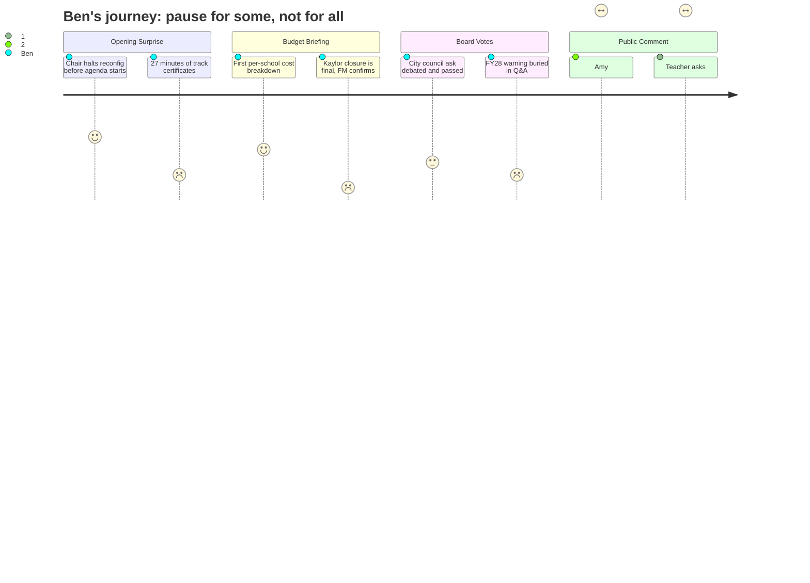

# Interpretation: Ben (PERSONA-010)
## Meeting: School Board Regular Meeting -- April 13, 2026 -- 2026-04-13

---

### Structured Points

#### 1. The Lede: Reconfiguration Paused Before the Meeting Even Starts
- **Fact:** Chair DeAngelis opened the meeting by announcing — before any agenda item — that the board will vote on April 29th to halt the September 2026 reconfiguration timeline, citing strong board support for delay and two and a half hours of constituent conversations. The Kaylor closure, however, was not included in that pause.
- **Source:** Transcript [03:16–05:35]
- **Emotional valence:** positive
- **Threat level:** 2
- **Open question:** true — The chair said the board "only knows what you know" and that there are "no side meetings." But who drove the timeline originally, and why did it take public pressure rather than board process to surface the concern?

#### 2. First Look at Per-School Cost Breakdown
- **Fact:** Finance Director Abigail Ketchen presented a location-sorted budget view — the first time this meeting cycle has made per-school cost allocation visible. The all-in full budget assigned roughly $5.7M–$7.8M to each elementary school before reductions; after reductions and Kaylor closure, Kaylor's line drops to $0.3M (minimal utilities). Ketchen noted a closure saves roughly $4M, about half the total reduction package.
- **Source:** Transcript [31:41–36:24]; Board Slides, "Budget Development Sorted by Location," slide 9
- **Emotional valence:** positive
- **Threat level:** 1
- **Open question:** true — Ketchen cautioned that facility and transportation costs required allocation judgment calls rather than direct assignment. A Brown parent at public comment did rough per-pupil math suggesting ~$38K/student at Small vs. ~$28K/student at Skillin. Ketchen did not confirm or dispute those figures during the meeting.

#### 3. Finance Director: Kaylor Cannot Stay Open
- **Fact:** A public commenter asked directly: "Is it still possible to keep Kaylor open?" Ketchen responded: "I really don't think so. I'm very sorry. If I thought there was a real path there financially, I would love to see that be true. I don't think that's the financial path forward."
- **Source:** Transcript [91:05–91:51]
- **Emotional valence:** negative
- **Threat level:** 4
- **Open question:** false — The closure was not paused. The contrast is the story: parents of students at other schools got more time; Kaylor families did not.

#### 4. FY26 Deficit Range Widens — and One Key Number Is Still Unknown
- **Fact:** The finance committee report updated the FY26 deficit estimate to a range of $80K to $1.1M, up from prior reporting. Separately, board member Holman flagged an item in yellow on the cost-center report — time-beyond-contract costs owed under the new SPTA agreement — that has not yet been calculated. Assistant Superintendent Prince said phase-one submissions were just rolled out and estimates should be available by May. Ketchen confirmed this would add to the deficit.
- **Source:** Transcript [92:00–100:30]; Board Slides, Finance Committee Report, slide 21
- **Emotional valence:** negative
- **Threat level:** 3
- **Open question:** true — The $80K-$1.1M range is already wide. The SPTA time-beyond-contract liability is a fourth unknown layered on top. The board will not know the real FY26 bottom line until sometime after June 30.

#### 5. Board Asks City for $360K Offset and a 1% Tax Increase for Contingency
- **Fact:** The board passed two requests to carry to the city council budget workshop the following night. First, a 4–1 vote to ask the city to absorb $360K in shared-service costs (SROs at roughly $220K and snow removal at roughly $140K). Second, a unanimous vote to ask for a 1% property tax increase directed to seeding the depleted fund balance, not to restoring laid-off positions. A separate motion to restore positions at half a percent failed for lack of a second.
- **Source:** Transcript [106:47–146:33]; Board Slides, New Business item 8.2, slide 26
- **Emotional valence:** neutral
- **Threat level:** 2
- **Open question:** true — A 1% increase adds roughly $540K to the budget (Ketchen's figure) and is intended for contingency, not staff restoration. Public commenters explicitly asked the board to use any new money to restore positions. The board chose financial stability over restoration, 3–2 on the contingency question.

#### 6. Brown Elementary Loses Its Principal — Third Departure Announced This Meeting
- **Fact:** The superintendent reported three resignations: a special education teacher at Skillin, a grade-one teacher at Dyer, and Beth Kellogg, principal of Brown Elementary, effective June 30. Kellogg's departure was flagged as distinct from the classroom teacher resignations — the recall list applies to the teachers, not to the principal position.
- **Source:** Transcript [41:49–62:00]; Board Slides, Superintendent's Report, slide 5
- **Emotional valence:** negative
- **Threat level:** 3
- **Open question:** true — Brown's principal is leaving at the end of the school year, mid-restructuring, with no named successor. The district has not publicly described a replacement timeline or search process.

#### 7. Finance Director Flags FY28 Will Require "Careful Planning" to Stay Under 6%
- **Fact:** Ketchen told the board: "I have analyzed enough that I can say that we will have to do some careful planning ahead if we want to remain under 6% the following year." She listed unknowns including health insurance (projected at 12% increase this year), the EPS formula revision, worldwide events, and the as-yet-unknown FY26 actual. She declined to predict a specific outcome but said her roll-forward model lands "a touch over 6%" before attrition.
- **Source:** Transcript [37:10–41:10]; Board Slides, "Budget information for discussion," slide 10
- **Emotional valence:** negative
- **Threat level:** 3
- **Open question:** true — A third-year teacher named Chloe Bartlett asked at public comment: "Next March, are we going to go through another year of fear of being cut?" Ketchen's FY28 modeling does not answer that question.

#### 8. Kaylor Parent Names the Equity Dimension the Board Has Not Named
- **Fact:** A Kaylor parent, Amy, told the board during public comment that Kaylor serves the highest rate of renters, the highest rate of free/reduced lunch students, the second-highest proportion of multilingual learners, and the second-highest proportion of students of color among South Portland elementaries. She said: "It feels profoundly unfair" that these families are not being given the same extended timeline granted to other schools, and that she had read "really horrible comments" about Kaylor online. The board did not respond directly to her statement.
- **Source:** Transcript [80:07–82:00]
- **Emotional valence:** negative
- **Threat level:** 4
- **Open question:** true — The integration policy trove documents that Kaylor has been identified in steering committee findings as one of two schools with substantially higher concentrations of economically disadvantaged students. The board directed a resource equity report for high-need schools in August 2024. That report has not appeared in public board materials.

---

### Journey Map

---

### Reactions

Okay so here's the piece I want to write this week. The lede writes itself: the board announced before the meeting even officially started that they're pausing the reconfiguration timeline. Chair DeAngelis read it from what looked like notes, said she'd had a two-and-a-half-hour constituent call that day, and made clear the board supports delay. That's a real story — public pressure moved a school board. But the part that keeps me up is this: the pause doesn't apply to Kaylor. That school is still closing. And at public comment, a Kaylor mom named Amy stood up and said exactly what the board hadn't said — that Kaylor serves the highest share of renters, the most kids on free lunch, some of the highest concentrations of multilingual learners and kids of color in the district. Everybody else gets more time. Those 160 kids don't. That's the contrast I want to build the piece around.

On the budget side, the finance director finally showed a per-school cost breakdown — the first time I've seen the numbers sliced that way all season. She said closing Kaylor saves roughly $4M, which is about half the total reduction package. I need to call her and confirm the allocation methodology because a parent at public comment did his own napkin math and came up with a $38K-per-pupil figure at Small versus $28K at Skillin, and those numbers, if they hold up, are exactly the kind of comparison my readers can understand. The finance director didn't dispute them. There was also this moment buried in the Q&A where a board member asked whether we could keep Kaylor open, and Ketchen said — pretty plainly — "I really don't think so. I'm very sorry." That's a direct quote I want in the piece.

The other thing I can't quite shake: the finance director told the board that FY28 will also require "careful planning" to stay under 6%. She wouldn't commit to specifics, and she has a long list of unknowns — health insurance, the EPS formula, a time-beyond-contract liability under the new SPTA contract that nobody has even calculated yet. A third-year Dyer teacher named Chloe Bartlett stood up shaking and asked the board directly: are we going to do this again next year? Nobody gave her a straight answer. That's probably my kicker. The headline drama is the reconfiguration pause. The quiet underneath it is that the structural problem isn't solved, and the people most affected by that — Kaylor's families, the teachers who don't know if they have a job next fall, the kids losing PE and computer science and library time — they're still waiting.