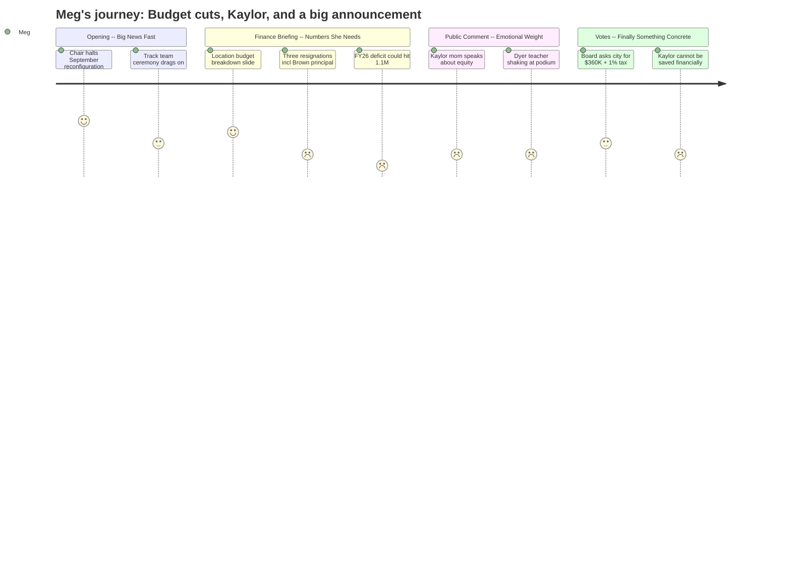

# Interpretation: Meg (PERSONA-011)
## Meeting: School Board Regular Meeting -- April 13, 2026 -- 2026-04-13

### Structured Points

#### 1. Chair announces reconfiguration halt before the meeting even starts
- **Fact:** Chair DeAngelis opened the meeting by announcing that the board will vote on April 29th to halt the September 2026 reconfiguration plan, stating there is "strong support on this board to delay the action." She added that both members who previously opposed reconfiguration have committed to the model moving forward for a later date. [~00:03:16–00:05:35]
- **Source:** Transcript [00:03:16–00:05:35]; Board Slides p.2 (Important Dates list confirms April 29th special meeting)
- **Emotional valence:** positive
- **Threat level:** 2
- **Open question:** true — The formal vote hasn't happened yet; what exactly will the April 29th motion say, and does "halt" mean the September 2026 timeline specifically or something broader?

#### 2. Brown Elementary principal resigns effective June 30th
- **Fact:** Superintendent Entwistle announced three resignations: Victoria Argese (special ed teacher, Skillin), Katelyn Field (grade 1 teacher, Dyer), and Beth Kellogg, principal at Brown Elementary, effective June 30, 2026. The two classroom teachers may be filled from the recall list; the principal position would not be. [~00:41:49–00:42:35; Board Slides p.5]
- **Source:** Transcript [00:41:49–00:42:35]; Board Slides p.5
- **Emotional valence:** negative
- **Threat level:** 4
- **Open question:** true — Who leads Brown next year? Is there a succession plan? Will this be filled before school ends or over the summer?

#### 3. Finance director puts a $4M dollar figure on what the Kaylor closure saves
- **Fact:** Finance Director Abigail Ketchen presented a new location-based budget breakdown and stated that closing Kaylor accounts for roughly $4 million of the total reductions made — about half of all cuts. She also confirmed, in response to a direct public question, that she cannot recommend keeping Kaylor open on financial grounds: "I really don't think so... I can't recommend that move financially." [~00:35:37–00:36:24; ~00:91:05–00:91:51]
- **Source:** Transcript [00:35:37–00:36:24; 00:91:05–00:91:51]; Board Slides p.9 (location budget table showing Kaylor at $0.3M current vs $5.7M full)
- **Emotional valence:** negative
- **Threat level:** 4
- **Open question:** false — The finance director was unambiguous. Kaylor is closing.

#### 4. FY26 deficit range revealed: up to $1.1 million, and reserves are gone
- **Fact:** Finance Director Ketchen reported that the current fiscal year (FY26) is tracking toward a deficit range of $80,000 to $1.1 million. A public commenter noted that the fund balance (savings reserve) is already in the negative. An additional unknown is the cost of time-beyond-contract owed to SPTA members under the new contract — a figure that has not yet been calculated but will add to the deficit. [~00:92:40–00:95:51; Board Slides p.21]
- **Source:** Transcript [00:92:40–00:95:51; 00:97:28–00:99:44]; Board Slides p.21
- **Emotional valence:** negative
- **Threat level:** 5
- **Open question:** true — What is the actual SPTA time-beyond-contract liability? Dr. Prince said submissions are being collected now; the board won't have a number until May.

#### 5. Board votes to ask city council for $360K in shared service offsets and a 1% tax increase into contingency
- **Fact:** The board voted 4-1 to ask the city council to absorb $360,000 in costs (estimated $220K for SROs and $140K for snow removal/sanding). They also voted unanimously to ask for a 1% tax increase directed into contingency/fund balance — not to restore laid-off positions. A motion to restore positions at 0.5% failed for lack of a second. The chair will present both requests at the April 14th city council budget workshop. [~01:21:32–01:35:00; ~01:34:53]
- **Source:** Transcript [01:07:34–01:46:33]; Board Slides p.26
- **Emotional valence:** neutral
- **Threat level:** 3
- **Open question:** true — Will the city council act on either request? The workshop is non-binding; no vote is expected April 14th.

#### 6. Special ed OT model changing: embedded OTs at Dyer and Skillin going away
- **Fact:** Director of Instructional Support Kat Cox confirmed that the embedded OT model — where OTs serve directly inside two life skills classrooms at Dyer and Skillin — will be discontinued in FY27. The district will return to a pull-out/consultative model. The district will have 3.8 OTs for a projected caseload of 138 students (ratio 1:36). Each elementary school will gain a half-time BCBA and half-time instructional strategist. [~00:43:20–01:00:27; Board Slides pp.14–15]
- **Source:** Transcript [00:43:20–01:00:27]; Board Slides pp.14–15
- **Emotional valence:** negative
- **Threat level:** 3
- **Open question:** true — For parents of kids currently in those two life skills classrooms, the practical change to their child's daily routine is not fully spelled out.

#### 7. Finance director flags that FY28 will also require "careful planning" to stay under 6%
- **Fact:** Ketchen told the board that her early FY28 modeling shows the district will need to plan carefully to avoid another large tax increase, citing health insurance, the EPS formula update, contract negotiations, and "worldwide events" as major unknowns. She was careful not to predict another crisis-level year but said it would not be "not so bad" either. [~00:37:10–00:40:16; Board Slides p.10]
- **Source:** Transcript [00:37:10–00:40:16]; Board Slides p.10
- **Emotional valence:** negative
- **Threat level:** 3
- **Open question:** true — A Dyer teacher asked directly: "Next March, are we going to be going through another year of fear?" No definitive answer was given.

---

### Journey Map

---

### Reactions

OK so I watched the whole thing and here's what you actually need to know. Chair DeAngelis opened the meeting — like, minute three — by announcing they're voting on April 29th to officially halt the September reconfiguration. Strong board support for the delay, formal vote coming. This isn't done yet (April 29th is when they actually vote) but she was clear about where this is going. The committee work continues, Smith and Richardson are the two board reps. Reconfiguration is still happening — just NOT this September.

The budget news is where I'm going to need you to pay attention. Finance director Ketchen showed a new breakdown sorted by school location instead of cost centers, and the headline number is that closing Kaylor saves about $4 million — roughly half of all the cuts they're making. When someone in public comment asked if Kaylor could still be kept open, Ketchen said flat out: "I really don't think so... I can't recommend that move financially." That's the clearest she's been. The other number that alarmed me: the current year deficit could be anywhere from $80,000 to $1.1 million. They literally don't know yet. The fund balance is already negative. There's also an unknown amount owed to teachers under the new SPTA contract for time-beyond-15-hours — they're collecting submissions now and won't have a number until May. That's money that hasn't been counted yet.

Brown parents: **Beth Kellogg is resigning as principal, effective June 30th.** That's the one that hit me. Two classroom teachers are also leaving (Skillin sped teacher, Dyer first grade) and the board said those might be filled from the recall list, but the principal position won't be. The board also voted tonight — 4 to 1 — to ask the city to cover $360K in SROs and snow removal, and unanimously voted to ask for a 1% tax increase, but the money would go into reserves, not to bring back teachers. A motion to restore positions at half a percent increase failed because nobody seconded it. The city council workshop is tomorrow night — no binding vote happens there, just a presentation.