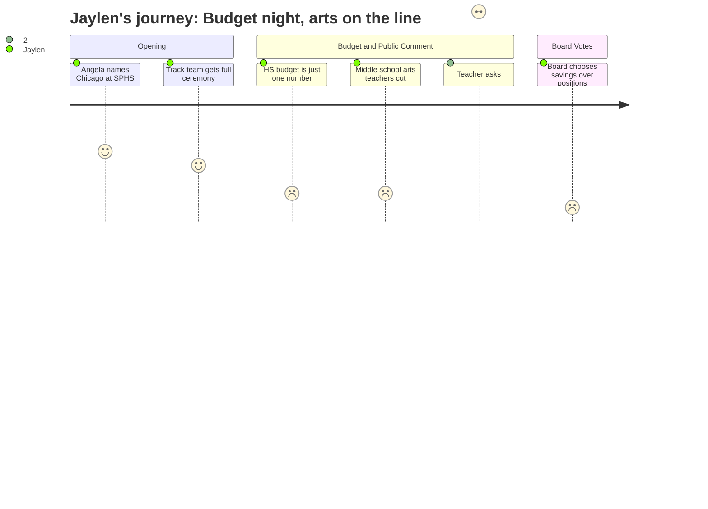

# Interpretation: Jaylen (PERSONA-012)
## Meeting: School Board Regular Meeting -- April 13, 2026 -- 2026-04-13

---

### Structured Points

#### 1. Angela names Chicago at SPHS -- and it's the only time theater comes up
- **Fact:** Student representative Angela Kabisa reported that SPHS students "recently performed the musical 'Chicago,' and it was amazing." This is the only mention of SPHS theater in the entire three-hour meeting.
- **Source:** Transcript [09:25], student representative report
- **Emotional valence:** positive
- **Threat level:** 1
- **Open question:** false

#### 2. The boys track team gets a full ceremony -- names read, coach honored
- **Fact:** The championship boys indoor track team was recognized with an extended ceremony. Every athlete was called by name, certificates were distributed, and Athletic Director Livingston announced Coach Cahill had been named the Portland Press Herald Coach of the Year.
- **Source:** Transcript [16:31--30:01], board slides slide 7
- **Emotional valence:** positive
- **Threat level:** 1
- **Open question:** false

#### 3. The high school budget is one number -- no programs named, no breakdown
- **Fact:** The Finance Director's location-based budget breakdown presents the high school as a single line item of $18.2M in the current FY27 budget. No breakdown by program, department, course offering, or staffing category is presented to the board or public.
- **Source:** Board Slides, "Budget Update: Budget Development, Sorted by Location" (Slide 9)
- **Emotional valence:** negative
- **Threat level:** 3
- **Open question:** true

#### 4. Middle school arts teachers are named and described as eliminated
- **Fact:** Parent Caroline Bowman identified four middle school educators being cut by name: Mr. Wetzel (computer science), Ms. Hellyer (STEM and lacrosse), Mrs. Watson (athletic equipment and access), and Mr. Lenson (unified basketball). Board Member Holman separately stated she has "strong feelings" about restoring "related arts positions at the middle school."
- **Source:** Transcript [115:17] (Holman), [155:51--158:56] (Bowman testimony)
- **Emotional valence:** negative
- **Threat level:** 3
- **Open question:** true

#### 5. Board votes 3-2 to put potential $360K into savings rather than restore positions
- **Fact:** After voting to ask the city to cover $360K in SRO and snow removal costs, the board split on what to do with that money if approved. Members Smith, Risch, and DeAngelis voted to move the savings into contingency (fund balance). Members Richardson and Holman voted to use it to restore positions, citing related arts at the middle school specifically. The contingency motion passed 3-2.
- **Source:** Transcript [143:25--145:48]
- **Emotional valence:** negative
- **Threat level:** 4
- **Open question:** true

#### 6. Finance Director warns that FY28 will also require "careful planning"
- **Fact:** Finance Director Ketchen said "we will have to do some careful planning ahead if we want to remain under 6% the following year," referring to FY28 -- the school year that is Jaylen's senior year. She described a "long list of unknowns" including health insurance, state funding changes, and "worldwide events."
- **Source:** Transcript [37:10--37:50], board slides slide 10
- **Emotional valence:** negative
- **Threat level:** 3
- **Open question:** true

#### 7. A third-year teacher asks if another year of fear is coming -- no one gives a real answer
- **Fact:** Teacher Chloe Bartlett asked directly from the public podium: "Next March, are we going to be going through another year of fear of being cut? Are we going to go through another year of not knowing?" The Finance Director's subsequent answer acknowledged the question was fair but said there were still too many unknowns to promise anything different.
- **Source:** Transcript [84:49--85:36] (Bartlett testimony), [86:22--90:19] (Ketchen response)
- **Emotional valence:** negative
- **Threat level:** 3
- **Open question:** true

---

### Journey Map

---

### Reactions

Okay so the thing that hit hardest was near the end. The board had this $360,000 they were going to ask the city for -- and two of them, Richardson and Holman, actually wanted to use it to bring back the teachers they cut. Holman kept saying "related arts at the middle school." But then three of them voted to just put it in a savings account. A savings account. Not the computer science teacher who built a whole program. Not the phys ed teacher. The savings account. I don't want to be dramatic but that was a real moment -- you could feel it. Two people voted for teachers. Three people voted for a reserve fund. And then the meeting moved on.

The only time theater got mentioned the whole night was when Angela -- the student rep, she's actually really good at this -- said Chicago was "amazing" at SPHS. It was. I know, I was in it. But that was ten seconds in a three-hour meeting. The rest of the time they talked about the high school as one number: $18.2 million. That's it. One number for every class, every sport, every program, every teacher. What does that mean? What's in that number? Is theater in there? AP classes? My coach's job? Nobody asked. A parent named specific middle school teachers who are losing their jobs -- the CS teacher, the STEM teacher, the PE teacher -- and that was more real information than anything the board put on their slides. Parents had to come up and say "here's what's actually getting cut" because the district never says it out loud.

What's actually keeping me up is the FY28 thing. The finance director basically said next year is also going to need "careful planning." Next year is my senior year. I'm trying to figure out what AP classes I'm taking. And nobody at that table -- not one board member -- asked what these cuts mean for students at SPHS specifically. The board talked about "the kids" the whole time, but no current student said anything. I've testified at a board meeting before. I know it does something. But after watching that vote tonight I'm not sure what it does anymore.