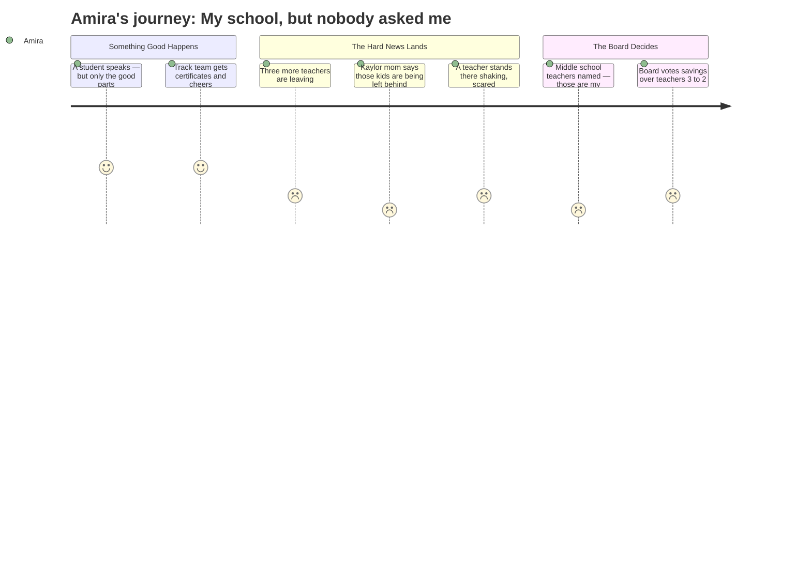

# Interpretation: Amira (PERSONA-013)
## Meeting: School Board Regular Meeting -- April 13, 2026 -- 2026-04-13

### Structured Points

#### 1. A student actually got to speak — but only about good stuff
- **Fact:** Student representative Angela Kabisa gave a report covering positive activities across all district schools — field trips, readathons, talent shows, the high school musical. No mention of budget cuts, teacher losses, or what students are worried about.
- **Source:** Transcript [06:20–10:11]
- **Emotional valence:** neutral
- **Threat level:** 2
- **Open question:** true

#### 2. The track team got called up and celebrated
- **Fact:** The championship boys indoor track team from South Portland High School was recognized individually by name, given certificates, and posed for photos with the board. Coach Cahill was also named Portland Press Herald Coach of the Year.
- **Source:** Transcript [16:31–30:01]
- **Emotional valence:** positive
- **Threat level:** 1
- **Open question:** false

#### 3. Three more adults at elementary schools announced they are leaving
- **Fact:** The superintendent's report listed three resignations: a special education teacher at Skillin, a first-grade teacher at Dyer, and the principal of Brown Elementary — all effective by the end of August or June 2026.
- **Source:** Board Slides 4.13.26, Slide 5; Transcript [41:49–43:20]
- **Emotional valence:** negative
- **Threat level:** 3
- **Open question:** true

#### 4. A Kaylor mom said her school's kids are getting the worst of it — and they're the ones who need the most help
- **Fact:** A parent identified as Amy stood up and named the demographics of Kaylor Elementary: highest proportion of renters, highest free and reduced lunch participation, second-highest multilingual learners, and second-highest students of color in the district. She said it "feels profoundly unfair" that this school was chosen to close, and that she had read "horrible" comments about Kaylor online. The board did not directly respond to her comments.
- **Source:** Transcript [80:07–82:32]
- **Emotional valence:** negative
- **Threat level:** 4
- **Open question:** true

#### 5. A teacher stood at the microphone shaking and said she was scared
- **Fact:** Chloe Bartlett, a third-grade teacher at Dyer, told the board she was "shaking" and "so sad and scared" to be speaking. She said her heart had been broken repeatedly since February and asked directly: "Next March, are we going to be going through another year of fear of being cut? Are we going to go through another year of not knowing?"
- **Source:** Transcript [84:49–85:36]
- **Emotional valence:** negative
- **Threat level:** 3
- **Open question:** true

#### 6. Parents named specific middle school teachers who are being cut — teachers who run computer science, STEM, and PE
- **Fact:** A parent named Caroline Bowman listed South Portland Middle School teachers whose positions are being eliminated: Mr. Wetzel (computer science, built the program from scratch), Ms. Hellyer (STEM, girls lacrosse), Mrs. Watson (PE, helps families access equipment), and Mr. Lenson (unified basketball). She said these programs are "the heartbeat of their school day" and that for some students, PE is "their only safe time during the day to be active."
- **Source:** Transcript [155:51–158:56]
- **Emotional valence:** negative
- **Threat level:** 4
- **Open question:** true

#### 7. The board voted to put money into savings instead of bringing teachers back
- **Fact:** After parents and educators publicly urged the board to restore laid-off positions, the board voted 3–2 to direct any additional funding they receive toward building up the district's financial reserves (contingency fund) rather than recalling staff. Members Smith, Risch, and Chair DeAngelis were in favor; Members Richardson and Holman opposed.
- **Source:** Transcript [144:12–145:48]
- **Emotional valence:** negative
- **Threat level:** 3
- **Open question:** true

#### 8. The board said it would pause reconfiguration — but Kaylor is still closing this year
- **Fact:** Chair DeAngelis announced at the start of the meeting that the board plans to vote on April 29th to halt the full reconfiguration plan and delay it to fall 2027. However, she confirmed that Kaylor Elementary will still close as planned. The finance director said she could not recommend keeping Kaylor open based on the financial picture.
- **Source:** Transcript [03:16–06:20]; Transcript [91:05–91:51]
- **Emotional valence:** neutral
- **Threat level:** 2
- **Open question:** true

---

### Journey Map

---

### Reactions

Okay so I watched part of it because my friend Nadia sent me the link and said "you have to see this." The first part was actually kind of nice — there was a girl named Angela who's the student rep and she talked about all the good stuff happening at the schools, like the track team got this big ceremony and everybody got their name called and certificates and everything. That part was actually really nice and made me feel like, okay, things are fine.

But then it got really heavy. There was this mom from Kaylor — that's the school that's closing — and she was saying how Kaylor has the most families who rent, the most kids who get free lunch, and a lot of multilingual learners and kids of color. And she was like, *we're not getting extra time, we're not getting the chance to breathe like everyone else.* That part actually made me feel kind of sick because that school sounds like… it sounds like a school a lot of kids like me would go to. And they're the ones losing everything right now while the other parents are like "yay we got more time to think." And then a parent also read a whole list of middle school teachers getting cut — the computer science teacher, the gym teachers, the STEM one — like those are *real* teachers at a real school, and people were saying those classes are the only time some kids feel okay during the day. Nobody asked us.

What I keep thinking about is the teacher who stood up there shaking. She was a third-grade teacher and she said she was scared. She was *shaking*. And she asked the board, are we going to do this again next year, are teachers going to be scared again? And the board didn't really answer. Then after all the parents begged them to bring teachers back, the board voted to put the money into like a savings account instead. Three votes to two. I don't really understand all the money stuff but I understood that part. People asked for help and the answer was no.