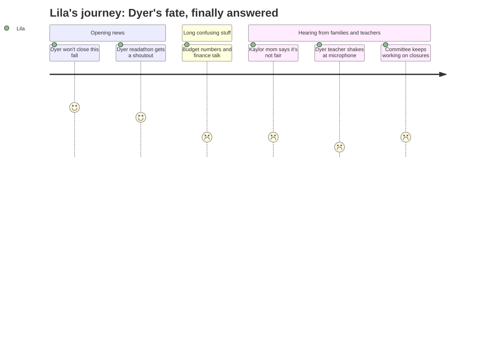

# Interpretation: Lila (PERSONA-014)
## Meeting: School Board Regular Meeting -- April 13, 2026 -- 2026-04-13

### Structured Points

#### 1. Dyer is not closing this year
- **Fact:** At the very start of the meeting, Board Chair DeAngelis announced that the board will vote on April 29 to halt reconfiguration for September 2026, and stated that there is already strong board support for the delay.
- **Source:** Transcript [03:16–04:48]
- **Emotional valence:** positive
- **Threat level:** 2
- **Open question:** true

#### 2. Dyer's readathon made it into the big meeting
- **Fact:** Student representative Angela Kabisa reported to the full board that Dyer students completed their readathon with 200,000 minutes read, and that students are now preparing for an upcoming character parade with families invited to attend.
- **Source:** Transcript [07:54–08:15]
- **Emotional valence:** positive
- **Threat level:** 1
- **Open question:** false

#### 3. Kaylor is still closing — the finance director said it cannot be saved
- **Fact:** When a parent asked during the meeting whether it was still possible to keep Kaylor open, Finance Director Ketchen said "I really don't think so" and stated she cannot recommend that path financially, even if she wished it were possible.
- **Source:** Transcript [91:05–91:51]
- **Emotional valence:** negative
- **Threat level:** 4
- **Open question:** true

#### 4. A Kaylor mom said it feels "profoundly unfair" that those kids have to go through this now
- **Fact:** A Kaylor parent named Amy told the board that while others in the room felt relief, Kaylor's 160 children are not afforded the same. She described Kaylor as serving the highest share of renters, free and reduced lunch students, and the second-highest shares of multilingual learners and children of color in the district.
- **Source:** Transcript [80:07–81:43]
- **Emotional valence:** negative
- **Threat level:** 3
- **Open question:** true

#### 5. A Dyer teacher was shaking at the microphone and almost cried
- **Fact:** Chloe Bartlett, a third-grade teacher at Dyer who said it is her third year in the district, told the board she was "shaking" and "scared" to be at the podium. She said her heart had been "broken so many times" since February and asked directly how the board would make sure the trauma, stress, and loss would not be repeated a third year in a row.
- **Source:** Transcript [84:49–85:36]
- **Emotional valence:** negative
- **Threat level:** 3
- **Open question:** true

#### 6. A grade 1 teacher at Dyer is leaving at the end of the year
- **Fact:** The superintendent's report announced that Katelyn Field, a grade 1 teacher at Dyer Elementary, has submitted her resignation, effective August 31, 2026.
- **Source:** Board Slides 4.13.26, Slide 5; Transcript [41:49–42:35]
- **Emotional valence:** negative
- **Threat level:** 2
- **Open question:** true

#### 7. The reconfiguration committee is still working — school closures could happen next year
- **Fact:** Chair DeAngelis stated that the Reconfiguration Committee will continue working, with Board Members Smith and Richardson assigned to it, with the goal of moving reconfiguration forward for the year after September 2026. Board Member Holman later clarified that "halt" meant a change in pace, not a cancellation of the overall plan.
- **Source:** Transcript [04:48–05:35]; Transcript [177:43–178:29]
- **Emotional valence:** negative
- **Threat level:** 3
- **Open question:** true

### Journey Map

### Reactions

So my mom watched the school board meeting and she told me the most important part right away — Dyer is NOT closing this year! The chair lady said it right at the very beginning, before they even did anything else. She said they're going to vote on April 29 to say no to closing schools this September, and that most of the board already wants to do that. I was SO relieved I actually cried a little bit and my mom hugged me. But then I asked her like five times "but what about next year" and she kept saying we don't know yet. She said there's still a committee that keeps working on it. So it's not totally over. It's just... not this year.

The sad part is that Kaylor IS still closing. Like, for real, definitely. The money lady got asked directly "can Kaylor stay open" and she said "I really don't think so" and she was sorry. And then this mom from Kaylor got up and talked and she was really upset. She said it feels really not fair because the Kaylor kids are the ones who get free lunch and who speak different languages at home, and they're the ones who still have to move. She said there are 160 kids. That made me feel really weird inside because that could have been Dyer. That IS like Dyer except it's not happening to us this year. I kept thinking about what it would feel like if it was our school and everyone else got to stay.

And then a Dyer teacher came up to the microphone. She said she's been at Dyer for three years and she loves it, but she was shaking. She actually said "I'm shaking" out loud. She asked the board how they were going to make sure this scary year doesn't happen AGAIN. Like, she was almost crying. That made me realize my teachers have been scared this whole time too, just like me. Also, one of the first grade teachers at Dyer is leaving at the end of the year. I don't know whose teacher she is but I hope those kids are okay. My mom doesn't know for sure if my teacher is staying but she thinks so. I really, really hope so.