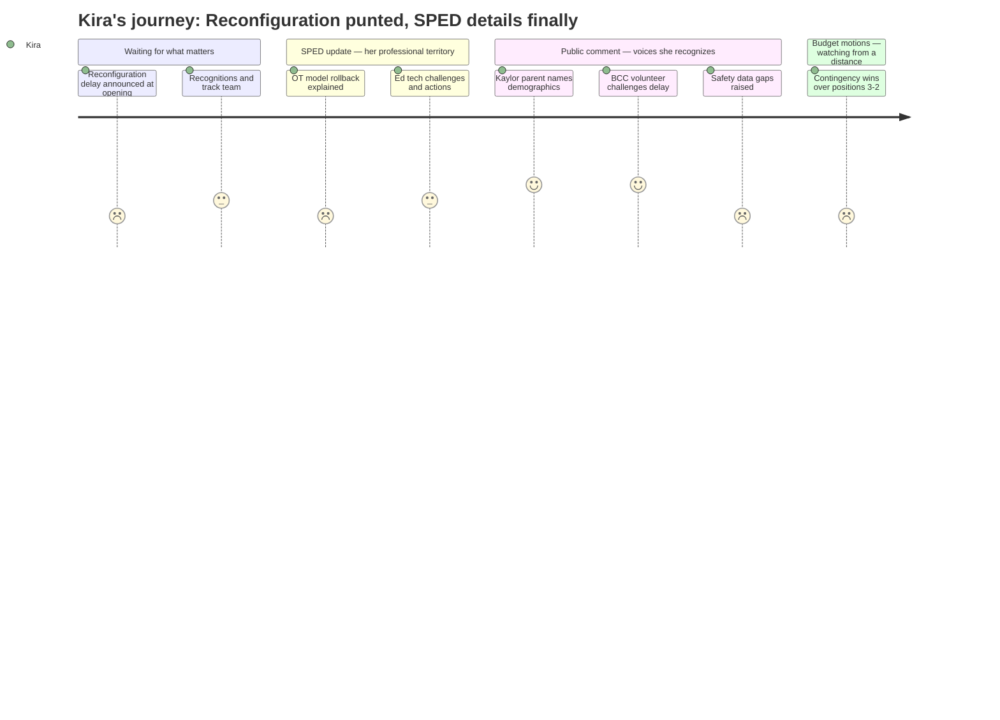

# Interpretation: Kira (PERSONA-015)
## Meeting: School Board Regular Meeting -- April 13, 2026 -- 2026-04-13

### Structured Points

#### 1. Reconfiguration Delayed to Fall 2027 — Announced Before Agenda Even Opens
- **Fact:** Chair DeAngelis announced in her opening remarks, before any agenda items, that the board will vote on April 29th to halt reconfiguration for September 2026, pushing it to fall 2027. She cited "strong support on this board" for the delay and noted that board members Feller and Richardson — both previously in opposition — have committed to the reconfiguration model for the following year. The Reconfiguration Committee will continue with Smith and Richardson as board representatives.
- **Source:** Transcript [04:02--05:35]
- **Emotional valence:** negative
- **Threat level:** 4
- **Open question:** true — The committee will "continue to move forward," but with what mandate, what timeline, and what accountability for delivering the equity outcomes the 2024 BCC work already outlined? A delay to fall 2027 means another full school year without addressing the cross-school inequities in MTSS access, specialist deployment, and resource distribution that Kira observes daily.

#### 2. OT Embedded Model Being Rolled Back — Staffing Crisis Unresolved
- **Fact:** Director Kat Cox presented the FY27 special education staffing plan, which eliminates the embedded OT model at Dyer and Skillin life skills classrooms and returns to a pull-out/consultative model. The district will have 3.8 OT positions serving a projected 138 students — a 1:36 ratio. Cox acknowledged the embedded model was created specifically to address ed tech shortages and has worked well, but described the change as returning to pre-COVID practice.
- **Source:** Transcript [43:20--48:03]; Board Slides, OT staffing slides 1-2
- **Emotional valence:** negative
- **Threat level:** 4
- **Open question:** true — The ed tech shortage that prompted the embedded OT model has not been resolved. Cox is proposing referral incentives and outside agency partnerships as future solutions, but none of these are confirmed. Kira, who travels between buildings and observes staffing firsthand, would want to know: what happens in those classrooms in September if ed tech vacancies persist, as they have consistently for years?

#### 3. Special Education Teacher Resignation at Skillin — One of Kira's Buildings
- **Fact:** The superintendent's report listed three resignations: Victoria Argese, special education teacher at Skillin Elementary, effective August 31, 2026; Katelyn Field, grade 1 teacher at Dyer Elementary, also effective August 31; and Beth Kellogg, principal at Brown Elementary, effective June 30. The board chair confirmed that the two classroom teachers would go to the recall list, but a principal replacement is not covered by that mechanism.
- **Source:** Transcript [41:49--42:35; 61:13--62:00]; Board Slides, Superintendent's Report slide 5
- **Emotional valence:** negative
- **Threat level:** 3
- **Open question:** true — Skillin is one of Kira's buildings. A special ed teacher departure, combined with the OT model rollback and ongoing ed tech vacancy challenges, compounds the staffing instability in the very classrooms where Kira works. The recall list offers a mechanism, but does not guarantee a replacement with equivalent training or familiarity with current students' IEPs.

#### 4. Location-Based Budget Breakdown Shows Kaylor at $5.7M — A Number Kira Can Finally Use
- **Fact:** Finance Director Ketchen presented a new budget analysis sorted by school location rather than cost center. This showed the all-in full FY27 budget assigned Kaylor at approximately $5.7M. Ketchen stated that closing a school accounts for "about half" of the full reductions made — roughly $4M impact on the elementary budget as a whole when accounting for redistribution of some costs to remaining buildings.
- **Source:** Transcript [31:41--36:24]; Board Slides, Budget Development slide sorted by location
- **Emotional valence:** positive
- **Threat level:** 1
- **Open question:** false — For the first time, Kira has a per-building cost breakdown that lets her see what each school actually consumes. The fact that Kaylor at 70% capacity carries a $5.7M footprint while Skillin at 83% capacity carries $7.8M tells a story about structural inefficiency that supports her equity argument. This is data she can actually use in conversation.

#### 5. Kaylor Parent Names the Demographics — Validation From a Different Angle
- **Fact:** Public commenter Amy, identifying herself as a Kaylor parent, stated that Kaylor has the highest proportion of renters, the highest proportion of free/reduced lunch students, the second-highest population of multilingual learners, and the second-highest population of students of color among South Portland elementary schools. She argued that asking Kaylor to absorb the closure burden while other schools received a timeline delay was "profoundly unfair."
- **Source:** Transcript [80:07--82:00]
- **Emotional valence:** positive
- **Threat level:** 2
- **Open question:** false — Amy named publicly what Kira knows from her caseloads: Kaylor's student population is among the most vulnerable in the district. That this is now on the record, in the meeting, from a Kaylor parent — not just from internal staffing data — matters for the ongoing committee process. However, Kira also knows that naming vulnerability without redistricting is incomplete; she'd want to hear how reconfiguration actually addresses this rather than just acknowledges it.

#### 6. Mindy Allos References BCC Work — Sixteen Months of Community Effort Being Sidelined Again
- **Fact:** Public commenter Mindy Allos stated that she volunteered on the Boundaries and Configurations Steering Committee for sixteen months beginning January 2023, and challenged the reconfiguration delay by noting that "the same voices" have asked for more time throughout that entire process. She argued that "time is clearly not the answer" and that the committee had done the foundational work already.
- **Source:** Transcript [82:32--84:04]
- **Emotional valence:** positive
- **Threat level:** 2
- **Open question:** true — Kira would share this frustration. The 2024 Board votes directed consultant-led attendance zone analysis by January 2025 and a magnet/controlled choice investigation by the same date. Neither report has appeared in public documents. Allos's testimony confirms that community members with deep knowledge of the prior process also see a pattern of delay. What Kira wants to know: will the new Reconfiguration Committee have access to that prior work, and will it be bound to any deliverable timeline?

#### 7. Restraint and Seclusion Data Presented Without Full Incident Context
- **Fact:** Director Cox presented restraint and seclusion data comparing the same date range in FY25 and FY26. The chart showed incident counts at the building level for both years, with the embedded OT model in place at both Dyer and Skillin during both periods. Public commenter Lauren Shapiro raised the concern that restraint and seclusion data does not capture all dangerous incidents, and that data on all forms of violence or behavioral escalation involving staff and students is not publicly available in a single accessible format.
- **Source:** Transcript [59:40--60:27; 166:42--167:30]; Board Slides, Restraint and Seclusion slide
- **Emotional valence:** negative
- **Threat level:** 3
- **Open question:** true — Kira would recognize immediately that restraint and seclusion represent only the most formal and escalated end of a behavioral spectrum. She works in these buildings. She knows that what gets coded as restraint or seclusion is a subset of what actually happens in under-resourced classrooms. The board received the data as presented and didn't probe the under-reporting concern directly.

#### 8. Budget Goes to Contingency, Not Positions — A Three-to-Two Board Vote
- **Fact:** The board voted 3-2 to direct any funds recovered through the $360,000 municipal services offset (if the city approves) to the contingency fund rather than toward restoring positions. Members Smith, Risch, and DeAngelis voted for contingency; Members Richardson and Holman voted to restore positions, with Holman specifically naming middle school related arts.
- **Source:** Transcript [144:12--145:48]
- **Emotional valence:** negative
- **Threat level:** 2
- **Open question:** true — For Kira, this vote has a specific meaning at the elementary level: the two reinstated special education ed tech positions were already the result of insurance savings, not this motion. If additional funds had gone toward restoring positions, elementary specialists and intervention staff might have had more support. Contingency is defensible in the abstract; in practice, it means no immediate relief for the classrooms Kira travels between every day.

---

### Journey Map

---

### Reactions

I knew when the chair opened by announcing the reconfiguration delay — before the agenda even started — that this was going to be a long night. Sixteen months of Boundaries and Configurations work, a Board vote in May 2024 directing consultant reports by January 2025 that never materialized, and now we're adding another year. A parent from Kaylor stood up and laid it out plainly: highest free lunch rate, highest renter percentage, second-highest multilingual learner population, second-highest students of color. I know those numbers. I see those kids at three buildings every single week. The equity argument for redistricting isn't abstract for me — it's the MTSS waitlist at one school versus walk-in access at another, and it doesn't get fixed by studying it for a third year.

The special ed update was the part I actually needed to hear, and Kat Cox is trying — I want to be honest about that. But rolling back the embedded OT model at Dyer and Skillin while the ed tech shortage is still unresolved is asking those life skills classrooms to absorb more instability. We're now at 3.8 OTs for a projected 138 students, which is within state regs but nowhere near what those caseloads actually require to do good work. And then we got three slides on ed tech hiring challenges with action items like "try ZipRecruiter" and "explore outside agency partnerships." I've watched the district try to fill those positions through a pandemic. A referral incentive isn't going to solve a structural supply problem. The presentation was candid about the challenges, which I appreciate, but I didn't hear a plan that would survive contact with September.

The part that sat with me after I got home: the restraint and seclusion data. Lauren Shapiro asked exactly the right question about under-reporting, and the board's response was essentially "we'll help you find the ESEA dashboard." Those numbers are the formal endpoint of a long chain of near-misses that don't get coded. I'm in those buildings. I know what doesn't make it into the report. And we're about to go into next year with reduced OT coverage, ongoing ed tech vacancies, and a reconfiguration process that's been delayed another twelve months — which means the resource inequities that drive dysregulation in the first place stay exactly where they are. That's what I was turning over at midnight.