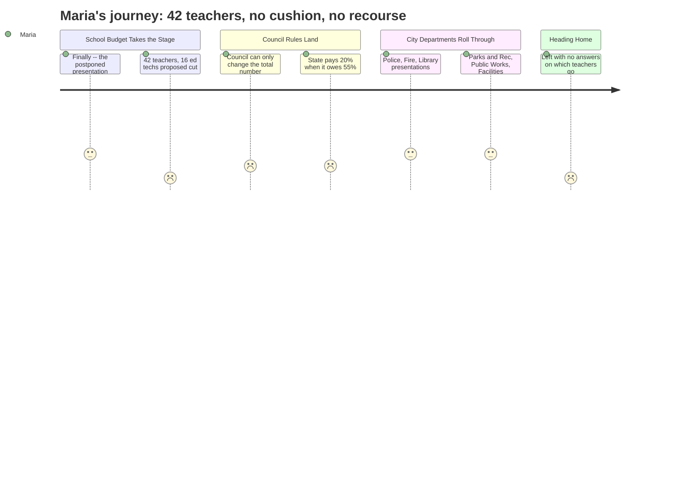

```markdown
---
schema_version: "1.0"
meeting_id: "2026-04-14-city-council"
persona_id: "PERSONA-001"
persona_name: "Maria"
meeting_date: 2026-04-14
meeting_title: "City Council Regular Meeting -- April 14, 2026"
interpretation_date: 2026-04-15
interpreter_model: "claude-sonnet-4-6"
---

# Interpretation: Maria (PERSONA-001)
## Meeting: City Council Regular Meeting -- April 14, 2026 -- 2026-04-14

### Structured Points

#### 1. School Budget Presentation Delayed a Full Week
- **Fact:** The school budget presentation was postponed from April 7 to this evening because the School Board had not yet adopted a proposed budget by the original hearing date.
- **Source:** City Council Agenda — 2026-04-14, Section B.1, City Manager Position Paper
- **Emotional valence:** negative
- **Threat level:** 2
- **Open question:** true

#### 2. 42 Teacher Positions Proposed for Elimination
- **Fact:** The proposed FY27 budget includes elimination of 78 positions total, of which 42 are teachers -- 12% of all district staff.
- **Source:** Fiscal Context, FY27 budget figures
- **Emotional valence:** negative
- **Threat level:** 5
- **Open question:** true

#### 3. 16 Ed Tech Positions Also on the Chopping Block
- **Fact:** In addition to 42 teachers, 16 educational technician positions are proposed for elimination as part of the same 78-position reduction package.
- **Source:** Fiscal Context, FY27 budget figures
- **Emotional valence:** negative
- **Threat level:** 4
- **Open question:** true

#### 4. Council Legally Barred From Protecting Specific Programs
- **Fact:** Under state law and the City Charter, the Council can only vote to raise or lower the school budget's total dollar amount -- it cannot direct the district to keep or cut any specific position, program, or school building.
- **Source:** City Council Agenda — 2026-04-14, Section B.1, City Manager Position Paper
- **Emotional valence:** negative
- **Threat level:** 3
- **Open question:** true

#### 5. Enrollment Decline Used to Justify Staffing Reductions
- **Fact:** Elementary enrollment dropped 23% over four years (1,401 to 1,080 students) while staffing grew by 82 positions during the same period -- a ratio imbalance the district is now correcting through cuts.
- **Source:** Fiscal Context, FY27 budget figures
- **Emotional valence:** neutral
- **Threat level:** 3
- **Open question:** true

#### 6. State Funding Covers Only 20% -- Should Be 55%
- **Fact:** State funding currently covers approximately 20% of South Portland's actual school costs, versus the 55% it should provide under the state's own adequacy formula.
- **Source:** Fiscal Context, FY27 budget figures
- **Emotional valence:** negative
- **Threat level:** 3
- **Open question:** false

#### 7. No Reserve Left -- Every Cut Is Real
- **Fact:** The district's fund balance (its savings cushion) is described as essentially depleted, meaning there is no buffer to soften the impact of proposed eliminations.
- **Source:** Fiscal Context, FY27 budget figures
- **Emotional valence:** negative
- **Threat level:** 4
- **Open question:** false

#### 8. After the School Segment, the Meeting Ran Through Police, Fire, Library, and Eight Other City Departments
- **Fact:** Following the school budget hearing, the Council proceeded to budget presentations from ten non-school city departments (City Clerk, HR, Social Services, Police, Fire, Library, Sustainability, Public Works, Facilities, Parks/Rec), with no further school discussion on the agenda.
- **Source:** City Council Agenda — 2026-04-14, Section C.1, Workshop Order of Departments
- **Emotional valence:** neutral
- **Threat level:** 1
- **Open question:** false

---

### Journey Map



---

### Reactions

Okay so I finally went to the meeting they postponed from LAST week. Last Tuesday I showed up and they hadn't even finalized the budget yet. Tonight they presented it and -- forty-two teachers. FORTY-TWO. Plus sixteen ed techs. I kept trying to do the math in my head: we have what, five elementary schools? That's a lot of people gone. And no one said which ones. No one said "here's what gets cut at your school specifically." Just: seventy-eight positions total, here's the breakdown by type. Like that's supposed to tell me whether Mia still has her art teacher next year.

The thing that's making me crazy is what I found out tonight about how this even works. The City Council -- who has to approve the bottom line -- can't tell the district what to cut or keep. Like, legally they cannot. So even if a councilor gets up and says "don't cut music" -- doesn't matter. They vote on the number, the school board decides what to do with it. Which means the people in that room tonight with the microphones aren't actually the ones making the decision. I felt like I'd driven to the wrong building.

And look -- I get it, enrollment is down. They kept saying that. 1,400 kids four years ago, now 1,080. That's real. But someone needs to explain to me why that means my kids' classroom gets smaller staff and not, I don't know, the district figuring out why families are leaving in the first place. Then after all that we sat through an hour of police and fire and the library and the dog park situation while I'm sitting there still thinking about forty-two teachers. I have the school board workshop on my calendar and I am going with a list.
```