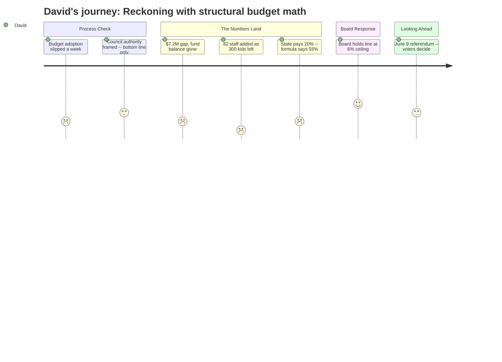

# Interpretation: David (PERSONA-002)
## Meeting: City Council Regular Meeting -- April 14, 2026 -- 2026-04-14

### Structured Points

#### 1. Budget adoption arrived one week late
- **Fact:** The school board had not yet adopted a proposed FY27 budget by the original April 7 public hearing date, forcing tonight's presentation to be postponed from that scheduled slot.
- **Source:** City Council Agenda — 2026-04-14, Section B.1, Position Paper of the City Manager: "As the School Board had yet to adopt a proposed budget for FY27 by the April 7, 2026 City Council public hearing date, their budget presentation was postponed to this evening."
- **Emotional valence:** neutral
- **Threat level:** 2
- **Open question:** true — With a June 9 referendum and a compressed Council review window, a one-week slip at the front end of this process is worth tracking. Did the late adoption affect the depth of the presentation tonight?

#### 2. The structural gap requires cutting $7.2M from a depleted position
- **Fact:** A roll-forward budget would require an 18–19% property tax increase. The board set a 6% ceiling, creating a gap of approximately $7.2M that must be closed through cuts — and the fund balance (savings) is essentially depleted, leaving no cushion to phase in adjustments.
- **Source:** Fiscal Context, FY27 Budget Figures (presented at School Budget public hearing, City Council Agenda B.1)
- **Emotional valence:** negative
- **Threat level:** 5
- **Open question:** true — With the fund balance gone, what is the district's plan if actual FY27 costs come in above projection mid-year? There is no reserve draw available.

#### 3. The enrollment-to-staffing ratio tells the structural story
- **Fact:** Elementary enrollment declined 23% over four years (1,401 to 1,080 students) while staffing grew by 82 positions over the same period. The proposed budget now eliminates 78 positions — essentially unwinding that growth, but belatedly and at the cost of mid-year disruption to staff and families.
- **Source:** Fiscal Context, FY27 Budget Figures (78 position eliminations including 42 teachers, 16 ed techs; enrollment decline 2022–2026)
- **Emotional valence:** negative
- **Threat level:** 4
- **Open question:** true — What was the stated rationale for adding 82 positions during a period of declining enrollment? Were those driven by program expansions, special education mandates, or administrative growth? The per-pupil cost of $26,651 — highest among comparable districts — suggests the answer matters for future budgeting.

#### 4. The board's 6% ceiling is evidence of fiscal discipline
- **Fact:** Rather than presenting a roll-forward budget and asking Council and voters to fund an 18–19% tax increase, the board set a self-imposed ceiling of 6% and built the proposed budget within that constraint.
- **Source:** Fiscal Context, FY27 Budget Figures (6% tax increase ceiling set by board)
- **Emotional valence:** positive
- **Threat level:** 1
- **Open question:** false — This is the right call. Passing through a structural cost problem as a tax spike would not fix the underlying enrollment-to-staffing mismatch.

#### 5. State funding is covering 20% of costs when formula implies 55%
- **Fact:** State education funding currently covers approximately 20% of South Portland's actual per-pupil costs, against a formula-implied contribution of 55%. The school tax therefore bears 61% of total property taxes — a structural imbalance that no local budget decision can correct.
- **Source:** Fiscal Context, FY27 Budget Figures (state funding 20% actual vs. 55% formula; school tax = 61% of property taxes)
- **Emotional valence:** negative
- **Threat level:** 4
- **Open question:** true — Is the 55% figure based on the current statutory formula, or the formula as it was intended to operate before the state began underfunding EPS? Understanding that distinction matters for knowing whether there is a realistic legislative path.

#### 6. Council cannot direct specific cuts — only move the bottom line
- **Fact:** Per state law and City Charter, Council may only increase or decrease the total school budget appropriation. It cannot direct which positions to keep or cut, or whether a building closes. Any bottom-line change sends the budget back to the school board for revision before the May 5 hearing.
- **Source:** City Council Agenda — 2026-04-14, Section B.1, Position Paper of the City Manager: "Council cannot dictate which specific items to add/cut/increase/decrease, including whether or not a school building is closed."
- **Emotional valence:** neutral
- **Threat level:** 2
- **Open question:** false — This is straightforward statutory structure. The constraint is appropriate and prevents Council from substituting its judgment for the board's on operational decisions.

#### 7. Budget materials are on the district website, not consolidated
- **Fact:** The agenda directs interested parties to the school department budget page (spsdme.org/page/budget27) and separately to the city archive page for city budget materials — two distinct locations with no integrated view.
- **Source:** City Council Agenda — 2026-04-14, Section B.1 and C.1
- **Emotional valence:** neutral
- **Threat level:** 1
- **Open question:** true — Do the school budget documents on that page include year-over-year comparisons, a staffing history table, or fund balance trend data — or is it a static presentation deck? That determines whether tonight's presentation is the ceiling of available detail or a floor.

---

### Journey Map

---

### Reactions

The headline number is $7.2 million. That's the gap between what it costs to run the district as-is and what the board decided voters can reasonably absorb in a tax increase. To close it, they're proposing to cut 78 positions — 42 teachers, 16 ed techs, the rest in facilities and support. That's 12% of the workforce. What I keep coming back to is the enrollment data: the district lost 300 elementary students over four years — a 23% drop — and during that same period somehow *added* 82 staff positions. Tonight's cuts are basically correcting that. It's painful, but the underlying math isn't complicated. What I want to know, and didn't hear clearly answered, is what drove the 82 additions. Were those program commitments? Special ed mandates? Administrative growth? That distinction matters a lot for whether this is a one-time correction or a recurring problem.

The state funding number is the thing that should be making everyone angrier than it is. South Portland is supposed to receive funding that covers something like 55% of per-pupil costs under the EPS formula. It's actually getting about 20%. That gap is showing up directly in our property tax bills — the school levy is already 61% of total property taxes. Every time the district has to backfill state underfunding with local tax dollars, it makes the budget look like a local management problem when part of it is a state policy failure. I didn't hear that framed explicitly tonight, but it's in the numbers if you go looking.

The one thing that actually made me feel better: the board set a 6% ceiling and built a budget inside it rather than just passing through an 18–19% increase and calling it a day. That's the disciplined move. The fund balance is gone — there's no cushion — so if anything comes in hot mid-year, there's no reserve draw to buy time. That's the number I'd want to watch through execution. The process runs through a June 9 referendum, which is tight. I'll be downloading whatever gets posted to that district budget page before the May 5 Council hearing.