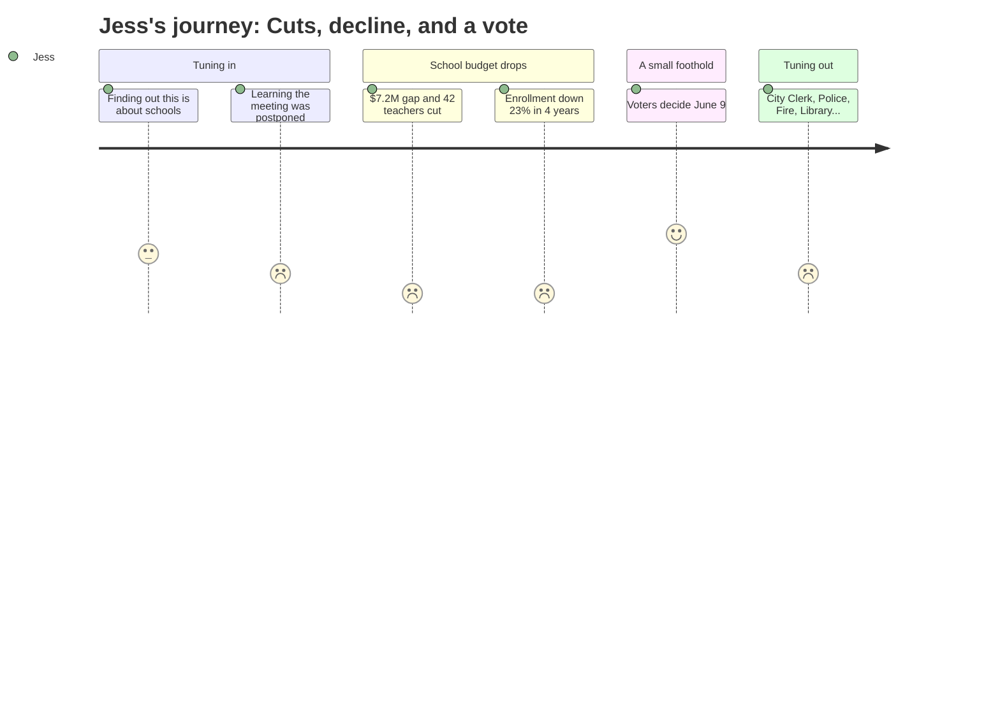

# Interpretation: Jess (PERSONA-003)
## Meeting: City Council Budget Workshop #1 -- April 14, 2026

### Structured Points

#### 1. The school board couldn't even meet its own deadline
- **Fact:** The school budget presentation was postponed from the original April 7 public hearing because the school board had not yet adopted a proposed budget in time. The April 14 workshop served as the rescheduled hearing.
- **Source:** City Council Agenda, Section B.1 — Position Paper of the City Manager
- **Emotional valence:** negative
- **Threat level:** 2
- **Open question:** true

#### 2. 42 teachers are proposed for elimination
- **Fact:** The proposed FY27 budget includes elimination of 78 positions total — 12% of district staff — of which 42 are teachers, 16 are ed techs, and the remainder are facilities, food service, transport, and administrative roles.
- **Source:** Fiscal Context — FY27 Budget Summary
- **Emotional valence:** negative
- **Threat level:** 5
- **Open question:** true

#### 3. Elementary enrollment has fallen 23% in four years
- **Fact:** Elementary enrollment dropped from 1,401 to 1,080 students over four years. The district explicitly links this decline to the staffing and budget pressure it now faces.
- **Source:** Fiscal Context — FY27 Budget Summary
- **Emotional valence:** negative
- **Threat level:** 4
- **Open question:** true

#### 4. The district has no savings cushion remaining
- **Fact:** The fund balance — the district's reserve savings — is described as essentially depleted. There is no financial buffer available to soften this year's cuts or absorb future shocks.
- **Source:** Fiscal Context — FY27 Budget Summary
- **Emotional valence:** negative
- **Threat level:** 4
- **Open question:** false

#### 5. The state is covering only 20% of costs when it should cover 55%
- **Fact:** State education funding is paying roughly 20% of actual costs. The expected state share is approximately 55%. This structural underfunding from Augusta is a driver of the local gap — not solely a district spending problem.
- **Source:** Fiscal Context — FY27 Budget Summary
- **Emotional valence:** neutral
- **Threat level:** 3
- **Open question:** true

#### 6. Voters — including Jess — get to weigh in on June 9
- **Fact:** Per the Council's stated timeline, the school budget will go to voters in a validation referendum on June 9, 2026. The Council votes to send it to voters at the May 5 public hearing.
- **Source:** City Council Agenda, Section B.1 — Position Paper of the City Manager
- **Emotional valence:** positive
- **Threat level:** 1
- **Open question:** false

#### 7. The Council cannot protect any specific program or school
- **Fact:** Under state law and the City Charter, the Council may only adjust the school budget's bottom-line total — it cannot direct the district to keep or cut any specific item, including whether a school building remains open.
- **Source:** City Council Agenda, Section B.1 — Position Paper of the City Manager
- **Emotional valence:** negative
- **Threat level:** 3
- **Open question:** true

---

### Journey Map

---

### Reactions

Oh my god, okay, so I finally watched that school board meeting — well, the Council one — and I have to tell you I am not sleeping tonight. They are cutting *forty-two teachers*. That's not a typo. Four. Two. And the thing is, my kid isn't even in kindergarten yet, so everyone in that room is talking about kids who are already enrolled, and I'm just sitting here like — what is the school going to look like in two years when I actually need it? Nobody said a word about that.

And they didn't even have a budget ready for the original meeting. They had to postpone it a whole week because the school board hadn't finished it yet. That's not a great sign, right? Like if they can't get the paperwork together on time, how are they going to figure out which 42 teachers to let go and still have the schools function? Also, I looked it up, and enrollment has dropped 23% in four years. TWENTY-THREE PERCENT. That is not a small dip, that is people leaving or not having kids or sending their kids somewhere else, and I genuinely cannot tell which one it is or what it means for my neighborhood school.

The one thing that made me feel a tiny bit better: there's a voter referendum on June 9. So like, I can actually vote on this. I don't know if I understand the budget well enough to know what I'm voting *for* exactly, but at least I get a say. I just wish someone had explained what happens to incoming families — to kids who aren't in the system yet — if these cuts go through. Everyone kept talking about the current kids, the current schools, the current staff. My kid doesn't exist in that conversation at all, and that's honestly the scariest part.