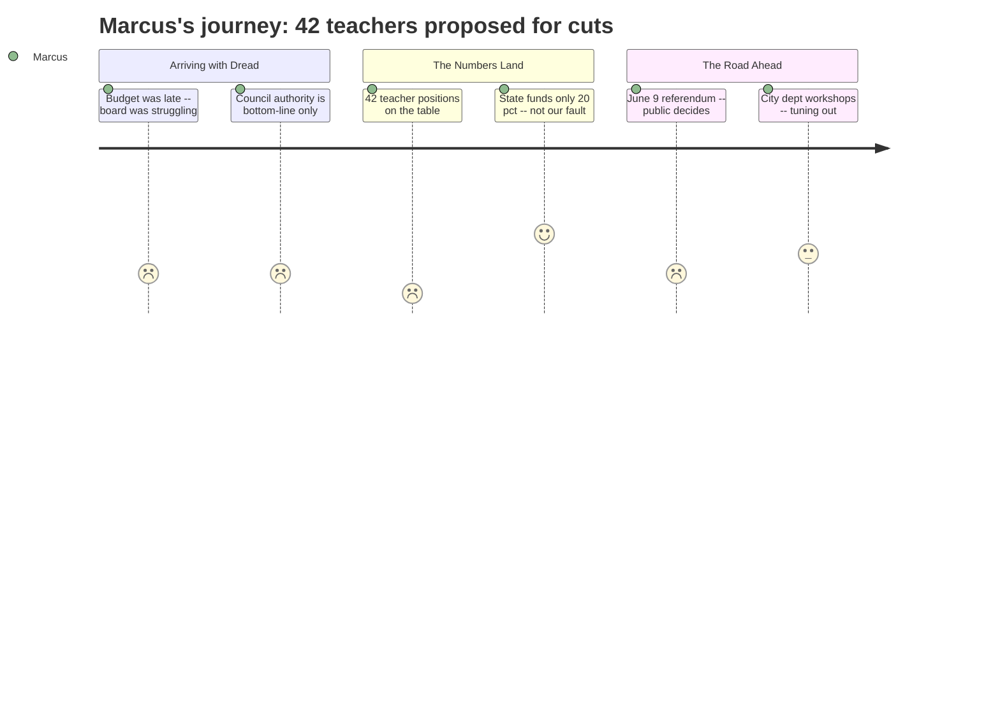

# Interpretation: Marcus (PERSONA-004)
## Meeting: City Council Regular Meeting -- April 14, 2026 -- 2026-04-14

### Structured Points

#### 1. 42 Teacher Positions Proposed for Elimination
- **Fact:** The FY27 proposed budget includes eliminating 42 teaching positions out of 78 total proposed cuts -- the single largest category of reductions.
- **Source:** Fiscal Context, FY27 key budget figures
- **Emotional valence:** negative
- **Threat level:** 5
- **Open question:** true

#### 2. 16 Ed Tech Positions Also on the Chopping Block
- **Fact:** Alongside the 42 teachers, 16 ed tech positions are proposed for elimination -- the second largest category of cuts by role type.
- **Source:** Fiscal Context, FY27 key budget figures
- **Emotional valence:** negative
- **Threat level:** 4
- **Open question:** true

#### 3. Council Can Only Move the Bottom Line -- Not Protect Specific Positions
- **Fact:** The City Manager's position paper explicitly states that the Council cannot direct which specific items to cut or restore, including whether a school building closes. It can only raise or lower the total dollar amount appropriated to schools.
- **Source:** Agenda, Section B-1, City Manager Position Paper
- **Emotional valence:** negative
- **Threat level:** 3
- **Open question:** false

#### 4. School Board Hadn't Adopted a Budget by April 7
- **Fact:** The school budget presentation was postponed from April 7 to April 14 because the Board had not yet adopted a proposed budget -- suggesting internal difficulty reaching consensus on cuts.
- **Source:** Agenda, Section B-1, City Manager Position Paper
- **Emotional valence:** neutral
- **Threat level:** 2
- **Open question:** true

#### 5. State Funding Is Less Than Half of What It Should Be
- **Fact:** State funding covers approximately 20% of actual district costs, against a benchmark of 55%. This represents tens of millions in structural underfunding that is not of the district's making.
- **Source:** Fiscal Context, FY27 key budget figures
- **Emotional valence:** negative
- **Threat level:** 4
- **Open question:** false

#### 6. Enrollment Decline Framing Is Specifically Elementary -- High School Not Disaggregated
- **Fact:** The fiscal context attributes the structural gap partly to a 23% elementary enrollment decline (1,401 to 1,080 students over four years). High school enrollment figures are not separately provided, but the 42 teacher cuts are not broken out by school level.
- **Source:** Fiscal Context, FY27 key budget figures
- **Emotional valence:** negative
- **Threat level:** 3
- **Open question:** true

#### 7. Voters Will Have the Final Word on June 9
- **Fact:** If the Council sends the budget to voters after the May 5 public hearing, a validation referendum is scheduled for June 9, 2026. A failed referendum could trigger even deeper cuts.
- **Source:** Agenda, Section B-1, City Manager Position Paper
- **Emotional valence:** neutral
- **Threat level:** 3
- **Open question:** true

#### 8. Staffing Growth Narrative Will Be Used Against the Union
- **Fact:** The fiscal framing explicitly states that district staffing grew by 82 positions while enrollment dropped by 300 students -- a framing that positions current staffing levels as excessive rather than as a deliberate programmatic choice.
- **Source:** Fiscal Context, FY27 key budget figures
- **Emotional valence:** negative
- **Threat level:** 4
- **Open question:** false

---

### Journey Map

---

### Reactions

Forty-two teachers. That's what I keep coming back to. Not "positions" -- teachers. People I eat lunch with, people who run the robotics club, people who cover for each other when someone's out sick. Forty-two. And the way it gets presented, it's just a number in a fiscal gap analysis, sitting right next to the enrollment decline graph like it's perfectly logical. What they're not telling you is that the enrollment decline they're citing is *elementary*. The high school numbers aren't even broken out. We have no idea how many of those 42 are SPHS teachers versus district-wide, and they're absolutely not going to volunteer that information.

The other thing I keep thinking about is that the Council can't do anything specific even if they wanted to. It's all bottom-line. They can vote to give the district more money or less money -- that's it. They can't say "save the AP courses" or "don't cut the ed techs." So tonight was really about whether any councilor is going to stand up and say we need to fund this at a higher level, which means either higher taxes or cuts somewhere else in the city budget. I didn't hear any of that crystallize into a commitment. And meanwhile the state is covering 20% when it should be covering 55%. That's the real story. Nobody in Augusta is cutting 42 teachers -- they're just quietly watching us do it for them.

And then there's the June 9 referendum. The public votes on this. Which means the next six weeks are a public opinion campaign, and the "staffing grew while enrollment dropped" line is going to be everywhere. Our job -- and SPEA's job -- is to make sure people understand what those 82 positions actually *are*. Did we overstaff? Or did we add special education support, multilingual learners programming, social-emotional staff because kids needed it? That story doesn't tell itself. I'm going to be reaching out to the union rep tomorrow to see what the communication plan looks like, because if we let that framing go unanswered, we lose this referendum before it starts.