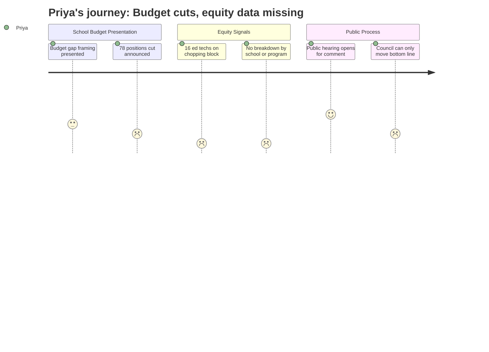

# Interpretation: Priya (PERSONA-005)
## Meeting: City Council Regular Meeting -- April 14, 2026 -- 2026-04-14

---

### Structured Points

#### 1. Sixteen Ed Tech Positions on the Chopping Block
- **Fact:** The proposed FY27 budget eliminates 16 ed tech positions as part of a 78-position reduction package. Ed techs are the primary paraprofessional support for students with IEPs and English learners in classroom settings.
- **Source:** FY27 Budget Fiscal Context — position elimination breakdown (42 teachers, 16 ed techs, 14 facilities/food/transport, 2 administrators, 4 non-bargaining)
- **Emotional valence:** negative
- **Threat level:** 5
- **Open question:** true — Which schools lose ed techs? Are schools serving higher concentrations of students with IEPs or English learners absorbing a disproportionate share of these cuts?

#### 2. Proposed Cuts Presented With No Equity Disaggregation
- **Fact:** The school budget presentation frames 78 position eliminations as a response to a $7.2M structural gap, but provides no breakdown of cuts by school building, program type, or student population served. The impact on English learners, students with disabilities, or economically disadvantaged students is unquantified in the materials presented to Council.
- **Source:** City Council Budget Workshop #1 Agenda, April 14, 2026 — school budget presentation item (B.1); FY27 Budget Fiscal Context
- **Emotional valence:** negative
- **Threat level:** 4
- **Open question:** true — Can the district provide a school-by-school and program-by-program breakdown of proposed eliminations before the May 5 Council hearing?

#### 3. Building Closure Is a Live Option, With No Demographic Analysis on Record
- **Fact:** The Council agenda explicitly notes that "Council cannot dictate... whether or not a school building is closed," signaling that elementary reconfiguration — including closure — is within the district's active decision space. No demographic analysis of which school populations would be affected has been presented publicly.
- **Source:** City Council Budget Workshop #1 Agenda, April 14, 2026 — City Manager position paper under item B.1
- **Emotional valence:** negative
- **Threat level:** 4
- **Open question:** true — Which school is under consideration for closure? The Board's own 2024 steering committee found that two elementary schools serve substantially more economically disadvantaged students than the other three. Has that distribution informed reconfiguration modeling?

#### 4. State Funding Covers 20% When It Should Cover 55%
- **Fact:** State funding for the district covers only approximately 20% of actual costs against a formula that should deliver roughly 55%. The district's per-pupil cost of $26,651 is the highest among comparable districts.
- **Source:** FY27 Budget Fiscal Context — state funding and per-pupil cost figures
- **Emotional valence:** neutral
- **Threat level:** 3
- **Open question:** true — The 35-percentage-point funding gap from Augusta is a structural injustice that falls hardest on districts with high-needs populations. Is the district making that argument publicly and loudly at the state level, or is this being absorbed locally as a budget-balancing problem?

#### 5. Enrollment Decline Framed as a Budget Driver Without Demographic Breakdown
- **Fact:** Elementary enrollment dropped 23% over four years (1,401 to 1,080 students), and this decline is cited as a primary driver of the structural budget gap. The presentation does not address which student populations account for this decline or whether declining enrollment is concentrated in specific schools.
- **Source:** FY27 Budget Fiscal Context — enrollment figures
- **Emotional valence:** negative
- **Threat level:** 3
- **Open question:** true — Is enrollment declining uniformly across all elementary schools, or are some schools losing students faster than others? The demographic composition of who left matters for equity planning.

#### 6. Public Hearing Format Creates a Real — if Narrow — Advocacy Window
- **Fact:** The April 14 meeting is structured as a public hearing, meaning community members can testify on the school budget before Council provides guidance to the district. Council can direct the district to revise its bottom line, which would require the Board to reconvene and reallocate.
- **Source:** City Council Budget Workshop #1 Agenda, April 14, 2026 — City Manager position paper under item B.1; workshop schedule noting May 5 Council public hearing and June 9 voter validation referendum
- **Emotional valence:** positive
- **Threat level:** 2
- **Open question:** false — The process timeline is clear and provides at least two more public touchpoints before the June 9 referendum.

---

### Journey Map

---

### Reactions

Okay, so I went to this meeting expecting to finally get real numbers and I left with more questions than answers. The big alarm for me is the ed techs — sixteen positions. Those aren't administrative overhead. Those are the people sitting next to kids who have IEPs, translating instructions for English learners, making it possible for kids with disabilities to be in general ed classrooms at all. And I sat through that whole presentation waiting for someone to say "here's which schools absorb these cuts, here's what it means for our highest-need populations" — and it never came. Seventy-eight positions, $7.2 million, and not one disaggregated number. I don't know if nobody thought to ask or if the data just isn't being compiled that way, but either way, we're flying blind on who actually takes the hit.

The building closure piece is the one that's going to keep me up. The agenda literally says the Council can't tell the district whether to close a school — meaning that decision is entirely in the district's hands and it's clearly on the table. The Board's own steering committee back in 2024 found that two of our elementary schools have substantially more economically disadvantaged students than the other three. That analysis exists. So when a school closure happens and it turns out it's one of those two schools — I want to know right now whether that equity data is part of the reconfiguration modeling or whether they're running pure enrollment math and calling it neutral. The absence of that analysis in this budget cycle is a gap I can't explain away.

What I'm taking into the next few weeks: I'm going to testify at the May 5 hearing and specifically demand a school-by-school, program-by-program breakdown of these cuts before the June 9 referendum. I also want to put together something for the June vote that makes the state funding story legible — 20% of what we're owed from Augusta is a policy failure, not a school management failure, and our community deserves to understand that distinction before they're asked to raise their property taxes again. If the League or the immigrant family coalition wants to co-sign a letter to Council asking for the disaggregated data, now is the moment.