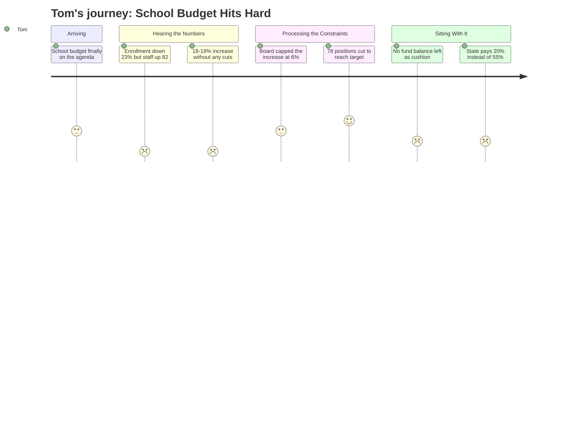

---
schema_version: "1.0"
meeting_id: "2026-04-14-city-council"
persona_id: "PERSONA-006"
persona_name: "Tom"
meeting_date: 2026-04-14
meeting_title: "City Council Regular Meeting -- April 14, 2026"
interpretation_date: 2026-04-15
interpreter_model: "claude-sonnet-4-6"
---

# Interpretation: Tom (PERSONA-006)
## Meeting: City Council Regular Meeting -- April 14, 2026 -- 2026-04-14

### Structured Points

#### 1. Staffing grew while enrollment collapsed
- **Fact:** Elementary enrollment fell 23% over four years (1,401 to 1,080 students), but during the same period the district added 82 staff positions — a net increase of 12% of total staff.
- **Source:** Fiscal Context, FY27 budget figures
- **Emotional valence:** negative
- **Threat level:** 5
- **Open question:** true

#### 2. Without cuts, taxpayers faced an 18–19% property tax increase
- **Fact:** The district's structural gap between projected costs and available revenue stood at $7.2M. Covering that gap without any spending reductions would have required an 18–19% property tax increase.
- **Source:** Fiscal Context, FY27 budget figures
- **Emotional valence:** negative
- **Threat level:** 5
- **Open question:** false

#### 3. Board capped the tax increase at 6% and required $7.2M in cuts
- **Fact:** The School Board set a 6% property tax increase as a ceiling and directed administration to identify approximately $7.2M in reductions to meet it.
- **Source:** Fiscal Context, FY27 budget figures
- **Emotional valence:** neutral
- **Threat level:** 3
- **Open question:** true

#### 4. 78 positions proposed for elimination, including 42 teachers
- **Fact:** The proposed FY27 budget eliminates 78 positions — 12% of total district staff — including 42 teachers, 16 ed techs, 14 facilities/food/transport staff, 2 administrators, and 4 non-bargaining employees.
- **Source:** Fiscal Context, FY27 budget figures
- **Emotional valence:** positive
- **Threat level:** 2
- **Open question:** true

#### 5. South Portland's per-pupil spending is the highest among comparable districts
- **Fact:** The district's per-pupil cost is $26,651, described as the highest among comparable districts.
- **Source:** Fiscal Context, FY27 budget figures
- **Emotional valence:** negative
- **Threat level:** 4
- **Open question:** true

#### 6. State is funding only 20% of actual costs — its obligation is 55%
- **Fact:** State education aid covers approximately 20% of actual district costs. The state's own funding formula implies an obligation of roughly 55%. The gap is absorbed by local property taxpayers.
- **Source:** Fiscal Context, FY27 budget figures
- **Emotional valence:** negative
- **Threat level:** 4
- **Open question:** true

#### 7. The fund balance is gone — no financial cushion remains
- **Fact:** The district's fund balance (reserve savings) is described as essentially depleted. There is no remaining financial cushion to absorb future cost shocks without immediate tax impact.
- **Source:** Fiscal Context, FY27 budget figures
- **Emotional valence:** negative
- **Threat level:** 4
- **Open question:** true

---

### Journey Map

---

### Reactions

They lost 300 kids in four years. Three hundred. And during that same stretch, they *hired* 82 more people. I sat there listening to this and I kept thinking — does anyone in that building own property in this city? Because if you did, you wouldn't let that happen. That's not a budgeting problem, that's a management failure. And now they come to us asking for a 6% increase after they already figured out they would've needed 18 or 19% if they hadn't made cuts. Eighteen percent. Think about what that would have done to your tax bill.

Look, I'll give them this: the board drew a line at 6% and said figure it out. That took some spine. And yes, cutting 78 positions is painful — some of those are teachers and I'm not happy about that either. But you can't keep growing payroll when the kids aren't there. The per-pupil cost is $26,651. Highest in the region. That's not a badge of honor, that's a flashing red light. And now the savings account is empty. Zero cushion. So what happens next year when health insurance goes up 12% again and enrollment keeps dropping? They come back for another 6%? Another 8%?

The state thing burns me too. Augusta is supposed to be covering 55 cents of every dollar — that's their own formula — and they're sending 20 cents. The rest lands on my tax bill, on your tax bill, on everyone in this city who owns a home. I don't know how you fix that from here, but I do know that nobody at that meeting was talking about going to the legislature and making some noise about it. We're just quietly eating the difference every single year. That's the part nobody wants to say out loud.