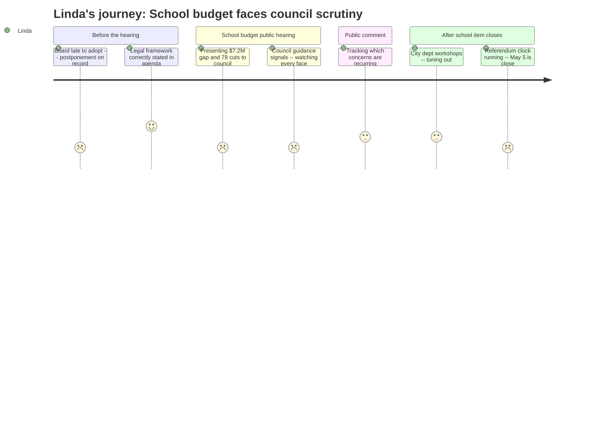

# Interpretation: Linda (PERSONA-007)
## Meeting: City Council Regular Meeting -- April 14, 2026 -- 2026-04-14

### Structured Points

#### 1. Postponement from April 7 is publicly visible
- **Fact:** The city manager's position paper explicitly states the school budget presentation was postponed because "the School Board had yet to adopt a proposed budget for FY27 by the April 7, 2026 City Council public hearing date."
- **Source:** Agenda, Section B.1, City Manager Position Paper
- **Emotional valence:** negative
- **Threat level:** 3
- **Open question:** false

#### 2. Council authority is correctly bounded by state law
- **Fact:** The city manager's position paper accurately states that council may only change the bottom-line school budget number and "cannot dictate which specific items to add/cut/increase/decrease, including whether or not a school building is closed."
- **Source:** Agenda, Section B.1, City Manager Position Paper
- **Emotional valence:** positive
- **Threat level:** 1
- **Open question:** false

#### 3. State subsidy is covering roughly 20% instead of the expected 55%
- **Fact:** State funding currently covers only approximately 20% of actual district costs, against an EPS-formula expectation of roughly 55%, creating a structural shortfall that is not attributable to district spending decisions.
- **Source:** Fiscal Context
- **Emotional valence:** negative
- **Threat level:** 5
- **Open question:** false

#### 4. Structural gap requires eliminating 78 positions -- 12% of staff
- **Fact:** Closing a $7.2M gap under the board's 6% tax-increase ceiling requires the proposed elimination of 78 positions: 42 teachers, 16 ed techs, 14 facilities/food/transport, 2 administrators, and 4 non-bargaining staff.
- **Source:** Fiscal Context
- **Emotional valence:** negative
- **Threat level:** 5
- **Open question:** false

#### 5. The fund balance is gone -- no cushion for council to invoke
- **Fact:** The district's fund balance is described as essentially depleted, meaning there is no reserves buffer that could be drawn down to soften cuts or absorb a council-directed budget decrease.
- **Source:** Fiscal Context
- **Emotional valence:** negative
- **Threat level:** 4
- **Open question:** false

#### 6. Council "guidance" is an unscripted political variable
- **Fact:** The agenda structure for the school budget hearing allows councilors to "provide guidance to the School about their budget request" after public comment, with no specification of what form or effect that guidance takes.
- **Source:** Agenda, Section B.1, City Manager Position Paper
- **Emotional valence:** neutral
- **Threat level:** 3
- **Open question:** true

#### 7. The validation referendum timeline is unforgiving
- **Fact:** The council must vote to send the budget to voters at the May 5 public hearing; the validation referendum is set for June 9, 2026. Any council-directed change would require the board to reconvene before May 5 and revise.
- **Source:** Agenda, Section B.1, City Manager Position Paper
- **Emotional valence:** neutral
- **Threat level:** 3
- **Open question:** false

#### 8. Per-pupil cost is the highest among comparable districts
- **Fact:** South Portland's per-pupil cost of $26,651 is the highest among comparable districts, a figure that will be visible to any councilor or resident who compares peer benchmarks.
- **Source:** Fiscal Context
- **Emotional valence:** negative
- **Threat level:** 4
- **Open question:** true

---

### Journey Map

---

### Reactions

The postponement from April 7 is what I keep coming back to. It's right there in the city manager's position paper -- "the School Board had yet to adopt a proposed budget by the April 7 hearing date." That's public record now. I understand why it happened; we were still working through the scenarios and the numbers are genuinely brutal. But optics matter. We've been asking the community to trust us through an extraordinarily painful process, and the first thing the council sees is that we weren't ready on schedule. That's a credibility ding we didn't need.

What did reassure me -- and I'll give the city manager's office credit for this -- is that the position paper was legally precise. Council can only touch the bottom line. They cannot tell us to keep a building open, cannot restore a specific teaching position, cannot micromanage the staffing model. That boundary needed to be stated clearly and publicly before anyone from the community got up to the mic and asked a councilor to fix something that isn't theirs to fix. The "guidance" language in the agenda is the part I watch like a hawk, though. Guidance from a council majority that wants us to cut deeper, or restore something the public loved, lands differently depending on how many votes are in the room. That's the unscripted variable I'm sitting with tonight.

The number that honestly should be in every councilor's briefing packet -- and I don't know how loudly it came through -- is the state subsidy figure. We're getting 20% coverage against an EPS expectation of 55%. That's not a district management problem. That's Augusta not holding up its end of the formula. Our per-pupil cost looks high in isolation, but when your enrollment drops 23% in four years and the state funding barely moves, the math is going to look ugly regardless of how carefully we've managed the budget. We are heading into a validation referendum with a depleted fund balance, 78 fewer positions than last year, and a public that doesn't fully understand that the legislature's decisions in 2024 and 2025 put us here. That's what I'll be up at 2 a.m. thinking about.