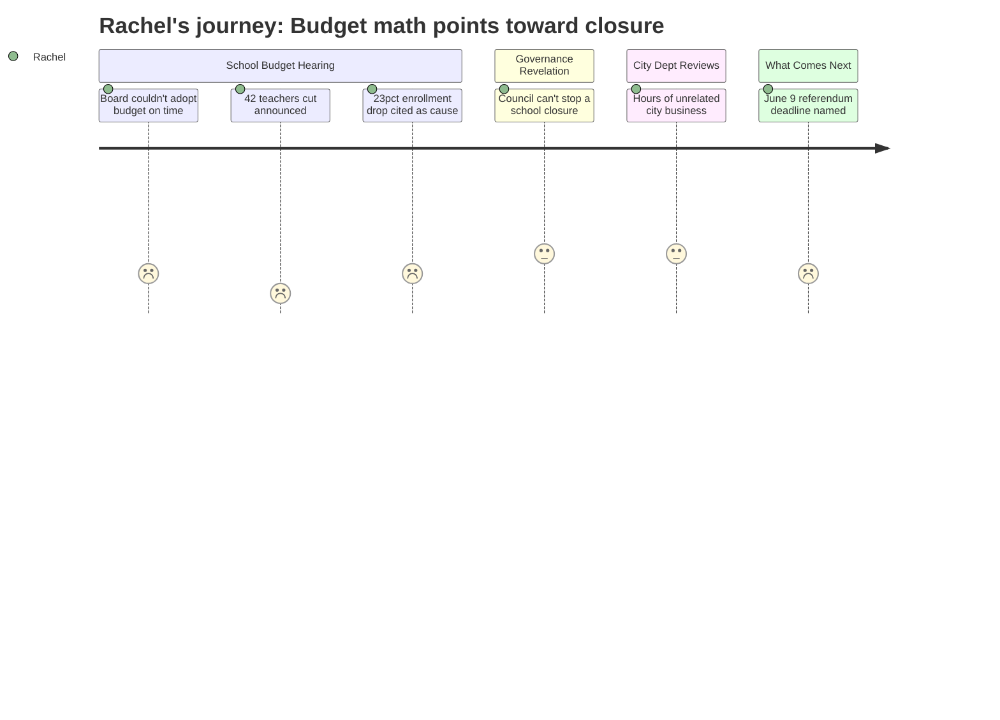

---

### Reactions

So I finally went to that meeting tonight — the one they postponed from last week because the school board couldn't even get their act together to pass a budget in time. And what I heard was terrifying. They're cutting 42 teachers. Forty-two. I'm sitting in that chamber thinking: which schools are losing those teachers? Is my kids' school viable after that? Does a building become impossible to run when you gut the staff? And no one would say. They just kept talking about the structural gap, the state underfunding, the 18-percent tax increase that nobody will pass. I understand the math is bad. I don't understand why nobody will tell me which schools are on the table.

The moment that really got me was the enrollment numbers. They said elementary is down 23% in four years — 1,401 kids down to 1,080. That's not just a trend, that's the entire argument they'll use to justify closing a building. I'm sitting there doing the division: 1,080 kids across five elementary schools, some of those buildings have to be running half-empty. And the fund balance is gone, so they can't slow-walk this over multiple years. The decision is coming fast. And then they told us — almost like a footnote — that the City Council can't even weigh in on whether a school closes. That's entirely the school board's call. I came to the wrong meeting. I've been focused on the wrong body.

The timeline is what I can't stop thinking about. Council votes May 5th, it goes to voters June 9th. That's eight weeks. If a school closure is part of this budget, when do they announce it — before the vote? After? Could they pass a budget that implies a closure without naming the school, and then announce it when nobody can do anything? I don't know, and I couldn't get a straight answer. I'm texting the other parents from our school tonight. We need to be at every school board meeting between now and June as a group, not scattered. The Council can't help us. The school board is the only place this gets decided.