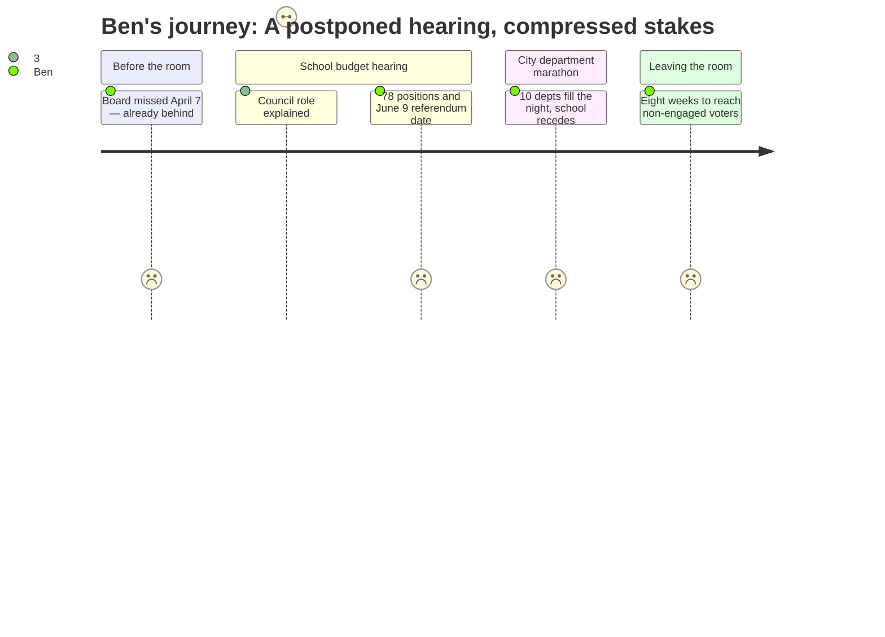

# Interpretation: Ben (PERSONA-010)
## Meeting: City Council Budget Workshop #1 — April 14, 2026

---

### Structured Points

#### 1. School Board Missed Its Own Deadline
- **Fact:** The school budget presentation was postponed from April 7 to April 14 because the school board had not yet adopted a proposed budget in time for the originally scheduled Council public hearing.
- **Source:** Agenda, Section B.1 — Position Paper of the City Manager
- **Emotional valence:** negative
- **Threat level:** 3
- **Open question:** true — What caused the board to miss the April 7 target? How far behind schedule is this process relative to prior years?

#### 2. Council Can Only Touch the Bottom Line
- **Fact:** State law and the City Charter restrict the Council to adjusting only the total school budget number. Councilors cannot direct which specific positions, programs, or buildings are cut or saved — including whether any school closes.
- **Source:** Agenda, Section B.1 — Position Paper of the City Manager
- **Emotional valence:** neutral
- **Threat level:** 2
- **Open question:** false

#### 3. The Cuts Are a School Board Decision, Not a Council Decision
- **Fact:** Because the Council's authority is limited to the bottom-line figure, the specific elimination of 78 staff positions (42 teachers, 16 ed techs, others) and any related school restructuring are determined solely by the school board. If Council lowers the number further, the board again decides what falls.
- **Source:** Agenda, Section B.1 — Position Paper of the City Manager; Fiscal Context
- **Emotional valence:** negative
- **Threat level:** 3
- **Open question:** true — Do South Portland residents understand that their leverage point on specific program cuts is the school board, not the Council? Most political energy around budget season flows toward the Council chamber.

#### 4. The School Budget Was Folded Into a Ten-Department Workshop Night
- **Fact:** The school budget public hearing was incorporated into Budget Workshop #1, which also included presentations from the City Clerk, Human Resources, Social Services, Police, Fire, Library, Sustainability, Public Works, Facilities, and Parks/Rec. The agenda allotted smaller departments 5–10 minutes and larger ones up to 15.
- **Source:** Agenda, Section C.1 — Budget Workshop #1 Position Paper
- **Emotional valence:** negative
- **Threat level:** 2
- **Open question:** true — How much floor time did the school budget actually receive relative to its share of the property tax bill (61%)? Was public comment on the school budget meaningfully separate from the city department discussion?

#### 5. The $7.2M Gap Has a Structural Story Behind It
- **Fact:** Elementary enrollment declined 23% over four years — from 1,401 to 1,080 students — while staffing grew by 82 positions. That mismatch, compounded by a 12% health insurance increase and state aid covering only 20% of costs rather than the expected 55%, produced the $7.2M structural gap now forcing the proposed cuts.
- **Source:** Fiscal Context
- **Emotional valence:** negative
- **Threat level:** 4
- **Open question:** true — Why did staffing grow as enrollment fell? Was that a deliberate choice, a delayed adjustment, or something else? This is the "how did we get here" thread that readers need to follow the budget debate.

#### 6. The Timeline Is Compressed — Eight Weeks to the Referendum
- **Fact:** The Council will vote to send the budget to voters at the May 5 public hearing. The validation referendum is June 9, 2026 — roughly eight weeks from this meeting, and five weeks from the Council's formal vote.
- **Source:** Agenda, Section B.1 — Position Paper of the City Manager
- **Emotional valence:** negative
- **Threat level:** 3
- **Open question:** true — Given how late the board adopted its proposed budget, is there sufficient time for meaningful public education before the referendum?

#### 7. Budget Materials Are Online, Not Consolidated
- **Fact:** The agenda directs the public to two separate URLs for budget materials: the school department site (spsdme.org/page/budget27) and the city archive (southportland.gov/Archive.aspx?ADID=177). No plain-language summary or consolidated document is referenced.
- **Source:** Agenda, Sections B.1 and C.1
- **Emotional valence:** neutral
- **Threat level:** 1
- **Open question:** true — Is there an accessible entry-point document for residents who won't read a full budget packet? If not, the gap between official communication and public understanding falls to outlets like The Forecaster to fill.

---

### Journey Map

---

### Reactions

So the first thing to know is that the school board didn't even have a budget ready in time for the April 7 Council hearing — they missed their own deadline by a week. That's buried in the position paper but it's actually a meaningful detail. This is a $7.2M problem affecting 78 jobs and potentially school buildings, and the board needed extra time just to get a proposal to the Council. We're eight weeks from a referendum. I want to flag that without being unfair — there may be a reasonable explanation — but the timeline is legitimately tight, and voters are going to be making a consequential decision with very little runway.

The thing that kept running through my head during the hearing is that most people don't understand what the Council can actually do here. State law says they can only move the bottom-line total. They cannot tell the district to save a particular teacher, restore a program, or reverse a school closure decision. That authority is entirely at the school board level. So all the energy residents are directing at City Hall is aimed at the wrong body. The lede I'm building toward is something like: if you want to shape the specifics — which 42 teachers, which buildings — the conversation already happened, or is happening now, at the school board. The Council is just the budget ceiling, not the architect.

The other thing that got to me, practically speaking, is that the school budget got folded into a workshop night that also ran the Police, Fire, Library, Public Works, and six other departments. The schools are 61 percent of the property tax bill, and they're getting one slot in a ten-department marathon. I'm not saying that's scandalous — it's how the calendar works when the board doesn't adopt on time — but it does mean the depth of public scrutiny last night was limited. The real accountability moments for the specific cuts happened at school board meetings most residents didn't watch. That's the gap I want my piece to fill.