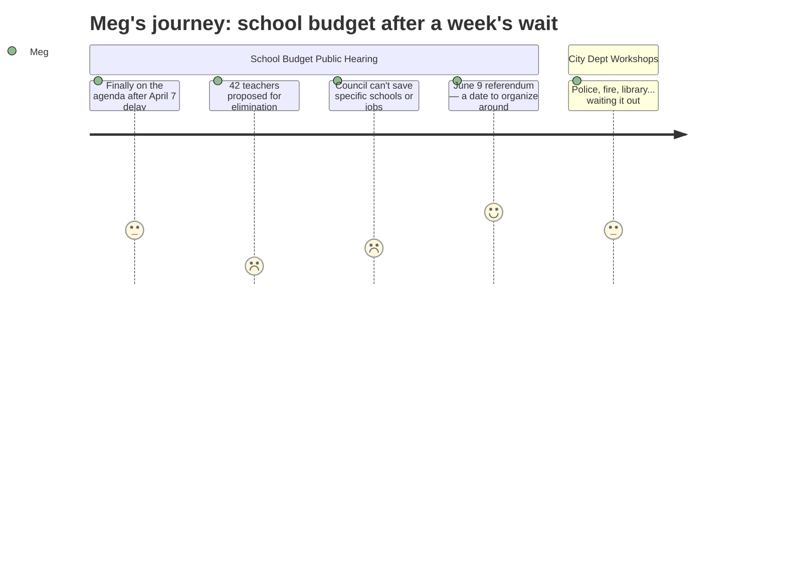

# Interpretation: Meg (PERSONA-011)
## Meeting: City Council Regular Meeting -- April 14, 2026 -- 2026-04-14

### Structured Points

#### 1. School budget finally showed up — one week late
- **Fact:** The school budget presentation was postponed from the April 7 public hearing because the school board had not yet adopted its proposed budget. It was rescheduled to tonight and presented as both a public hearing and a de facto council workshop.
- **Source:** City Council Agenda, Section B.1 — Position Paper of the City Manager
- **Emotional valence:** negative
- **Threat level:** 2
- **Open question:** false

#### 2. 42 teachers proposed for elimination
- **Fact:** The FY27 proposed budget includes elimination of 78 total positions — 42 teachers, 16 ed techs, 14 facilities/food/transport staff, 2 administrators, and 4 non-bargaining staff — representing roughly 12% of the district workforce.
- **Source:** FY27 budget materials (fiscal context)
- **Emotional valence:** negative
- **Threat level:** 5
- **Open question:** true

#### 3. Council cannot dictate which schools close or which positions are cut
- **Fact:** By state law and city charter, the council may only increase or decrease the school budget's bottom-line dollar amount. It cannot direct the school board to protect or eliminate any specific position, program, or building — including whether a school is closed.
- **Source:** City Council Agenda, Section B.1 — Position Paper of the City Manager
- **Emotional valence:** negative
- **Threat level:** 3
- **Open question:** false

#### 4. The $7.2M gap — and why cuts are this deep
- **Fact:** A roll-forward (no-change) budget would require an 18–19% property tax increase. The board set a 6% ceiling, creating a structural gap of approximately $7.2M that must be closed through cuts. The school fund balance is essentially depleted.
- **Source:** FY27 budget materials (fiscal context)
- **Emotional valence:** negative
- **Threat level:** 4
- **Open question:** false

#### 5. Elementary enrollment down 23% in four years
- **Fact:** Elementary enrollment dropped from 1,401 to 1,080 students over four years — a 23% decline — while district staffing grew by 82 positions over the same period. This mismatch is a primary driver of the structural budget gap.
- **Source:** FY27 budget materials (fiscal context)
- **Emotional valence:** negative
- **Threat level:** 4
- **Open question:** true

#### 6. State is covering 20% of costs when it should cover 55%
- **Fact:** Maine state funding covers approximately 20% of South Portland's actual per-pupil costs; the expected share under the state formula is roughly 55%. South Portland's per-pupil cost of $26,651 is the highest among comparable districts.
- **Source:** FY27 budget materials (fiscal context)
- **Emotional valence:** negative
- **Threat level:** 3
- **Open question:** true

#### 7. Referendum is June 9 — that's the community's vote
- **Fact:** The budget follows a fixed timeline: council public hearing May 5, council sends it to voters, then a community validation referendum on June 9, 2026. The council vote in May determines what goes to voters; the June vote is the community's direct say.
- **Source:** City Council Agenda, Section B.1 — Position Paper of the City Manager
- **Emotional valence:** positive
- **Threat level:** 1
- **Open question:** false

---

### Journey Map

---

### Reactions

Ok so here's the school budget recap — this was actually supposed to happen last week (April 7) and got postponed because the school board hadn't even finished adopting their budget yet. So if you tried to tune in then, that's why nothing happened. Tonight they finally presented it. The headline number is 78 positions being cut. That includes **42 teachers**, 16 ed techs, 14 facilities/food/transport staff, and a few others. That's about 12% of the entire district workforce. The reason it's this bad: a true no-change budget would require an 18–19% property tax hike. The board drew the line at 6%, which forces roughly $7.2M in cuts. And the savings account is basically empty — there's no cushion to soften any of this.

One thing I want people to understand about tonight: the city council **cannot** save your kid's school or a specific teacher. By law, they can only vote to change the total dollar amount — up or down. They can't tell the school board "keep the art teacher" or "don't close that building." That call stays entirely with the school board. So if you're hoping the council is going to ride in and fix this, that's not how it works. They can add or cut money from the pot. Everything else is the board's decision. Worth knowing before you start emailing your councilor asking them to protect something specific.

Here's what you CAN do: **mark June 9 on your calendar.** That's the community referendum — the actual vote where South Portland residents weigh in on the school budget. Council holds a public hearing May 5, then sends it to voters. June 9 is your moment. The one thing I still don't have — and I looked — is which schools lose which teachers. The numbers are all district-wide aggregates. If your kid is in elementary school, note that enrollment dropped 23% in four years at the elementary level specifically (1,401 kids down to 1,080). That's the math driving a lot of these cuts. What it means school-by-school, I can't tell you yet. I'll be watching for that.